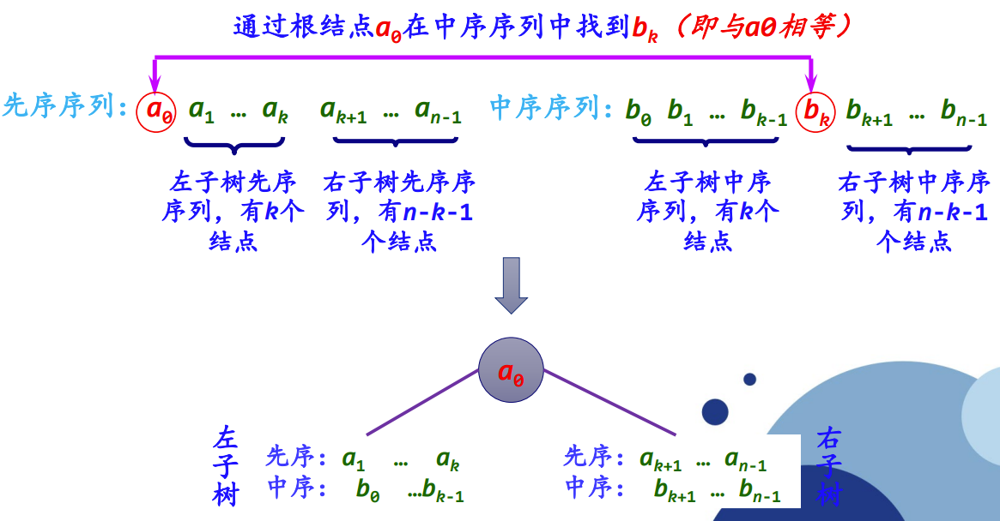

<script type="text/javascript" src="http://cdn.mathjax.org/mathjax/latest/MathJax.js?config=TeX-AMS-MML_HTMLorMML"></script>
<script type="text/x-mathjax-config">
    MathJax.Hub.Config({ tex2jax: {inlineMath: [['$', '$']]}, messageStyle: "none" }); 
</script>

# 第一章 算法概述

## 1.1 算法的概念

### 1.1.1 算法的定义和特性
1. 算法的定义
   1. 非形式化定义：算法是规则的有限集合，是为解决特定问题而规定的一系列操作。
   2. 形式化定义：算法是一个四元组，即$(Q, I, \Omega, F)$，其中：
      1. Q: 包含子集I和$\Omega$的集合，表示计算状态
      2. I: 计算的输入集合
      3. $\Omega$: 计算的输出集合
      4. F: 计算的规则，是一个由Q到它自身的函数，具有自反性，即对于任何一个元素$q \in Q, F(q) \in Q$
   3. 一个算法是对于所有的输入元素x都能在有穷步骤内终止的一个方法
   4. 在算法的形式化定义中，对于任何一个$x \in I$，x均满足以下性质：$x_0 = x, x_{k+1} = F(x_k), k \ge 0$
      - 任何一个输入元素x均可得到一个序列，即$x_0, x_1, ..., x_k$。对任何输入元素x，该序列表示算法在第k步结束
2. 算法的特性
   1. 有限性：一个算法必须保证执行有限步之后结束
   2. 确定性：算法的每一步骤必须有确切的定义，不能有歧义
   3. 可行性：算法原则上能精确地运行，在现有条件下是可以实现的
   4. 输入：一个算法有0个或多个输入
   5. 输出：一个算法有一个或多个输出（广义输出：包括提供处理结果的多种形式），以反映对输入数据加工后的结果
3. 算法与程序的区别
   1. 算法描述了问题处理的方式或步骤，程序采用具体语言规则实现算法的功能
   2. 算法依靠程序来完成，算法是程序的灵魂
   3. 程序不一定满足有穷性，可直接在及其环境下运行
4. 算法描述方式
   1. 自然语言
   2. 框图（流程图）
   3. 高级语言
   4. 类语言

### 1.1.2 求解问题的基本过程
1. 明确问题性质并分析需求
2. 建立问题的描述模型
   1. 数值型问题 -> 建立数学模型
   2. 非数值型问题 -> 建立过程模型
3. 选择解决方法
4. 设计处理算法
   1. 数值型问题 -> 采用数值分析现成的经典算法
   2. 非数值型问题 -> 通过构建数据结构或算法分析设计进行处理
5. 程序化：将设计好的算法用特定的程序设计语言实现，并在具体的计算机上运行
6. 算法分析

### 1.1.3 算法设计示例——计算最大公约数
1. 欧几里得算法
   1. `r = m % n;`
   2. `if (r == 0) return(n); else goto(3);`
   3. `m = n; r = m; goto(1);`
   
   算法基于`gcd(m, n) == gcd(n, m % n)`， `gcd(m, 0) == m`。`(m, n) -> n == 0 ? m: gcd(n, m % n)`
2. 连续整数检测法
   1. `t = min(m, n);`
   2. `if (m % t == 0) goto(3); else goto(4);`
   3. `if (n % t == 0) return(t); else goto(4);`
   4. `t--; goto(2);`
3. 质因数分解法
   1. M = 获取质因数集(m)
   2. N = 获取质因数集(n)
   3. $mn = M \cap N$
   4. return 连乘(mn)


## 1.2 算法设计与分析任务
- 算法设计：设计解决给定问题的有效算法，构造问题的解
- 算法分析：涉及分析判断某一算法质量的准则和技术，对算法进行有效性评价


## 1.3 算法分析准则
1. 正确性：指假设给定有意义的输入，算法经有限时间计算，可产生正确答案
   1. 两方面含义：
      1. 解决问题的方法选取是正确的，也就是数学上的正确性
      2. 实现这个方法的一系列指令是正确的
   2. 四个层次
      1. 程序不含语法错误
      2. 程序对几组输入数据能得出满足规格要求的结果
      3. 对典型的、苛刻的、带有刁难性的几组输入有正确的结果
      4. 对一切合法的输入都能产生满足规格要求的结果
2. 可读性
3. 健壮性（鲁棒性）：程序对于规范要求以外输入情况的处理能力
4. 高效率和低存储量
   1. 效率：算法的执行时间。对于一个具体问题，执行时间短的算法运行效率高
   2. 存储量：算法在执行过程中所需要的最大存储空间


## 1.4 算法分析基础

### 1.4.1 常用数学术语
1. 计量单位（IEEE）
2. 阶乘函数
   1. $n! = 1 \times 2 \times 3 \times ... \times n$
   2. 斯特林公式：$n! \approx \sqrt[]{2 \pi n} (\frac{n}{e})^2$
3. 排列组合
   1. 排列数：$P_{n}^{r} = n(n-1)...(n-r+1) = \frac{n!}{(n-r)!}$
   2. 组合数：$C_{n}^{r} = \frac{n!}{(n-r)!r!} = \frac{n(n-1)...(n-r+1)}{r!}$
4. 布尔型变量
   - 在表达式中的布尔型变量将被赋予0/1值
5. 上下取整
   1. $\left \lceil x \right \rceil$ 向上取整：不小于x的最小整数
   2. $\left \lfloor x \right \rfloor$ 向下取整：不大于x的最大整数
   3. 取整函数的性质
      1. $x-1 < \left \lfloor x \right \rfloor \le x \le \left \lceil x \right \rceil \le x+1$
      2. $\left \lfloor n \right \rfloor + \left \lceil n \right \rceil = n$
   4. 对于$n \ge 0, a, b > 0$，有如下性质
      1. $\left \lceil \frac{\left \lceil \frac{n}{a} \right \rceil}{b} \right \rceil = \left \lceil \frac{n}{ab} \right \rceil = \left \lfloor \frac{\left \lfloor \frac{n}{a} \right \rfloor}{b} \right \rfloor$
      2. $\frac{a-(b-1)}{b} \le \left \lfloor \frac{a}{b} \right \rfloor \le \left \lceil \frac{a}{b} \right \rceil \le \frac{a+(b-1)}{b}$
6. 取模操作符：取模函数返回整除后的余数，数学表达式中用 n mod m 表示

### 1.4.2 对数与指数
$$
\begin{matrix}
 \\ \log_{b}{y} = x
 \\ b^x = y
 \\ b^{\log_{b}{y}} = y
\end{matrix}
$$

任意函数m, n, r，任意正整数a, b, c，对数运算有性质：
1. $\log_{2}{(nm)} = \log_{2}{n} + \log_{2}{m}$
2. $\log_{2}{(\frac{n}{m})} = \log_{2}{n} - \log_{2}{m}$
3. $r = n^{\log_{n}{r}}$
4. $\log_{c}{n^r} = r \log_{c}{n}$
5. $\log_{a}{n} = \frac{\log_{b}{n}}{\log_{b}{a}}$

正整数m, n和实数$a > 0$，指数运算性质：
1. $(a^m)^n = a^{mn} = (a^n)^m$
2. $a > 1$ -> $a^n$ 为单调递增函数
3. $a > 1$ -> $\lim_{n \to \infty} \frac{n^b}{a^n} = 0$ -> $n^b = O(a^n)$
4. $e^x = 1 + x + \frac{x^2}{2!} + \frac{x^3}{3!} + ... = \sum_{i=0}^{\infty} \frac{x^i}{x!}$
5. $\lim_{n \to \infty} (1 + \frac{x}{n})^n = e^x$

### 1.4.3 数学证明法
1. 反证法：肯定题设而否定结论，从而得出矛盾
2. 数学归纳法：归纳奠基、归纳推导


## 1.5 算法复杂性分析方法
- 算法时间复杂度：算法中有关操作次数的多少，同T(n)表示【time】
- 算法空间复杂度：算法在执行过程中所占存储空间的大小，用S(n)表示【space】

### 1.5.1 复杂度函数
1. 复杂函数公式 C = F(N, I, A)
   1. N: 问题规模
   2. I: 输入
   3. A: 算法本身（具体计算时忽略）
2. 算法的时间复杂度
   1. 算法的时间复杂度
      - 一个算法的执行时间 = 算法中所有语句执行时间的总和
      - 每条语句的执行时间 = 该条语句的执行次数 * 执行一次所需实际时间
      - 非递归算法计算法
        - for/while循环：循环体内计算时间 * 循环次数
        - 嵌套循环：循环体内计算时间 * 所有循环次数
        - 顺序语句：各语句计算时间相加
        - if-else语句：if语句计算时间和else语句计算时间之中的较大者
   2. 算法耗费时间的计算公式：$T(N, I) = \sum_{i=1}^{k} t_i e_i (N, I)$
      1. N: 问题规模
      2. k: 计算机提供的元运算种类
      3. $t_i$: 第i种运算所需的时间
      4. $e_i$: 第i种运算次数
   3. 语句频度：该语句在一个算法中重复执行的次数
      1. 一个算法的时间耗费就是该算法中所有语句频度之和
      2. 在进行算法时间复杂度分析时，一般情况下不考虑常数，主要注重复杂度公式中的最高次项

### 1.5.2 最好、最坏和平均情况
1. 平均时间复杂度 $A(n) = \sum_{I \in D_n}^{n+l} D(I)f(I)$
   1. $D_n$: 多规模输入集
   2. P(I): 概率
   3. f(I): 操作时间
2. 最坏时间复杂度：问题消耗的上界 $W(n) = \max_{i \in D_n} t(i) = \max\{t(i)\}, 1 \le i \le n+1$
3. 最好时间复杂度：问题的最佳性、解决问题的下界
   1. 问题下界（最小消耗）的证明方法
      1. 设计算法A，找出一个函数W(n)，A至多是W(n)的上界
      2. 对于某个函数F，问题规模输入n，使算法至少运行F(n)次运算
      3. 若W和F相等，则A是最优的；若W和F不相等，则可能存在更好的算法或下界
4. 在实时系统时关注最坏情况分析，其他情况下，通常考虑平均情况

### 1.5.3 渐进分析
1. 当问题规模很大，且趋于无穷时对算法性能的分析，其渐进时间复杂度表示为 $\lim_{n \to \infty} T(n)$
2. 对算法资源开销的一种不精确的估算方法，为大规模问题的算法资源开销评估提供了一种简化的分析方法
3. 函数阶渐进形态的三种表示法
   1. 低阶$O(上界)$
      1. 若存在一个正常数C和$n_0$，对所有的$n>n_0$，都有$f(n) \le Cg(n)$，则记作$f(n) = O(g(n))$
      2. 即f的阶不高于g的阶
   2. 高阶$\Omega(下界)$
      1. 若存在一个正常数C和$n_0(C \ne 0)$，使得$\forall n \ge n_0, f(n) \ge Cg(n)$，记作$f(n) = \Omega(g(n))$
      2. 即f的阶高于g的阶
   3. 等阶$\theta$
      1. 当且仅当$f=O(g)$且$f(n) = \Omega(g(n))$时，f(n)与g(n)同阶
4. 渐进阶分析简化规则
   1. 若f(n)在O(g(n))中且g(n)在O(h(n))中，则f(n)在O(h(n))中 -> 函数阶满足传递性
   2. 若f(n)在O(kg(n))中对任意常数$k \ge 0$成立，则f(n)在O(g(n))中 -> 可忽略大O表示法中的常数因子
   3. 若$f_1(n)$在$O(g_1(n))$中，且$f_2(n)$在$O(g_2(n))$中，则$f_1(n) + f_2(n)$在O(max(g_1(n), g_2(n)))中 -> 顺序给出一个程序的多个部分，只需考虑其中开销较大的部分
   4. 若$f_1(n)$在$O(g_1(n))$中，且$f_2(n)$在$O(g_2(n))$中，则$f_1(n) f_2(n)$在O(g_1(n) g_2(n))中 -> 程序中的循环中有限次重复某种开销相等的操作，则总开销为每次开销与重复次数之积

### 1.5.4 阶的证明方法
1. 反证法：常用于否定的论述
2. 极限法：利用极限描述
   $$
   \lim_{n \to \infty} \frac{f(n)}{g(n)} = C
   \left\{\begin{matrix}若C \ne 0，则f和g同阶，f = \theta (g)
   \\若C = 0，则f和g不同阶，f = \Omega (g)，但g不是 \theta (f)
   \\若C = \infty，则f和g同阶，f是g的高阶
   \end{matrix}\right.
   $$
   洛必达法则常用于求极限，若$\lim_{n \to \infty} f(n) = \lim_{n \to \infty} g(n) = \infty$，则$\lim_{n \to \infty} \frac{f(n)}{g(n)} = \lim_{n \to \infty} \frac{f'(n)}{g'(n)}$


# 第二章 递归与分治策略

## 2.1 递归的概念
1. 递归：函数、过程、子程序在运行过程中直接或间接调用自身而产生的重入现象
   1. 任何间接递归都可以等价地转换为直接递归
   2. 尾递归：递归调用语句是最后一条执行语句的递归过程（函数）
2. 优点：描述简捷，结构清晰，算法的正确性比较容易证明
3. 缺点：执行效率低，空间消耗多，收软、硬件环境条件限制


## 2.2 具有递归特性的问题
1. 递归定义的数学函数
   1. 阿克曼函数
   $$
   Ack(m, n) = \left\{\begin{matrix}n+1 &,m=0
   & \\Ack(m-1, 1) &, m \ne 0, n = 0
   & \\Ack(m-1, Ack(n, n-1)) &, m \ne 0, n \ne 0
   \end{matrix}\right.
   $$
   2. 斐波那契数列
   $$
   F(n) = \left\{\begin{matrix}1 &, n = 0, 1
   & \\F(n-1)+F(n-2) &, n > 1
   \end{matrix}\right.
   $$
2. 递归定义的数据结构：广义表、（二叉）树...
3. 递归求解方法：欧几里得算法、汉诺塔问题...

---
1. 一般来说，能够用递归解决的问题应该满足以下三个条件
   1. 需要解决的问题可以转化为一个或多个子问题来求解，而这些子问题的求解方法与原问题完全相同，只是在数量规模上不同
   2. 递归调用的次数必须是有限的
   3. 必须有结束递归的条件来终止递归
2. 递归模型：递归算法的抽象，反应一个递归问题的递归结构
3. 递归出口：确定递归到何时结束 $f(s_1) = m_1$
4. 递归体：确定递归求解时的递推关系 $f(s_{n+1}) = g(f(s_i), f(s_{i+1}), ..., f(s_n), c_j, c_{j+1}, ..., c_n) n, i, j, m \in N^*$
   1. $s_{n+1}$: 大问题
   2. $s_i、s_{i+1}、...、s_n$: 小问题
   3. $c_j、c_{j+1}、...、c_m$: 若干非递归问题
   4. g: 非递归函数


## 2.3 递归过程的设计与实现
1. 递归算法的设计
   1. 寻找对问题进行分解的方法
   2. 寻找所分解问题的出口，即设计递归出口
2. 执行阶段
   1. 自上而下的递归进层阶段（递推阶段）
      1. 保存本层参数、返回地址
      2. 分配局部数据空间、传递参数
      3. 传第一条指令
   2. 自下而上的递归出层阶段（回归阶段）
      1. 恢复上层
      2. 传递结果
      3. 转断点执行

---
递归算法的执行过程的说明
1. 一个正确的递归程序虽然每次调用的是相同的子程序，但它的参量、输入数据等均有变化。
2. 在正常的情况下，随着调用的不断深入，必定会出现调用到某一层的函数时，不再执行递归调用而终止函数的执行，遇到递归出口便是这种情况。
3. 递归调用是函数嵌套调用的一种特殊情况，即它是调用自身代码。也可以把每一次递归调用理解成调用自身代码的一个复制件。
4. 由于每次调用时，它的参量和局部变量均不相同，因而也就保证了各个复制件执行时的独立性。
5. 系统为每一次调用开辟一组存储单元，用来存放本次调用的返回地址以及被中断的函数的参量值。
6. 这些单元以系统栈的形式存放，每调用一次进栈一次，当返回时执行出栈操作，把当前栈顶保留的值送回相应的参量中进行恢复，并按栈顶中的返回地址，从断点继续执行。

### 2.3.1 递归算法设计的一般步骤
1. 对原问题$f(s_n)$进行分析，抽象出合理的“小问题”$f(s_{n-1})$（与数学归纳法中假设n=k-1时等式成立相似）；
2. 假设$f(s_{n-1})$是可解的，在此基础上确定$f(s_n)$的解，即给出$f(s_n)$与$f(s_{n-1})$之间的关系（与数学归纳法中求证n=k时等式成立的过程相似）；
3. 确定一个特定情况（如f(1)或f(0)）的解，由此作为递归出口（与数学归纳法中求证n=1或n=0时等式成立相似）。

### 2.3.2 递归数据结构及其递归算法的设计
1. 递归数据结构的定义
   1. 递归数据结构：采用递归方式定义的数据结构
   2. 基本递归运算：在递归数据结构定义中包含的递归运算
2. 基于递归数据结构的递归算法设计
   1. 单链表的递归算法设计
      1. 设求解以L为首结点指针的整个单链表的某功能为“大问题”
      2. 设求解除首结点外余下结点构成的单链表（由L->next标识，而该运算为递归运算）的相同功能为“小问题”。
      3. 由大小问题之间的解关系得到递归体。
      4. 考虑特殊情况，通常是单链表为空或者只有一个结点时，这时很容易求解，从而得到递归出口。
   2. 二叉树的递归算法设计
      1. 设求解以b为根结点的整个二叉树的某功能为“大问题”。
      2. 转化为：求解其左、右子树的相同功能为“小问题”。
      3. 由大小问题之间的解关系得到递归体。
      4. 考虑特殊情况，通常是二叉树为空或者只有一个结点时，这时很容易求解，从而得到递归出口。
      5. 【例】对于含n（n>0）个结点的二叉树，所有结点值为int类型，设计一个算法由其先序序列a和中序序列b创建对应的二叉链存储结构。 

### 2.3.3 递归算法设计示例
1. 青蛙跳台阶问题：一只青蛙一次可以跳上1级台阶，也可以跳上2级。编写代码求青蛙跳上一个n级的台阶，总共有多少种跳法？
2. 瓷砖覆盖问题：用一个2\*1的小矩形横着或竖着去覆盖更大的矩形。如用8个2\*1小矩形横着或竖着去覆盖2\*8的大矩形，覆盖方法有多少种？
3. 集合的全排列问题
   1. 设$R={r_1, r_2, ..., r_n}$是要进行排列的n个元素，显然一共有n!种排列。
   2. 令$R=R-{r_i}$。集合X中元素的全排列记为perm(X)，则$(r_i)perm(X)$表示在全排列perm(X)的每一个排列前加上前缀r，得到的排列。
   3. R的全排列归纳定义如下:
      1. 当n=1时，perm(R)=(r)，其中r是集合R中唯一的元素;
      2. 当n>1时，$perm(R)由(r_1)perm(R_1), (r_2)perm(R_2), ..., (r_n)perm(R_n)$构成。
   ```python
   def perm(r):
      if len(r) == 0:
         return []
      if len(r) == 1:
         return [r]
      result = []
      for i, x in enumerate(r):
         rem = r[:i] + r[i+1:]
         for p in perm(rem):
               result.append([x] + p)
      return result
   ```
4. 整数划分问题：把一个正整数n表示成一系列正整数之和：$n = n_1 + n_2 + ... + n_k (n_1 \ge n_2 \ge ... \ge n_k \ge 1)$
   1. 正整数n的这种表示称为正整数n的划分。
   2. 正整数n的不同划分个数称为正整数n的划分数，记作P(n)。
   3. 如果${n_1, n_2, ..., n_i}$中的最大加数s不超过m，即$s = max(n_1, n_2, ..., n_i) \le m$ ,则称它属于n的一个m划分。我们记n的m划分的个数为f(n, m)。该问题就转化为求n的所有划分个数f(n, n)。
      1. $f(1, m) = 1, m \ge 1$
         - 当n=1时，不论m的值为多少（m > 0），只有一种划分即1个1
      2. $f(n, 1) = 1, n \ge 1$
         - 当m=1时，不论n的值为多少（n > 0），只有一种划分即n个1
      3. $f(n, m) = f(n, n), m \ge n$
         - 最大加数s实际上不能超过n
      4. $f(n, n) = 1 + f(n, n-1)$
         - 正整数n的划分是由s=n的划分和$s \le n-1$的划分构成
      5. $f(n, m) = f(n, m-1) + f(n-m, m), n > m > 1$
         - 正整数n的最大加数s不大于m的划分，是由s=m的划分和$s \le m-1$的划分组成
   
   正整数n的划分数p(n) = f(n, n)
   $$
   f(n, m) = \left\{\begin{matrix}1 &, n = 1, m = 1
   & \\f(n, n) $, n < m
   & \\1 + f(n, n-1) $, n = m
   & \\f(n, m-1) + f(n-m, m) $, n > m > 1
   \end{matrix}\right.
   $$


### 2.3.4 递归算法转化非递归算法
1. 直接转化法：用循环结构替代递归过程，不需要使用栈。
   1. 尾递归：只有一个递归调用语句，而且是处于算法的最后。
   2. 单向递归：递归函数中虽然有一处以上的递归调用语句，但各次递归调用语句的参数只和主调用函数有关，相互之间参数无关，并且这些递归调用语句也和尾递归一样处于算法的最后。
2. 间接转化法：用栈消除递归过程，通过分析只保存必须保存的信息，从而用非递归算法替代递归算法，需要使用栈。
   1. 使用栈保存中间结果，从而将递归算法转化为非递归算法的过程。
   2. 在设计栈时，除了保存递归函数的参数等外，还增加一个标志成员(tag)，对于某个递归小问题f(s')，其值为1表示对应递归问题尚未求出，需进一步分解转换，为0表示对应递归问题已求出，需通过该结果求解大问题f(s)。


## 2.4 递归算法分析
当一个算法包含对自身的递归调用过程时，该算法的运行时间复杂度可用递归方程进行描述，求解该递归方程，可得到对该算法时间复杂度的函数度量。

### 2.4.1 替换法
替换方法的最简单方式为：根据递归规律，将递归公式通过方程展开、反复代换子问题的规模变量，通过多项式整理，如此类推，从而得到递归方程的解。

【例】汉诺塔算法递归方程
$$
T(n) = \left\{\begin{matrix}1 &, n = 1
  & \\2T(n-1) + 1 &, n > 1
\end{matrix}\right.
$$
利用替换法求解该方程：


# 第三章 动态规划


# 第四章 贪心算法


# 第五章 回溯法


# 第六章 分支限界法


# 第七章 随机算法


