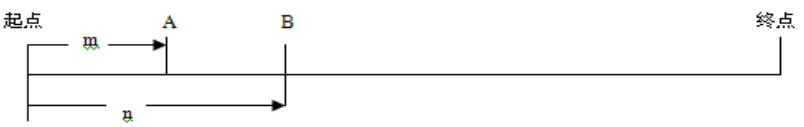
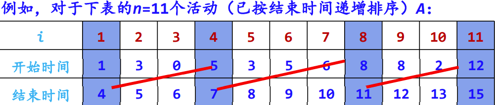
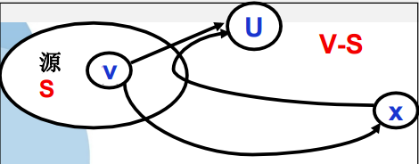

<script type="text/javascript" src="http://cdn.mathjax.org/mathjax/latest/MathJax.js?config=TeX-AMS-MML_HTMLorMML"></script>
<script type="text/x-mathjax-config">
    MathJax.Hub.Config({ tex2jax: {inlineMath: [['$', '$']]}, messageStyle: "none" }); 
</script>

# 第一章 算法概述

## 1.1 算法的概念

### 1.1.1 算法的定义和特性
1. 算法的定义
   1. 非形式化定义：算法是规则的有限集合，是为解决特定问题而规定的一系列操作。
   2. 形式化定义：算法是一个四元组，即$(Q, I, \Omega, F)$，其中：
      1. Q: 包含子集I和$\Omega$的集合，表示计算状态
      2. I: 计算的输入集合
      3. $\Omega$: 计算的输出集合
      4. F: 计算的规则，是一个由Q到它自身的函数，具有自反性，即对于任何一个元素$q \in Q, F(q) \in Q$
   3. 一个算法是对于所有的输入元素x都能在有穷步骤内终止的一个方法
   4. 在算法的形式化定义中，对于任何一个$x \in I$，x均满足以下性质：$x_0 = x, x_{k+1} = F(x_k), k \ge 0$
      - 任何一个输入元素x均可得到一个序列，即$x_0, x_1, ..., x_k$。对任何输入元素x，该序列表示算法在第k步结束
2. 算法的特性
   1. 有限性：一个算法必须保证执行有限步之后结束
   2. 确定性：算法的每一步骤必须有确切的定义，不能有歧义
   3. 可行性：算法原则上能精确地运行，在现有条件下是可以实现的
   4. 输入：一个算法有0个或多个输入
   5. 输出：一个算法有一个或多个输出（广义输出：包括提供处理结果的多种形式），以反映对输入数据加工后的结果
3. 算法与程序的区别
   1. 算法描述了问题处理的方式或步骤，程序采用具体语言规则实现算法的功能
   2. 算法依靠程序来完成，算法是程序的灵魂
   3. 程序不一定满足有穷性，可直接在及其环境下运行
4. 算法描述方式
   1. 自然语言
   2. 框图（流程图）
   3. 高级语言
   4. 类语言

### 1.1.2 求解问题的基本过程
1. 明确问题性质并分析需求
2. 建立问题的描述模型
   1. 数值型问题 -> 建立数学模型
   2. 非数值型问题 -> 建立过程模型
3. 选择解决方法
4. 设计处理算法
   1. 数值型问题 -> 采用数值分析现成的经典算法
   2. 非数值型问题 -> 通过构建数据结构或算法分析设计进行处理
5. 程序化：将设计好的算法用特定的程序设计语言实现，并在具体的计算机上运行
6. 算法分析

### 1.1.3 算法设计示例——计算最大公约数
1. 欧几里得算法
   1. `r = m % n;`
   2. `if (r == 0) return(n); else goto(3);`
   3. `m = n; r = m; goto(1);`
   
   算法基于`gcd(m, n) == gcd(n, m % n)`， `gcd(m, 0) == m`。`(m, n) -> n == 0 ? m: gcd(n, m % n)`
2. 连续整数检测法
   1. `t = min(m, n);`
   2. `if (m % t == 0) goto(3); else goto(4);`
   3. `if (n % t == 0) return(t); else goto(4);`
   4. `t--; goto(2);`
3. 质因数分解法
   1. M = 获取质因数集(m)
   2. N = 获取质因数集(n)
   3. $mn = M \cap N$
   4. return 连乘(mn)


## 1.2 算法设计与分析任务
- 算法设计：设计解决给定问题的有效算法，构造问题的解
- 算法分析：涉及分析判断某一算法质量的准则和技术，对算法进行有效性评价


## 1.3 算法分析准则
1. 正确性：指假设给定有意义的输入，算法经有限时间计算，可产生正确答案
   1. 两方面含义：
      1. 解决问题的方法选取是正确的，也就是数学上的正确性
      2. 实现这个方法的一系列指令是正确的
   2. 四个层次
      1. 程序不含语法错误
      2. 程序对几组输入数据能得出满足规格要求的结果
      3. 对典型的、苛刻的、带有刁难性的几组输入有正确的结果
      4. 对一切合法的输入都能产生满足规格要求的结果
2. 可读性
3. 健壮性（鲁棒性）：程序对于规范要求以外输入情况的处理能力
4. 高效率和低存储量
   1. 效率：算法的执行时间。对于一个具体问题，执行时间短的算法运行效率高
   2. 存储量：算法在执行过程中所需要的最大存储空间


## 1.4 算法分析基础

### 1.4.1 常用数学术语
1. 计量单位（IEEE）
2. 阶乘函数
   1. $n! = 1 \times 2 \times 3 \times ... \times n$
   2. 斯特林公式：$n! \approx \sqrt[]{2 \pi n} (\frac{n}{e})^2$
3. 排列组合
   1. 排列数：$P_{n}^{r} = n(n-1)...(n-r+1) = \frac{n!}{(n-r)!}$
   2. 组合数：$C_{n}^{r} = \frac{n!}{(n-r)!r!} = \frac{n(n-1)...(n-r+1)}{r!}$
4. 布尔型变量
   - 在表达式中的布尔型变量将被赋予0/1值
5. 上下取整
   1. $\left \lceil x \right \rceil$ 向上取整：不小于x的最小整数
   2. $\left \lfloor x \right \rfloor$ 向下取整：不大于x的最大整数
   3. 取整函数的性质
      1. $x-1 < \left \lfloor x \right \rfloor \le x \le \left \lceil x \right \rceil \le x+1$
      2. $\left \lfloor n \right \rfloor + \left \lceil n \right \rceil = n$
   4. 对于$n \ge 0, a, b > 0$，有如下性质
      1. $\left \lceil \frac{\left \lceil \frac{n}{a} \right \rceil}{b} \right \rceil = \left \lceil \frac{n}{ab} \right \rceil = \left \lfloor \frac{\left \lfloor \frac{n}{a} \right \rfloor}{b} \right \rfloor$
      2. $\frac{a-(b-1)}{b} \le \left \lfloor \frac{a}{b} \right \rfloor \le \left \lceil \frac{a}{b} \right \rceil \le \frac{a+(b-1)}{b}$
6. 取模操作符：取模函数返回整除后的余数，数学表达式中用 n mod m 表示

### 1.4.2 对数与指数
$$
\begin{matrix}
 \log_{b}{y} = x \\
 b^x = y \\
 b^{\log_{b}{y}} = y \\
\end{matrix}
$$

任意函数m, n, r，任意正整数a, b, c，对数运算有性质：
1. $\log_{2}{(nm)} = \log_{2}{n} + \log_{2}{m}$
2. $\log_{2}{(\frac{n}{m})} = \log_{2}{n} - \log_{2}{m}$
3. $r = n^{\log_{n}{r}}$
4. $\log_{c}{n^r} = r \log_{c}{n}$
5. $\log_{a}{n} = \frac{\log_{b}{n}}{\log_{b}{a}}$

正整数m, n和实数$a > 0$，指数运算性质：
1. $(a^m)^n = a^{mn} = (a^n)^m$
2. $a > 1$ -> $a^n$ 为单调递增函数
3. $a > 1$ -> $\lim_{n \to \infty} \frac{n^b}{a^n} = 0$ -> $n^b = O(a^n)$
4. $e^x = 1 + x + \frac{x^2}{2!} + \frac{x^3}{3!} + ... = \sum_{i=0}^{\infty} \frac{x^i}{x!}$
5. $\lim_{n \to \infty} (1 + \frac{x}{n})^n = e^x$

### 1.4.3 数学证明法
1. 反证法：肯定题设而否定结论，从而得出矛盾
2. 数学归纳法：归纳奠基、归纳推导


## 1.5 算法复杂性分析方法
- 算法时间复杂度：算法中有关操作次数的多少，同T(n)表示【time】
- 算法空间复杂度：算法在执行过程中所占存储空间的大小，用S(n)表示【space】

### 1.5.1 复杂度函数
1. 复杂函数公式 C = F(N, I, A)
   1. N: 问题规模
   2. I: 输入
   3. A: 算法本身（具体计算时忽略）
2. 算法的时间复杂度
   1. 算法的时间复杂度
      - 一个算法的执行时间 = 算法中所有语句执行时间的总和
      - 每条语句的执行时间 = 该条语句的执行次数 * 执行一次所需实际时间
      - 非递归算法计算法
        - for/while循环：循环体内计算时间 * 循环次数
        - 嵌套循环：循环体内计算时间 * 所有循环次数
        - 顺序语句：各语句计算时间相加
        - if-else语句：if语句计算时间和else语句计算时间之中的较大者
   2. 算法耗费时间的计算公式：$T(N, I) = \sum_{i=1}^{k} t_i e_i (N, I)$
      1. N: 问题规模
      2. k: 计算机提供的元运算种类
      3. $t_i$: 第i种运算所需的时间
      4. $e_i$: 第i种运算次数
   3. 语句频度：该语句在一个算法中重复执行的次数
      1. 一个算法的时间耗费就是该算法中所有语句频度之和
      2. 在进行算法时间复杂度分析时，一般情况下不考虑常数，主要注重复杂度公式中的最高次项

### 1.5.2 最好、最坏和平均情况
1. 平均时间复杂度 $A(n) = \sum_{I \in D_n}^{n+l} D(I)f(I)$
   1. $D_n$: 多规模输入集
   2. P(I): 概率
   3. f(I): 操作时间
2. 最坏时间复杂度：问题消耗的上界 $W(n) = \max_{i \in D_n} t(i) = \max\{t(i)\}, 1 \le i \le n+1$
3. 最好时间复杂度：问题的最佳性、解决问题的下界
   1. 问题下界（最小消耗）的证明方法
      1. 设计算法A，找出一个函数W(n)，A至多是W(n)的上界
      2. 对于某个函数F，问题规模输入n，使算法至少运行F(n)次运算
      3. 若W和F相等，则A是最优的；若W和F不相等，则可能存在更好的算法或下界
4. 在实时系统时关注最坏情况分析，其他情况下，通常考虑平均情况

### 1.5.3 渐进分析
1. 当问题规模很大，且趋于无穷时对算法性能的分析，其渐进时间复杂度表示为 $\lim_{n \to \infty} T(n)$
2. 对算法资源开销的一种不精确的估算方法，为大规模问题的算法资源开销评估提供了一种简化的分析方法
3. 函数阶渐进形态的三种表示法
   1. 低阶$O(上界)$
      1. 若存在一个正常数C和$n_0$，对所有的$n>n_0$，都有$f(n) \le Cg(n)$，则记作$f(n) = O(g(n))$
      2. 即f的阶不高于g的阶
   2. 高阶$\Omega(下界)$
      1. 若存在一个正常数C和$n_0(C \ne 0)$，使得$\forall n \ge n_0, f(n) \ge Cg(n)$，记作$f(n) = \Omega(g(n))$
      2. 即f的阶高于g的阶
   3. 等阶$\theta$
      1. 当且仅当$f=O(g)$且$f(n) = \Omega(g(n))$时，f(n)与g(n)同阶
4. 渐进阶分析简化规则
   1. 若f(n)在O(g(n))中且g(n)在O(h(n))中，则f(n)在O(h(n))中 -> 函数阶满足传递性
   2. 若f(n)在O(kg(n))中对任意常数$k \ge 0$成立，则f(n)在O(g(n))中 -> 可忽略大O表示法中的常数因子
   3. 若$f_1(n)$在$O(g_1(n))$中，且$f_2(n)$在$O(g_2(n))$中，则$f_1(n) + f_2(n)$在O(max(g_1(n), g_2(n)))中 -> 顺序给出一个程序的多个部分，只需考虑其中开销较大的部分
   4. 若$f_1(n)$在$O(g_1(n))$中，且$f_2(n)$在$O(g_2(n))$中，则$f_1(n) f_2(n)$在O(g_1(n) g_2(n))中 -> 程序中的循环中有限次重复某种开销相等的操作，则总开销为每次开销与重复次数之积

### 1.5.4 阶的证明方法
1. 反证法：常用于否定的论述
2. 极限法：利用极限描述
   $$
   \lim_{n \to \infty} \frac{f(n)}{g(n)} = C
   \left\{\begin{matrix}若C \ne 0，则f和g同阶，f = \theta (g) \\
   若C = 0，则f和g不同阶，f = \Omega (g)，但g不是 \theta (f) \\
   若C = \infty，则f和g同阶，f是g的高阶
   \end{matrix}\right.
   $$
   洛必达法则常用于求极限，若$\lim_{n \to \infty} f(n) = \lim_{n \to \infty} g(n) = \infty$，则$\lim_{n \to \infty} \frac{f(n)}{g(n)} = \lim_{n \to \infty} \frac{f'(n)}{g'(n)}$


# 第二章 递归与分治策略

## 2.1 递归的概念
1. 递归：函数、过程、子程序在运行过程中直接或间接调用自身而产生的重入现象
   1. 任何间接递归都可以等价地转换为直接递归
   2. 尾递归：递归调用语句是最后一条执行语句的递归过程（函数）
2. 优点：描述简捷，结构清晰，算法的正确性比较容易证明
3. 缺点：执行效率低，空间消耗多，收软、硬件环境条件限制


## 2.2 具有递归特性的问题
1. 递归定义的数学函数
   1. 阿克曼函数
   $$
   Ack(m, n) = \left\{\begin{matrix}n+1 &,m=0 \\
   Ack(m-1, 1) &, m \ne 0, n = 0 \\
   Ack(m-1, Ack(n, n-1)) &, m \ne 0, n \ne 0
   \end{matrix}\right.
   $$
   2. 斐波那契数列
   $$
   F(n) = \left\{\begin{matrix}1 &, n = 0, 1 \\
   F(n-1)+F(n-2) &, n > 1
   \end{matrix}\right.
   $$
2. 递归定义的数据结构：广义表、（二叉）树...
3. 递归求解方法：欧几里得算法、汉诺塔问题...

---
1. 一般来说，能够用递归解决的问题应该满足以下三个条件
   1. 需要解决的问题可以转化为一个或多个子问题来求解，而这些子问题的求解方法与原问题完全相同，只是在数量规模上不同
   2. 递归调用的次数必须是有限的
   3. 必须有结束递归的条件来终止递归
2. 递归模型：递归算法的抽象，反应一个递归问题的递归结构
3. 递归出口：确定递归到何时结束 $f(s_1) = m_1$
4. 递归体：确定递归求解时的递推关系 $f(s_{n+1}) = g(f(s_i), f(s_{i+1}), ..., f(s_n), c_j, c_{j+1}, ..., c_n) n, i, j, m \in N^*$
   1. $s_{n+1}$: 大问题
   2. $s_i、s_{i+1}、...、s_n$: 小问题
   3. $c_j、c_{j+1}、...、c_m$: 若干非递归问题
   4. g: 非递归函数


## 2.3 递归过程的设计与实现
1. 递归算法的设计
   1. 寻找对问题进行分解的方法
   2. 寻找所分解问题的出口，即设计递归出口
2. 执行阶段
   1. 自上而下的递归进层阶段（递推阶段）
      1. 保存本层参数、返回地址
      2. 分配局部数据空间、传递参数
      3. 传第一条指令
   2. 自下而上的递归出层阶段（回归阶段）
      1. 恢复上层
      2. 传递结果
      3. 转断点执行

---
递归算法的执行过程的说明
1. 一个正确的递归程序虽然每次调用的是相同的子程序，但它的参量、输入数据等均有变化。
2. 在正常的情况下，随着调用的不断深入，必定会出现调用到某一层的函数时，不再执行递归调用而终止函数的执行，遇到递归出口便是这种情况。
3. 递归调用是函数嵌套调用的一种特殊情况，即它是调用自身代码。也可以把每一次递归调用理解成调用自身代码的一个复制件。
4. 由于每次调用时，它的参量和局部变量均不相同，因而也就保证了各个复制件执行时的独立性。
5. 系统为每一次调用开辟一组存储单元，用来存放本次调用的返回地址以及被中断的函数的参量值。
6. 这些单元以系统栈的形式存放，每调用一次进栈一次，当返回时执行出栈操作，把当前栈顶保留的值送回相应的参量中进行恢复，并按栈顶中的返回地址，从断点继续执行。

### 2.3.1 递归算法设计的一般步骤
1. 对原问题$f(s_n)$进行分析，抽象出合理的“小问题”$f(s_{n-1})$（与数学归纳法中假设n=k-1时等式成立相似）；
2. 假设$f(s_{n-1})$是可解的，在此基础上确定$f(s_n)$的解，即给出$f(s_n)$与$f(s_{n-1})$之间的关系（与数学归纳法中求证n=k时等式成立的过程相似）；
3. 确定一个特定情况（如f(1)或f(0)）的解，由此作为递归出口（与数学归纳法中求证n=1或n=0时等式成立相似）。

### 2.3.2 递归数据结构及其递归算法的设计
1. 递归数据结构的定义
   1. 递归数据结构：采用递归方式定义的数据结构
   2. 基本递归运算：在递归数据结构定义中包含的递归运算
2. 基于递归数据结构的递归算法设计
   1. 单链表的递归算法设计
      1. 设求解以L为首结点指针的整个单链表的某功能为“大问题”
      2. 设求解除首结点外余下结点构成的单链表（由L->next标识，而该运算为递归运算）的相同功能为“小问题”。
      3. 由大小问题之间的解关系得到递归体。
      4. 考虑特殊情况，通常是单链表为空或者只有一个结点时，这时很容易求解，从而得到递归出口。
   2. 二叉树的递归算法设计
      1. 设求解以b为根结点的整个二叉树的某功能为“大问题”。
      2. 转化为：求解其左、右子树的相同功能为“小问题”。
      3. 由大小问题之间的解关系得到递归体。
      4. 考虑特殊情况，通常是二叉树为空或者只有一个结点时，这时很容易求解，从而得到递归出口。
      5. 【例】对于含n（n>0）个结点的二叉树，所有结点值为int类型，设计一个算法由其先序序列a和中序序列b创建对应的二叉链存储结构。 

### 2.3.3 递归算法设计示例
1. 青蛙跳台阶问题：一只青蛙一次可以跳上1级台阶，也可以跳上2级。编写代码求青蛙跳上一个n级的台阶，总共有多少种跳法？
2. 瓷砖覆盖问题：用一个2\*1的小矩形横着或竖着去覆盖更大的矩形。如用8个2\*1小矩形横着或竖着去覆盖2\*8的大矩形，覆盖方法有多少种？
3. 集合的全排列问题
   1. 设$R={r_1, r_2, ..., r_n}$是要进行排列的n个元素，显然一共有n!种排列。
   2. 令$R=R-{r_i}$。集合X中元素的全排列记为perm(X)，则$(r_i)perm(X)$表示在全排列perm(X)的每一个排列前加上前缀r，得到的排列。
   3. R的全排列归纳定义如下:
      1. 当n=1时，perm(R)=(r)，其中r是集合R中唯一的元素;
      2. 当n>1时，$perm(R)由(r_1)perm(R_1), (r_2)perm(R_2), ..., (r_n)perm(R_n)$构成。
   ```python
   def perm(r):
      if len(r) == 0:
         return []
      if len(r) == 1:
         return [r]
      result = []
      for i, x in enumerate(r):
         rem = r[:i] + r[i+1:]
         for p in perm(rem):
               result.append([x] + p)
      return result
   ```
4. 整数划分问题：把一个正整数n表示成一系列正整数之和：$n = n_1 + n_2 + ... + n_k (n_1 \ge n_2 \ge ... \ge n_k \ge 1)$
   1. 正整数n的这种表示称为正整数n的划分。
   2. 正整数n的不同划分个数称为正整数n的划分数，记作P(n)。
   3. 如果${n_1, n_2, ..., n_i}$中的最大加数s不超过m，即$s = max(n_1, n_2, ..., n_i) \le m$ ,则称它属于n的一个m划分。我们记n的m划分的个数为f(n, m)。该问题就转化为求n的所有划分个数f(n, n)。
      1. $f(1, m) = 1, m \ge 1$
         - 当n=1时，不论m的值为多少（m > 0），只有一种划分即1个1
      2. $f(n, 1) = 1, n \ge 1$
         - 当m=1时，不论n的值为多少（n > 0），只有一种划分即n个1
      3. $f(n, m) = f(n, n), m \ge n$
         - 最大加数s实际上不能超过n
      4. $f(n, n) = 1 + f(n, n-1)$
         - 正整数n的划分是由s=n的划分和$s \le n-1$的划分构成
      5. $f(n, m) = f(n, m-1) + f(n-m, m), n > m > 1$
         - 正整数n的最大加数s不大于m的划分，是由s=m的划分和$s \le m-1$的划分组成
   
   正整数n的划分数p(n) = f(n, n)
   $$
   f(n, m) = \left\{\begin{matrix}1 &, n = 1, m = 1 \\
   f(n, n) &, n < m \\
   1 + f(n, n-1) &, n = m \\
   f(n, m-1) + f(n-m, m) &, n > m > 1
   \end{matrix}\right.
   $$


### 2.3.4 递归算法转化非递归算法
1. 直接转化法：用循环结构替代递归过程，不需要使用栈。
   1. 尾递归：只有一个递归调用语句，而且是处于算法的最后。
   2. 单向递归：递归函数中虽然有一处以上的递归调用语句，但各次递归调用语句的参数只和主调用函数有关，相互之间参数无关，并且这些递归调用语句也和尾递归一样处于算法的最后。
2. 间接转化法：用栈消除递归过程，通过分析只保存必须保存的信息，从而用非递归算法替代递归算法，需要使用栈。
   1. 使用栈保存中间结果，从而将递归算法转化为非递归算法的过程。
   2. 在设计栈时，除了保存递归函数的参数等外，还增加一个标志成员(tag)，对于某个递归小问题f(s')，其值为1表示对应递归问题尚未求出，需进一步分解转换，为0表示对应递归问题已求出，需通过该结果求解大问题f(s)。


## 2.4 递归算法分析
当一个算法包含对自身的递归调用过程时，该算法的运行时间复杂度可用递归方程进行描述，求解该递归方程，可得到对该算法时间复杂度的函数度量。

### 2.4.1 替换法
替换方法的最简单方式为：根据递归规律，将递归公式通过方程展开、反复代换子问题的规模变量，通过多项式整理，如此类推，从而得到递归方程的解。

【例】汉诺塔算法递归方程
$$
T(n) = \left\{\begin{matrix}1 &, n = 1 \\
2T(n-1) + 1 &, n > 1
\end{matrix}\right.
$$
利用替换法求解该方程：
$$
\begin{align*}T(n) &= 2T(n-1) + 1 \\
&= 2(2T(n-2) + 1) + 1 \\
&= 2^2T(n-2) + 2 + 1 \\
&= 2^2(2T(n-3) + 1) + 2 + 1 \\
& ...... \\
&= 2^{k-1}(2T(n-k) + 1) + 2^{k-2} + ... + 2 + 1 \\
&= 2^{n-2}(2T(1) + 1) + 2^{n-2} + ... + 2 + 1 \\
&= 2^{n-1} + ... + 2 + 1 \\
&= 2^n - 1 \\
\end{align*}
$$
得到该算法的时间复杂度：$T(n) = O(2^n)$

【例】二路归并排序算法的递归方程
$$
T(n) = \left\{\begin{matrix}C_1 &, n = 1 \\
2T(\frac{n}{2} +C_2n) &, n > 1
\end{matrix}\right.
$$
当n>1时，利用替换法，可得：
$$
\begin{align*}T(n) &= 2T(\frac{n}{2}) + C_2n \\
&= 2[2T(\frac{n}{2^2}) + C_2(\frac{n}{2})] + C_2n \\
&= 2^2T(\frac{n}{2^2}) + 2C_2n \\
&= 2^2(2T(\frac{n}{2^3}) + C_2(\frac{n}{2^2})) + 2C_2n \\
&= 2^3(\frac{n}{2^3}) + 3C_2n \\
&= 2^kT(\frac{n}{2^k}) + kC_2n
\end{align*}
$$
取$n = 2^k$则$\forall n 2^i \le n \le 2^{n+1}, T(n) = nC_1 + C_2n \log_2n$（当n为奇数时，即$n = 2^k$可用$T(\frac{n+1}{2}) + T(\frac{n-1}{2})$替代$2T(\frac{n}{2})$
从而，$T(n) = 2^kT(\frac{n}{2^k}) + kC_2n = O(n \log_2n)$
即二次归并排序的算法时间复杂度为$T(n) = O(n \log_2n)$

上述递归方程推广至一般形式，记为：
$$
\left\{\begin{matrix}T(n) = aT(\frac{n}{b}) + d(n) &n > 1 \\
T(1) = 1 &n=1
\end{matrix}\right.
$$

对该方程通过替换法求解：
$$

$$
由$n = b^k$可得到解的一般形式为：$T(n) = a^kT(1) + \sum_{j=0}^{k-1} a^j d(b^{k-j})$
一般设$n = b^k$，则$k = \log_b n$，可得到解的一般形式为：$T(n) = a^kT(1) + \sum_{j=0}^{k-1} a^j d(b^{k-j}) = a^{\log_b n}T(1) + \sum_{j=0}^{{\log_b n}-1} a^j d(b^{{\log_b n}-j})$


# 第三章 动态规划


# 第四章 贪心算法

## 4.1 贪心算法基础

### 4.1.1 贪心算法的基本思想
- 贪心法的基本思路是在对问题求解时总是做出在当前看来是最好的选择，也就是说贪心法不从整体最优上加以考虑，所做出的仅是在某种意义上的局部最优解。
- 方法的“贪婪性”反映在对当前情况总是作最大限度的选择，即贪心算法总是做出在当前看来是最好的选择。

---
- 贪心法从问题的某一个初始解{}出发，采用逐步构造最优解的方法向给定的目标前进，每一步决策产生n-元组解$(x_0, x_1, ..., x_{n-1})$的一个分量。
- 贪心法每一步上用作决策依据的选择准则被称为最优量度标准（或贪心准则），也就是说，在选择解分量的过程中，添加新的解分量$x_k$后，形成的部分解$x_0, x_1, ..., x_k$不违反可行解约束条件。
- 每一次贪心选择都将所求问题简化为规模更小的子问题，并期望通过每次所做的局部最优选择产生出一个全局最优解。

---
- 【存在问题】在很多情况下，所有局部最优解合起来不一定构成整体问题的最优解，所以贪心法不能保证对所有问题都得到整体最有解。
- 【解决方法】需要证明该算法的每一步做出的选择都必然最终导致问题的整体最优。

### 4.1.2 贪心算法的基本要素
1. 贪心选择性质
   - 所谓贪心选择性质是指所求问题的整体最优解可以通过一系列局部最优的选择，即贪心选择来达到。
   - 也就是说，贪心法仅在当前状态下做出最好选择，即局部最优选择，然后再去求解做出这个选择后产生的相应子问题的解。
   - 证明方法：用数学归纳法证明。
     - 先考虑问题的一个整体最优解，并证明：
       - 可以修改这个最优解，使其从贪心选择开始，在做出贪心选择后，原问题可以转化为规模较小的类似问题，通过每一步的贪心选择，最后得到问题的整体最优解。
2. 最优子结构性质
   - 如果一个问题的最优解包含其子问题的最优解，则称此问题具有最优子结构性质。
   - 问题的最优子结构性质是该问题可用动态规划算法或贪心法求解的关键特征。
   - 证明方法：用反证法证明。
     - 首先：假设由这个问题的最优解X导出的子问题的解X’不是最优的。
     - 然后：证明在这个假设下可以构造出比原问题的最优解X更优的解Y，从而引出矛盾。
     - 得证:问题具有最优子结构性质。

动态规划算法和贪心算法的区别
| 项目     | 基本思想     | 依赖子问题的解 | 解问题的方向 | 最优解   | 复杂程度 |
| -------- | ------------ | -------------- | ------------ | -------- | -------- |
| 贪心选择 | 贪心选择     | 否             | 自顶向下     | 局部最优 | 简单有效 |
| 动态规划 | 递归定义填表 | 是             | 自底向上     | 整体最优 | 较复杂   |

### 4.1.3 贪心算法适合的问题
1. 贪心算法通常用来解决具有最大值或最小值的优化问题。
2. 它是从某一个初始状态出发，根据当前局部而非全局的最优决策，以满足约束方程为条件，以使得目标函数的值增加最快或最慢为准则，选择一个最快地达到要求的输入元素，以便尽快地构成问题的可行解。

### 4.1.4 贪心算法的基本步骤
1. 选定合适的贪心选择的标准；
2. 证明在此标准下该问题具有贪心选择性质；
3. 证明该问题具有最优子结构性质；
4. 根据贪心选择的标准，写出贪心选择的算法，求得最优解。
   - 贪心法的一般求解过程算法框架如下（设解向量$(x_0, x_1, ..., x_{n-1})$类型为SolutionType，其分量为SType类型）：
      ```cpp
      SolutionType Greedy(SType C[]) { // C:候选集合（问题的输入集合）
         SolutionType S = {}; // 解集合（初始为空集）
         while (not solution(S)) { //集合S没有构成问题的一个解
            x = select(C); // 在候选集合C中做贪心选择
            if feasiable(S, x) // 判断集合S中加入x后的解是否可行
               S = S + {X};
            C = C - {x};
         }
         return S;
      }
      ```

### 4.1.5 贪心算法示例——背包问题
【问题描述】设有编号为$1, 2, ..., n$的n个物品，它们的重量分别为$w_1, w_2, ..., w_n$，价值分别为$v_1, v_2, ..., v_n$，其中$w_i, v_i, (1 \le i \le n)$均为正数。
- 有一个背包可以携带的最大重量不超过W。
- 求解目标：在不超过背包负重的前提下，使背包装入的总价值最大（即效益最大化），与0/1背包问题的区别是，这里的每个物品可以取一部分装入背包。

【问题求解】设$x_i$表示物品i装入背包的情况，$0 \le x_i \le 1$。根据问题的要求，有
- 约束条件：$\sum_{i=1}^{n} w_i x_i \le W, (0 \le x_i \le 1, (1 \le i \le n))$
- 目标函数：$\max{\sum_{i=1}^{n} v_i x_i}$

问题转化为：寻找一个满足上述约束条件，并使目标函数达到最大的解向量$X = \{x_1, x_2, ..., x_n\}$。
- “效益”优先，使每装入一件物品就使背包获得最大可能的效益值增量。按物品收益从大到小排序...
  - 非最优解。原因：只考虑当前收益最大,而背包可用容量消耗过快
- 选重量作为量度，使背包容量尽可能慢地被消耗。按物品重量从小到大排序...
  - 最优解。原因：虽然容量消耗慢，但效益没有很快的增加
- 选利润/重量为量度，使每一次装入的物品应使它占用的每一单位容量获得当前最大的单位效益。按物品的$v_i / w_i$从大到小排序
  - 最优解

【贪心策略】选择单位重量价值最大的物品。
- 每次从物品集合中选择单位重量价值最大的物品，如果其重量小于背包容量，就可以把它完全装入，并将背包容量减去该物品的重量，然后就面临了一个最优子问题——它同样是背包问题，只不过背包容量减少了，物品集合减少了。
- 背包问题具有最优子结构性质。
- 代码实现
   ```python
   def Knap(w, a):  # w限重，a待放入的物品(重量, 价值)
      x = []
      a.sort(key=lambda x: x[1]/x[0], reverse=True)
      for ow, ov in a:
         x.append(1 if ow <= w else w/ow)
         w -= x[-1]*ow
         if w <= 0:
               break
      total = sum([i*j*k for i, (j, k) in zip(x, a)])
      return total, w  # 总价值，剩余重量
   ```

贪心法求解（部分背包问题）算法证明
1. 证明问题具有贪心选择性质（即证明：设背包按其单位价值量$v_i/w_i$由高到低排序，$(x_1, x_2, ..., x_n)$是背包问题的一个最优解。）
   1. 【算法证明】假设对于n个物品，按$w_i, v_i, (1 \le i \le n)$值递减排序得到1、2、...、n的序列，即$v_1 / w_1 \ge v_2 / w_2 \ge ... \ge v_n / w_n$。设$X = \{x_1, x_2, ..., x_n\}$是本算法找到解。
   2. 如果所有的$x_i$都等于1，这个解明显是最优解。否则，设minj是满足$x_{minj} < 1$的最小下标。考虑算法的工作方式，很明显，当$i < minj$时，$x_i = 1$，当$i > minj$时，$x_i = 0$；当$i = minj$时，$0 \le x_i < 1$。
   3. 设X的价值为$V(X) = \sum_{i+1}^{n} v_i x_i$并且此时的X为最优解。
   4. 设$Y = \{y_1, y_2, ..., y_n\}$是该背包问题的一个最优可行解，因此有$\sum_{i=1}^{n} w_i y_i \le W$
   5. 从而有$\sum_{i=1}^{n} w_i (x_i - y_i) = \sum_{i=1}^{n} w_i x_i - \sum_{i=1}^{n} w_i y_i \ge 0$，这个解的价值为$V(Y) = \sum_{i=1}^{n} v_i y_i$，则$V(X) - V(Y) = \sum_{i=1}^{n} v_i (x_i - y_i) = \sum_{i=1}^{n} w_i \frac{v_i}{w_i} (x_i - y_i)$
   6. 当$i < minj$时，$x_i = 1$，所以$x_i - y_i \ge 0$，且$v_i / w_i \ge v_{minj} / w_{minj}$。
   7. 当$i > minj$时，$x_i = 0$，所以$x_i - y_i \le 0$，且$v_i / w_i \le v_{minj} / w_minj$。
   8. 当$i = minj$时，$v_i / w_i = v_{minj} / w_{minj}$。
   9. 则$V(X) - V(Y) = \sum_{i=1}^{n} w_i \frac{v_i}{w_i} (x_i - y_i) = \sum_{i=1}^{minj-1} w_i \frac{v_i}{w_i} (x_i - y_i) + \sum_{i=minj}^{minj} w_i \frac{v_i}{w_i} (x_i - y_i) + \sum_{i=minj+1}^{n} w_i \frac{v_i}{w_i} (x_i - y_i) \ge \sum_{i=1}^{minj-1} w_i \frac{v_{minj}}{w_{minj}} (x_i - y_i) + \sum_{i=minj}^{minj} w_i \frac{v_{minj}}{w_{minj}} (x_i - y_i) + \sum_{i=minj+1}^{n} w_i \frac{v_{minj}}{w_{minj}} (x_i - y_i) = \frac{v_{minj}}{w_{minj}} \sum_{i=1}^{n} w_i (x_i - y_i) \ge 0$
   10. 与Y是最优解的假设矛盾，也就是说没有哪个可行解的价值会大于V(X)，因此解X是最优解。
2. 证明问题具有最优子结构性质
   1. 贪心选择物体1之后，问题转化为背包重量为$m - w_1 * x_1$，物体集为$\{物体_2, 物体_3, ..., 物体_n\}$的背包问题。且该问题的最优解包含在初始问题的最优解中。
   2. 对于部分背包和0-1背包这两类问题都具有最优子结构性质。对于部分背包问题，类似地，若它的一个最优解包含物品j，则从该最优解中拿出所含的物品j的那部分重量w，剩余的将是n-1个原重物品1, 2, ..., j-1, j+1, ..., n及重为$w_j - w$的物品j中可装入容量为c-w的背包且具有最大价值的物品。

【算法分析】对$v_i / w_i$排序的时间复杂性为$O(nlog_2n)$，while循环的时间为O(n)，所以本算法的时间复杂度为$O(nlog_2n)$。


## 4.2 汽车加油问题
【问题描述】一辆汽车加满油后可以行驶N千米。旅途中有若干个加油站，指出若要使沿途的加油次数最少，设计一个有效的算法，指出应在那些加油站停靠加油（前提：行驶前车里加满油）。

【问题分析】
- 由于汽车是由始向终点方向开的，我们最大的麻烦就是不知道在哪个加油站加油可以使我们既可以到达终点又可以使我们加油次数最少。
- 我们可以假设不到万不得已我们不加油，即除非我们油箱里的油不足以开到下一个加油站，我们才加一次油。
- 在局部找到一个最优的解。每加一次油我们可以看作是一个新的起点（具有最优子结构），用相同的递归方法进行下去。最终将各个阶段的最优解合并为原问题的解得到我们原问题的求解。

【贪心策略】汽车行驶过程中，应走到自己能走到并且离自己最远的那个加油站，在那个加油站加油后再按照同样的方法贪心选择下一个加油站。

【算法分析】
1. 贪心选择性质
   - 设在加满油后可行驶的N千米这段路程上任取两个加油站Ａ、Ｂ，且Ａ距离始点比Ｂ距离始点近，则若在Ｂ加油不能到达终点那么在Ａ加油一定不能到达终点，如下图：
     - 
   -  由图可知：因为$m + N < n + N$，即在B点加油可行驶的路程比在A点加油可行驶的路程要长n-m千米，所以只要终点不在A、B之间且在B的右边的话，根据贪心选择，为使加油次数最少就会选择距离加满油的点远一些的加油站去加油，因此，加油次数最少，满足贪心选择性质。
2. 最优子结构性质：当一个大问题的最优解包含着它的子问题的最优解时，称该问题具有最优子结构性质。
   - 每一次加油后与起点具有相同的条件，每个过程都是相同且独立。

【算法设计】
```python
def refueling(ss, n):  # ss到下个站的距离集，n为汽油箱的容量（距离计）
   if max(ss) > n:
      return -1
   cs = 0  # 当前行驶距离
   cnt = 0  # 加油次数
   for s in ss:
      cs += s
      if cs > n:
         cs = s
         cnt += 1
   return cnt
```

### 最优装载问题
【问题描述】有n个集装箱要装上一艘载重量为W的轮船，其中集装箱i$1 \le i \le n$的重量为$w_i$。不考虑集装箱的体积限制，现要选出尽可能多的集装箱装上轮船，使它们的重量之和不超过W。

【问题求解】这里的最优解是选出尽可能多的集装箱个数，并采用贪心法求解。
- 当重量限制为W时，$w_i$越小可装载的集装箱个数越多，所以采用优先选取重量轻的集装箱装船的贪心思路。
- 对$w_i$从小到大排序得到$\{w_1, w_2, ..., w_n\}$，设最优解向量为$x = \{x_1, x_2, ..., x_n\}$，显然，$x_1 = 1$，则$x' = \{x_2, ..., x_n\}$是装载问题$w' = \{w_2, ..., w_n\}$，$W' = W - w_1$的最优解，满足贪心最优子结构性质。

【算法描述】
```python
def loadway(ws, mw):  # ws：重量集合，mw：最大重量
    ws.sort()
    for i in range(len(ws)):
        if sum(ws[:i+1]) > mw:
            return ws[:i], sum(ws[:i]), mw-sum(ws[:i])
```

【算法分析】算法的主要时间花费在排序上，时间复杂度为$O(nlog_2n)$。


## 4.3 最优服务次序问题
【问题描述】设有n个顾客同时等待同一项服务，顾客i需要的服务时间为$t_i, 1 \le i \le n$，应如何安排这n个顾客的服务次序才能使平均等待时间达到最小。（平均等待时间是n个顾客等待服务时间的总和除以n。）

【问题分析】假设原问题为T，而我们已经知道了某个最优服务系列，即最优解为$A = \{t(1), t(2), ..., t(n)\}$(其中t(i)为第i个用户需要的服务时间)，则每个用户等待时间为:
$$
T(1) = t(1); T(2) = t(1) + t(2); \\
...... \\
T(n) = t(1) + t(2) + t(3) + ... + t(n);
$$
那么总等待时间，即最优值为：$TA = n*t(1) + (n-1)*t(2) + ... + (n+1-i)*t(i) + ... + 2*t(n-1) + t(n)$
由于平均等待时间是n个顾客等待时间的总和除以n，故本题实际上就是求
使顾客等待时间的总和最小的服务次序。 

【贪心策略】对服务时间最短的顾客先服务的贪心选择策略。首先对需要服务时间最短的顾客进行服务，即做完第一次选择后，原问题T变成了对n-1个顾客服务的新问题T'。
新问题和原问题相同，只是问题规模由n减小为n-1。基于此种选择策略，对新问题T'，选择n-1顾客中选择服务时间最短的先进行服务，如此进行下去，直至所有服务都完成为止。

【算法分析】
1. 贪心选择性质
   - 即证明最优服务A中t(1)满足条件: $t(1) \le t(i), (2 \le i \le n)$。【反证法】
   - 假设t(1)不是最小的，不妨设$t(1) > t(i), (i>1)$。设另一服务序列$B = \{t(i), t(2), ..., t(1), ..., t(n)\}$
   - 那么$TA - TB = n*[t(1)-t(i)] + (n+1-i)*[t(i)-t(1)] = (1-i)*[t(i)-t(1)] > 0$，即TA > TB，与A是最优服务相矛盾，故最优服务次序问题满足贪心选择性质。
2. 最优子结构性质
   - 在进行了贪心选择后，原问题T就变成了如何安排剩余的n-1个顾客的服务次序的问题T'，是原问题的子问题。若A是原问题T的最优解，则$A' = \{t(2), ..., t(i), ..., t(n)\}$是服务次序问题子问题T'的最优解。
   - 证明：假设A'不是子问题T'的最优解，其子问题的最优解为B'，则有$TB' < TA'$，而根据TA 的定义知，$TA' + t(1) = TA$。
     - 因此，$TB' + t(1) < TA' + t(1) = TA$，即存在一个比最优值TA更短的总等待时间，而这与TA为问题T的最优值相矛盾。
     - 因此，A'是子问题T'的最优值。从以上贪心选择及最优子结构性质的证明，可知对最优服务次序问题用贪心算法可求得最优解。 
   - 根据以上证明，最优服务次序问题可以用最短服务时间优先的贪心选择可以达到最优解。故只需对所有服务先按服务时间从小到大进行排序，然后按照排序结果依次进行服务即可。平均等待时间即为TA / n

【算法描述】
```python
def avgWaitTime(ts):
   ts.sort()
   n = len(ts)
   tp = [(n-i-1)*t for i, t in enumerate(ts)]
   return sum(tp) / n
```

### 活动安排问题
【问题描述】假设有一个需要使用某一资源的n个活动所组成的集合$S, S = \{1, ..., n\}$。
- 该资源任何时刻只能被一个活动所占用，活动i有一个开始时间$b_i$和结束时间$e_i$，$(b_i < e_i)$，其执行时间为$e_i - b_i$，假设最早活动执行时间为0。
  - 一旦某个活动开始执行，中间不能被打断，直到其执行完毕。
  - 若活动i和活动j有$b_i \ge e_j$或$b_j \ge e_i$，则称这两个活动兼容。
- 设计算法求一种最优活动安排方案，使得所有安排的活动个数最多。

【问题求解】假设活动时间的参考原点为0。一个活动$i, (1 \le i \le n)$用一个区间$[b_i, e_i)$表示，当活动按结束时间（右端点）递增排序后，两个活动$[b_i, e_i)$和$[b_j, e_j)$兼容（满足$b_i \ge e_j$或$b_j \ge e_i$，实际上就是指它们不相交。


【算法描述】
```python
def action(a):
   a.sort(key=lambda x: x[1])
   res = []
   p = 0
   for b, e in a:
      if b > p:
         res.append((b, e))
         p = e
   return res
```

【算法证明】通常证明一个贪心选择得出的解是最优解的一般的方法是，构造一个初始最优解，然后对该解进行修正，使其第一步为一个贪心选择，证明总是存在一个以贪心选择开始的求解方案。对于本问题，所有活动按结束时间递增排序，就是要证明：若X是活动安排问题A的最优解，$X = X' \cup \{1\}$，则X'是$A' = \{i \in A: e_i \ge b_1\}$的活动安排问题的最优解。
1. 贪心选择性质
   - 首先证明总存在一个以活动1开始的最优解。
   - 如果第一个选中的活动为$k (k \ne 1)$，可以构造另一个最优解Y，Y中的活动是兼容的，Y与X的活动数相同。
   - 那么用活动1取代活动k得到Y'，因为$e_1 \le e_k$，所以Y'中的活动是兼容的，即Y'也是最优的，这就说明总存在一个以活动1(即活动结束时间最小的活动)开始的最优解。
2. 最优子结构性质
   - 当做出了对活动1的贪心选择后，原问题就变成了在活动2、...、n中找与活动1兼容的那些活动的子问题。
   - 亦即，如果X为原问题的一个最优解，则$X' = X - \{1\}$也是活动选择问题$A' = \{i \in A | b_i \ge e_1\}$的一个最优解。
   - 反证法：如果能找到一个A'的含有比X'更多活动的解Y'，则将活动1加入Y'后就得到A的一个包含比X更多活动的解Y，这就与X是最优解的假设相矛盾。
   - 因此，在每一次贪心选择后，留下的是一个与原问题具有相同形式的最优化问题，即最优子结构性质。

### 活动安排问题——拓展（畜栏保留问题）
【问题描述】农场有n头牛，每头牛会有一个特定的时间区间$[b, e]$在蓄栏里挤牛奶，并且一个蓄栏里任何时刻只能有一头牛挤奶。现在农场主希望知道最少蓄栏能够满足上述要求，并给出每头牛被安排的方案。对于多种可行方案，输出一种即可。

【问题求解】牛的编号为1～n，每头牛的挤奶时间相当于一个活动，与前面活动安排问题不同，这里的活动时间是闭区间，例如$[2, 4]$与$[4, 7]$是交叉的，它们不是兼容活动。
- 采用与求解活动安排问题类似的贪心思路，将所有活动这样排序：结束时间相同按开始时间递增排序，否则按结束时间递增排序。
- 求出一个最大兼容活动子集，将它们安排在一个蓄栏中（蓄栏编号为1）；如果没有安排完，再在剩余的活动再求下一个最大兼容活动子集，将它们安排在另一个蓄栏中（蓄栏编号为2），以此类推。也就是说，最大兼容活动子集的个数就是最少蓄栏个数。

【算法描述】
```python
def cow(a):
   def cmp(x, y):
      s = x[1] - y[1]
      return s if s != 0 else x[0] - y[0]
   a.sort(key=functools.cmp_to_key(cmp))
   res = []
   for b, e in a:
      for r in res:
         if r[-1][1] < b:
               r.append((b, e))
               break
      else:
         res.append([(b, e)])
   return len(res), res
```


## 4.4 区间相交问题
【问题描述】给定x轴上n个闭区间。去掉尽可能少的闭区间，剩下的闭区间都不相交。输出计算出的去掉的最少闭区间数。

【问题分析】最小删去区间数目=区间总数目-最大相容区间数目。
- 区间选择问题即若干个区间要求互斥使用某一公共区间段，目标是选择最大的相容区间集合。假定集合$S = \{x_1, x_2, ..., x_n\}$中含有n个希望使用某一区间段，每个区间$x_i$有开始时间lefti和完成时间righti，
- 其中，$0 \le lefti < righti < \infty$。如果某个区间$x_i$被选中使用区间段，则该区间在半开区间$(lefti, righti]$这段时间占据区间段。如果区间$x_i$和$x_j$在区间$(lefti, righti]$和$(leftj, rightj]$上不重叠，则称它们是相容的，即如果$lefti \ge rightj$或者$leftj \ge righti$，区间$x_i$和$x_j$是相容的。区间选择问题是选择最大的相容区间集合。
- 最大相容区间问题可以用贪心算法解决，可以将集合S的n个区间段以右端点的非减序排列，每次总是选择具有最小右端点相容区间加入集合A中。直观上，按这种方法选择相容区间为未安排区间留下尽可能多的区间段。也就是说，该算法贪心选择的意义是使剩余的可安排区间段极大化，以便安排尽可能多的相容区间。

【算法分析】
1. 贪心选择性质
   - 设A是区间选择问题一个最优解，A中区间按右端点非减序排列；
   - 设K是A中第一区间，若k=1，则A就是一个以贪心选择开始的最优解；若$k > 1$，再设$B = A - \{k\} \cup \{1\}$
   - 由于$right1 \le rightk$且A中区间是相容的，故B中区间也是相容的。又由于B中区间个数与A中区间个数相同，且A是最优的，故B也是最优的。也就是B是以贪心选择区间1开始的最优区间选择。
   - 结论：总存在一个以贪心选择开始的最优区间选择方案。
2. 最优子结构性质（有问题）
   - 在选择了区间1后，原问题简化为对E中所有与区间1相容的区间进行区间选择的子问题，若A是原问题的一个最优解，则：$A' = A - \{1\}$是区间选择问题$E' = \{i \in E: lefti \ge righti\}$的最优解。
   - 反证法：假设，它包含比A更多间，$B' \cup \{1\} = B$，比A有更多区间B是最优解，与A为最优解矛盾。
   - 因此，每一步所作贪心选择都将问题简化为一个更小且与原问题具有相同形式的子问题，用数学归纳法知，区间选择算法使用贪心算法最终能产生原问题的最优解。

...


## 4.5 单源最短路径问题
【问题描述】给定一个带权有向图$G = (V, E)$，其中每条边的权是非负实数，另外，给定V中的一个顶点作为源点。现在要计算源点到其他各顶点的最短路径长度。这里路径长度是指路上各边权之和。

Dijkstra算法是一种按路径长度递增序产生各顶点最短路径的贪心算法。

算法步骤：
1. 初始时，S中仅含有源。设u是V的某一个顶点，把从源到u且中间只经过S中顶点的路称为从源到u的特殊路径，并用数组distance记录当前每个顶点所对应的最短特殊路径长度。
2. 每次从集合V-S中选取到源点v0路径长度最短的顶点w加入集合S。S中每加入一个新顶点w，都要修改顶点v0到集合V-S中节点的最短路径长度值。集合V-S中各节点新的最短路径长度值为原来最短路径长度值与顶点w的最短路径长度加上w到该顶点的路径长度值中的较小值。
3. 直到S包含了所有V中顶点，此时，distance就记录了从源到所有其他顶点之间的最短路径长度。

【贪心策略】设置两个顶点集合S和V-S，集合S中存放己经找到最短路径的顶点，集合V-S中存放当前还未找到最短路径的顶点。
- 设置顶点集合S，并不断地作贪心选择来扩充这个集合。一个顶点属于集合S当且仅当从源到该顶点的最短路径长度已知。

1. 贪心选择性质
   - Dijkstra算法所作的贪心选择是从V-S中选择具有最短路径的顶点u，从而确定从源到u的最短路径长度$distance[u]$。
   - 如果存在一条从源到u且长度比$distance[u]$更短的路，设这条路初次走出S之外到达的顶点为$x \in V - S$，如图：
   - 在这条路径上，分别记cost(v, x), cost(x, u)和cost(v, u)为顶点v到顶点x，顶点x到顶点v到顶点u的路长，那么$distance[x] \le cost(v, x), cost(v, x) + cost(x, u) = cost(v, u) < distance[u]$。
   - 利用边权的非负性，可知$cost(x, u) \ge 0$，从而推出$distance[x] < distance[u]$。此为矛盾。这就证明了$distance[u]$是从源到顶点u的最短路径长度。
2. 最优子结构性质
   - 算法中确定的$distance[u]$确实是源点到顶点u的最短特殊路径长度。为此，只要考察算法在添加u到S中后，$distance[u]$的值所引起的变化。当添加u之后，可能出现一条到顶点i特殊的新路。
   - 情况一：从u直接到达i。如果$cost[u][i] + distance[u] < distance[i]$，则$cost[u][i] + distance[u]$作为$distance[i]$新值。
   - 情况二：从u不直接到达i，而是回到老S中某个顶点x，最后到达i。当前$distance[i]$的值小于从源点经u和x，最后到达i的路径长度。因此，算法中不考虑此路。由此，不论$distance[u]$的值是否有变化，它总是关于当前顶点集S到顶点u的最短特殊路径长度。

【算法描述】
```python
def dijkstra(g, b):
   """
   Dijkstra's algorithm for finding the shortest path from a source to all
   other vertices in a graph. (by Copilot)

   Parameters
   ----------
   g : graph
      The graph to find the shortest path in.
   b : vertex
      The source vertex.

   Returns
   -------
   d : dictionary
      The dictionary of shortest paths.
   p : dictionary
      The dictionary of predecessors.
   """
   d = {}
   p = {}
   for v in g.vertices:
      d[v] = float('inf')
      p[v] = None
   d[b] = 0
   Q = g.vertices.copy()
   while Q:
      u = min(Q, key=lambda v: d[v])
      Q.remove(u)
      for v in g.neighbors(u):
         alt = d[u] + g.distance(u, v)
         if alt < d[v]:
               d[v] = alt
               p[v] = u
   return d, p
```


# 第五章 回溯法


# 第六章 分支限界法


# 第七章 随机算法


