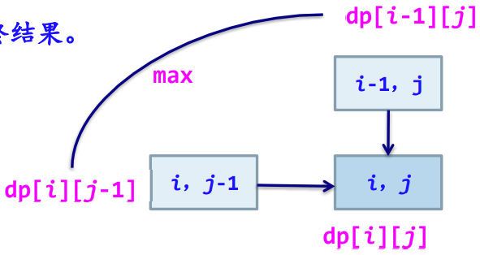
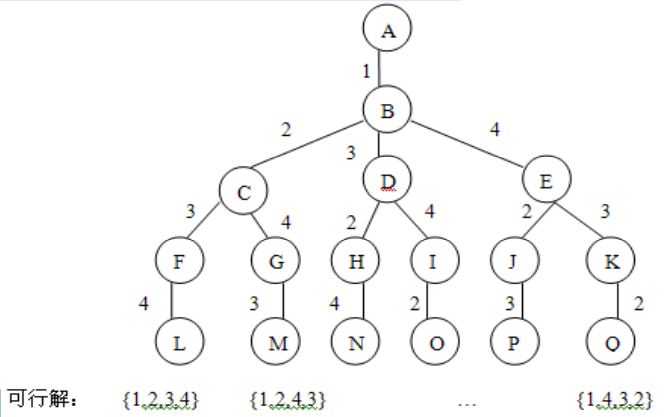

# 第一章 算法概述

## 1.1 算法的概念

### 1.1.1 算法的定义和特性
1. 算法的定义
   1. 非形式化定义：算法是规则的有限集合，是为解决特定问题而规定的一系列操作。
   2. 形式化定义：算法是一个四元组，即$(Q, I, \Omega, F)$，其中：
      1. Q: 包含子集I和$\Omega$的集合，表示计算状态
      2. I: 计算的输入集合
      3. $\Omega$: 计算的输出集合
      4. F: 计算的规则，是一个由Q到它自身的函数，具有自反性，即对于任何一个元素$q \in Q, F(q) \in Q$
   3. 一个算法是对于所有的输入元素x都能在有穷步骤内终止的一个方法
   4. 在算法的形式化定义中，对于任何一个$x \in I$，x均满足以下性质：$x_0 = x, x_{k+1} = F(x_k), k \ge 0$
      - 任何一个输入元素x均可得到一个序列，即$x_0, x_1, ..., x_k$。对任何输入元素x，该序列表示算法在第k步结束
2. 算法的特性
   1. 有限性：一个算法必须保证执行有限步之后结束
   2. 确定性：算法的每一步骤必须有确切的定义，不能有歧义
   3. 可行性：算法原则上能精确地运行，在现有条件下是可以实现的
   4. 输入：一个算法有0个或多个输入
   5. 输出：一个算法有一个或多个输出（广义输出：包括提供处理结果的多种形式），以反映对输入数据加工后的结果
3. 算法与程序的区别
   1. 算法描述了问题处理的方式或步骤，程序采用具体语言规则实现算法的功能
   2. 算法依靠程序来完成，算法是程序的灵魂
   3. 程序不一定满足有穷性，可直接在及其环境下运行
4. 算法描述方式
   1. 自然语言
   2. 框图（流程图）
   3. 高级语言
   4. 类语言

### 1.1.2 求解问题的基本过程
1. 明确问题性质并分析需求
2. 建立问题的描述模型
   1. 数值型问题 -> 建立数学模型
   2. 非数值型问题 -> 建立过程模型
3. 选择解决方法
4. 设计处理算法
   1. 数值型问题 -> 采用数值分析现成的经典算法
   2. 非数值型问题 -> 通过构建数据结构或算法分析设计进行处理
5. 程序化：将设计好的算法用特定的程序设计语言实现，并在具体的计算机上运行
6. 算法分析

### 1.1.3 算法设计示例——计算最大公约数
1. 欧几里得算法
   1. `r = m % n;`
   2. `if (r == 0) return(n); else goto(3);`
   3. `m = n; r = m; goto(1);`
   
   算法基于`gcd(m, n) == gcd(n, m % n)`， `gcd(m, 0) == m`。`(m, n) -> n == 0 ? m: gcd(n, m % n)`
2. 连续整数检测法
   1. `t = min(m, n);`
   2. `if (m % t == 0) goto(3); else goto(4);`
   3. `if (n % t == 0) return(t); else goto(4);`
   4. `t--; goto(2);`
3. 质因数分解法
   1. M = 获取质因数集(m)
   2. N = 获取质因数集(n)
   3. $mn = M \cap N$
   4. return 连乘(mn)


## 1.2 算法设计与分析任务
- 算法设计：设计解决给定问题的有效算法，构造问题的解
- 算法分析：涉及分析判断某一算法质量的准则和技术，对算法进行有效性评价


## 1.3 算法分析准则
1. 正确性：指假设给定有意义的输入，算法经有限时间计算，可产生正确答案
   1. 两方面含义：
      1. 解决问题的方法选取是正确的，也就是数学上的正确性
      2. 实现这个方法的一系列指令是正确的
   2. 四个层次
      1. 程序不含语法错误
      2. 程序对几组输入数据能得出满足规格要求的结果
      3. 对典型的、苛刻的、带有刁难性的几组输入有正确的结果
      4. 对一切合法的输入都能产生满足规格要求的结果
2. 可读性
3. 健壮性（鲁棒性）：程序对于规范要求以外输入情况的处理能力
4. 高效率和低存储量
   1. 效率：算法的执行时间。对于一个具体问题，执行时间短的算法运行效率高
   2. 存储量：算法在执行过程中所需要的最大存储空间


## 1.4 算法分析基础

### 1.4.1 常用数学术语
1. 计量单位（IEEE）
2. 阶乘函数
   1. $n! = 1 \times 2 \times 3 \times ... \times n$
   2. 斯特林公式：$n! \approx \sqrt[]{2 \pi n} (\frac{n}{e})^2$
3. 排列组合
   1. 排列数：$P_{n}^{r} = n(n-1)...(n-r+1) = \frac{n!}{(n-r)!}$
   2. 组合数：$C_{n}^{r} = \frac{n!}{(n-r)!r!} = \frac{n(n-1)...(n-r+1)}{r!}$
4. 布尔型变量
   - 在表达式中的布尔型变量将被赋予0/1值
5. 上下取整
   1. $\left \lceil x \right \rceil$ 向上取整：不小于x的最小整数
   2. $\left \lfloor x \right \rfloor$ 向下取整：不大于x的最大整数
   3. 取整函数的性质
      1. $x-1 < \left \lfloor x \right \rfloor \le x \le \left \lceil x \right \rceil \le x+1$
      2. $\left \lfloor n \right \rfloor + \left \lceil n \right \rceil = n$
   4. 对于$n \ge 0, a, b > 0$，有如下性质
      1. $\left \lceil \frac{\left \lceil \frac{n}{a} \right \rceil}{b} \right \rceil = \left \lceil \frac{n}{ab} \right \rceil = \left \lfloor \frac{\left \lfloor \frac{n}{a} \right \rfloor}{b} \right \rfloor$
      2. $\frac{a-(b-1)}{b} \le \left \lfloor \frac{a}{b} \right \rfloor \le \left \lceil \frac{a}{b} \right \rceil \le \frac{a+(b-1)}{b}$
6. 取模操作符：取模函数返回整除后的余数，数学表达式中用 n mod m 表示

### 1.4.2 对数与指数
$$
\begin{matrix}
 \log_{b}{y} = x \\
 b^x = y \\
 b^{\log_{b}{y}} = y \\
\end{matrix}
$$

任意函数m, n, r，任意正整数a, b, c，对数运算有性质：
1. $\log_{2}{(nm)} = \log_{2}{n} + \log_{2}{m}$
2. $\log_{2}{(\frac{n}{m})} = \log_{2}{n} - \log_{2}{m}$
3. $r = n^{\log_{n}{r}}$
4. $\log_{c}{n^r} = r \log_{c}{n}$
5. $\log_{a}{n} = \frac{\log_{b}{n}}{\log_{b}{a}}$

正整数m, n和实数$a > 0$，指数运算性质：
1. $(a^m)^n = a^{mn} = (a^n)^m$
2. $a > 1$ -> $a^n$ 为单调递增函数
3. $a > 1$ -> $\lim_{n \to \infty} \frac{n^b}{a^n} = 0$ -> $n^b = O(a^n)$
4. $e^x = 1 + x + \frac{x^2}{2!} + \frac{x^3}{3!} + ... = \sum_{i=0}^{\infty} \frac{x^i}{x!}$
5. $\lim_{n \to \infty} (1 + \frac{x}{n})^n = e^x$

### 1.4.3 数学证明法
1. 反证法：肯定题设而否定结论，从而得出矛盾
2. 数学归纳法：归纳奠基、归纳推导


## 1.5 算法复杂性分析方法
- 算法时间复杂度：算法中有关操作次数的多少，同T(n)表示【time】
- 算法空间复杂度：算法在执行过程中所占存储空间的大小，用S(n)表示【space】

### 1.5.1 复杂度函数
1. 复杂函数公式 C = F(N, I, A)
   1. N: 问题规模
   2. I: 输入
   3. A: 算法本身（具体计算时忽略）
2. 算法的时间复杂度
   1. 算法的时间复杂度
      - 一个算法的执行时间 = 算法中所有语句执行时间的总和
      - 每条语句的执行时间 = 该条语句的执行次数 * 执行一次所需实际时间
      - 非递归算法计算法
        - for/while循环：循环体内计算时间 * 循环次数
        - 嵌套循环：循环体内计算时间 * 所有循环次数
        - 顺序语句：各语句计算时间相加
        - if-else语句：if语句计算时间和else语句计算时间之中的较大者
   2. 算法耗费时间的计算公式：$T(N, I) = \sum_{i=1}^{k} t_i e_i (N, I)$
      1. N: 问题规模
      2. k: 计算机提供的元运算种类
      3. $t_i$: 第i种运算所需的时间
      4. $e_i$: 第i种运算次数
   3. 语句频度：该语句在一个算法中重复执行的次数
      1. 一个算法的时间耗费就是该算法中所有语句频度之和
      2. 在进行算法时间复杂度分析时，一般情况下不考虑常数，主要注重复杂度公式中的最高次项

### 1.5.2 最好、最坏和平均情况
1. 平均时间复杂度 $A(n) = \sum_{I \in D_n}^{n+l} D(I)f(I)$
   1. $D_n$: 多规模输入集
   2. P(I): 概率
   3. f(I): 操作时间
2. 最坏时间复杂度：问题消耗的上界 $W(n) = \max_{i \in D_n} t(i) = \max\{t(i)\}, 1 \le i \le n+1$
3. 最好时间复杂度：问题的最佳性、解决问题的下界
   1. 问题下界（最小消耗）的证明方法
      1. 设计算法A，找出一个函数W(n)，A至多是W(n)的上界
      2. 对于某个函数F，问题规模输入n，使算法至少运行F(n)次运算
      3. 若W和F相等，则A是最优的；若W和F不相等，则可能存在更好的算法或下界
4. 在实时系统时关注最坏情况分析，其他情况下，通常考虑平均情况

### 1.5.3 渐进分析
1. 当问题规模很大，且趋于无穷时对算法性能的分析，其渐进时间复杂度表示为 $\lim_{n \to \infty} T(n)$
2. 对算法资源开销的一种不精确的估算方法，为大规模问题的算法资源开销评估提供了一种简化的分析方法
3. 函数阶渐进形态的三种表示法
   1. 低阶$O(上界)$
      1. 若存在一个正常数C和$n_0$，对所有的$n>n_0$，都有$f(n) \le Cg(n)$，则记作$f(n) = O(g(n))$
      2. 即f的阶不高于g的阶
   2. 高阶$\Omega(下界)$
      1. 若存在一个正常数C和$n_0(C \ne 0)$，使得$\forall n \ge n_0, f(n) \ge Cg(n)$，记作$f(n) = \Omega(g(n))$
      2. 即f的阶高于g的阶
   3. 等阶$\theta$
      1. 当且仅当$f=O(g)$且$f(n) = \Omega(g(n))$时，f(n)与g(n)同阶
4. 渐进阶分析简化规则
   1. 若f(n)在O(g(n))中且g(n)在O(h(n))中，则f(n)在O(h(n))中 -> 函数阶满足传递性
   2. 若f(n)在O(kg(n))中对任意常数$k \ge 0$成立，则f(n)在O(g(n))中 -> 可忽略大O表示法中的常数因子
   3. 若$f_1(n)$在$O(g_1(n))$中，且$f_2(n)$在$O(g_2(n))$中，则$f_1(n) + f_2(n)$在O(max(g_1(n), g_2(n)))中 -> 顺序给出一个程序的多个部分，只需考虑其中开销较大的部分
   4. 若$f_1(n)$在$O(g_1(n))$中，且$f_2(n)$在$O(g_2(n))$中，则$f_1(n) f_2(n)$在O(g_1(n) g_2(n))中 -> 程序中的循环中有限次重复某种开销相等的操作，则总开销为每次开销与重复次数之积

### 1.5.4 阶的证明方法
1. 反证法：常用于否定的论述
2. 极限法：利用极限描述
   $$
   \lim_{n \to \infty} \frac{f(n)}{g(n)} = C
   \left\{\begin{matrix}若C \ne 0，则f和g同阶，f = \theta (g) \\
   若C = 0，则f和g不同阶，f = \Omega (g)，但g不是 \theta (f) \\
   若C = \infty，则f和g同阶，f是g的高阶
   \end{matrix}\right.
   $$
   洛必达法则常用于求极限，若$\lim_{n \to \infty} f(n) = \lim_{n \to \infty} g(n) = \infty$，则$\lim_{n \to \infty} \frac{f(n)}{g(n)} = \lim_{n \to \infty} \frac{f'(n)}{g'(n)}$


# 第二章 递归与分治策略

## 2.1 递归的概念
1. 递归：函数、过程、子程序在运行过程中直接或间接调用自身而产生的重入现象
   1. 任何间接递归都可以等价地转换为直接递归
   2. 尾递归：递归调用语句是最后一条执行语句的递归过程（函数）
2. 优点：描述简捷，结构清晰，算法的正确性比较容易证明
3. 缺点：执行效率低，空间消耗多，收软、硬件环境条件限制


## 2.2 具有递归特性的问题
1. 递归定义的数学函数
   1. 阿克曼函数
   $$
   Ack(m, n) = \left\{\begin{matrix}n+1 &,m=0 \\
   Ack(m-1, 1) &, m \ne 0, n = 0 \\
   Ack(m-1, Ack(n, n-1)) &, m \ne 0, n \ne 0
   \end{matrix}\right.
   $$
   2. 斐波那契数列
   $$
   F(n) = \left\{\begin{matrix}1 &, n = 0, 1 \\
   F(n-1)+F(n-2) &, n > 1
   \end{matrix}\right.
   $$
2. 递归定义的数据结构：广义表、（二叉）树...
3. 递归求解方法：欧几里得算法、汉诺塔问题...

---
1. 一般来说，能够用递归解决的问题应该满足以下三个条件
   1. 需要解决的问题可以转化为一个或多个子问题来求解，而这些子问题的求解方法与原问题完全相同，只是在数量规模上不同
   2. 递归调用的次数必须是有限的
   3. 必须有结束递归的条件来终止递归
2. 递归模型：递归算法的抽象，反应一个递归问题的递归结构
3. 递归出口：确定递归到何时结束 $f(s_1) = m_1$
4. 递归体：确定递归求解时的递推关系 $f(s_{n+1}) = g(f(s_i), f(s_{i+1}), ..., f(s_n), c_j, c_{j+1}, ..., c_n) n, i, j, m \in N^*$
   1. $s_{n+1}$: 大问题
   2. $s_i、s_{i+1}、...、s_n$: 小问题
   3. $c_j、c_{j+1}、...、c_m$: 若干非递归问题
   4. g: 非递归函数


## 2.3 递归过程的设计与实现
1. 递归算法的设计
   1. 寻找对问题进行分解的方法
   2. 寻找所分解问题的出口，即设计递归出口
2. 执行阶段
   1. 自上而下的递归进层阶段（递推阶段）
      1. 保存本层参数、返回地址
      2. 分配局部数据空间、传递参数
      3. 传第一条指令
   2. 自下而上的递归出层阶段（回归阶段）
      1. 恢复上层
      2. 传递结果
      3. 转断点执行

---
递归算法的执行过程的说明
1. 一个正确的递归程序虽然每次调用的是相同的子程序，但它的参量、输入数据等均有变化。
2. 在正常的情况下，随着调用的不断深入，必定会出现调用到某一层的函数时，不再执行递归调用而终止函数的执行，遇到递归出口便是这种情况。
3. 递归调用是函数嵌套调用的一种特殊情况，即它是调用自身代码。也可以把每一次递归调用理解成调用自身代码的一个复制件。
4. 由于每次调用时，它的参量和局部变量均不相同，因而也就保证了各个复制件执行时的独立性。
5. 系统为每一次调用开辟一组存储单元，用来存放本次调用的返回地址以及被中断的函数的参量值。
6. 这些单元以系统栈的形式存放，每调用一次进栈一次，当返回时执行出栈操作，把当前栈顶保留的值送回相应的参量中进行恢复，并按栈顶中的返回地址，从断点继续执行。

### 2.3.1 递归算法设计的一般步骤
1. 对原问题$f(s_n)$进行分析，抽象出合理的“小问题”$f(s_{n-1})$（与数学归纳法中假设n=k-1时等式成立相似）；
2. 假设$f(s_{n-1})$是可解的，在此基础上确定$f(s_n)$的解，即给出$f(s_n)$与$f(s_{n-1})$之间的关系（与数学归纳法中求证n=k时等式成立的过程相似）；
3. 确定一个特定情况（如f(1)或f(0)）的解，由此作为递归出口（与数学归纳法中求证n=1或n=0时等式成立相似）。

### 2.3.2 递归数据结构及其递归算法的设计
1. 递归数据结构的定义
   1. 递归数据结构：采用递归方式定义的数据结构
   2. 基本递归运算：在递归数据结构定义中包含的递归运算
2. 基于递归数据结构的递归算法设计
   1. 单链表的递归算法设计
      1. 设求解以L为首结点指针的整个单链表的某功能为“大问题”
      2. 设求解除首结点外余下结点构成的单链表（由L->next标识，而该运算为递归运算）的相同功能为“小问题”。
      3. 由大小问题之间的解关系得到递归体。
      4. 考虑特殊情况，通常是单链表为空或者只有一个结点时，这时很容易求解，从而得到递归出口。
   2. 二叉树的递归算法设计
      1. 设求解以b为根结点的整个二叉树的某功能为“大问题”。
      2. 转化为：求解其左、右子树的相同功能为“小问题”。
      3. 由大小问题之间的解关系得到递归体。
      4. 考虑特殊情况，通常是二叉树为空或者只有一个结点时，这时很容易求解，从而得到递归出口。
      5. 【例】对于含n（n>0）个结点的二叉树，所有结点值为int类型，设计一个算法由其先序序列a和中序序列b创建对应的二叉链存储结构。 

### 2.3.3 递归算法设计示例
> 注：代码使用python3编写，在代码对问题描述和下标与原始描述可能不符。

1. 青蛙跳台阶问题：一只青蛙一次可以跳上1级台阶，也可以跳上2级。编写代码求青蛙跳上一个n级的台阶，总共有多少种跳法？
2. 瓷砖覆盖问题：用一个2\*1的小矩形横着或竖着去覆盖更大的矩形。如用8个2\*1小矩形横着或竖着去覆盖2\*8的大矩形，覆盖方法有多少种？
3. 集合的全排列问题
   1. 设$R={r_1, r_2, ..., r_n}$是要进行排列的n个元素，显然一共有n!种排列。
   2. 令$R=R-{r_i}$。集合X中元素的全排列记为perm(X)，则$(r_i)perm(X)$表示在全排列perm(X)的每一个排列前加上前缀r，得到的排列。
   3. R的全排列归纳定义如下:
      1. 当n=1时，perm(R)=(r)，其中r是集合R中唯一的元素;
      2. 当n>1时，$perm(R)由(r_1)perm(R_1), (r_2)perm(R_2), ..., (r_n)perm(R_n)$构成。
   ```python
   def perm(r):
      if len(r) == 0:
         return []
      if len(r) == 1:
         return [r]
      result = []
      for i, x in enumerate(r):
         rem = r[:i] + r[i+1:]
         for p in perm(rem):
            result.append([x] + p)
      return result
   ```
4. 整数划分问题：把一个正整数n表示成一系列正整数之和：$n = n_1 + n_2 + ... + n_k (n_1 \ge n_2 \ge ... \ge n_k \ge 1)$
   1. 正整数n的这种表示称为正整数n的划分。
   2. 正整数n的不同划分个数称为正整数n的划分数，记作P(n)。
   3. 如果${n_1, n_2, ..., n_i}$中的最大加数s不超过m，即$s = max(n_1, n_2, ..., n_i) \le m$ ,则称它属于n的一个m划分。我们记n的m划分的个数为f(n, m)。该问题就转化为求n的所有划分个数f(n, n)。
      1. $f(1, m) = 1, m \ge 1$
         - 当n=1时，不论m的值为多少（m > 0），只有一种划分即1个1
      2. $f(n, 1) = 1, n \ge 1$
         - 当m=1时，不论n的值为多少（n > 0），只有一种划分即n个1
      3. $f(n, m) = f(n, n), m \ge n$
         - 最大加数s实际上不能超过n
      4. $f(n, n) = 1 + f(n, n-1)$
         - 正整数n的划分是由s=n的划分和$s \le n-1$的划分构成
      5. $f(n, m) = f(n, m-1) + f(n-m, m), n > m > 1$
         - 正整数n的最大加数s不大于m的划分，是由s=m的划分和$s \le m-1$的划分组成
   
   正整数n的划分数p(n) = f(n, n)
   $$
   f(n, m) = \left\{\begin{matrix}1 &, n = 1, m = 1 \\
   f(n, n) &, n < m \\
   1 + f(n, n-1) &, n = m \\
   f(n, m-1) + f(n-m, m) &, n > m > 1
   \end{matrix}\right.
   $$


### 2.3.4 递归算法转化非递归算法
1. 直接转化法：用循环结构替代递归过程，不需要使用栈。
   1. 尾递归：只有一个递归调用语句，而且是处于算法的最后。
   2. 单向递归：递归函数中虽然有一处以上的递归调用语句，但各次递归调用语句的参数只和主调用函数有关，相互之间参数无关，并且这些递归调用语句也和尾递归一样处于算法的最后。
2. 间接转化法：用栈消除递归过程，通过分析只保存必须保存的信息，从而用非递归算法替代递归算法，需要使用栈。
   1. 使用栈保存中间结果，从而将递归算法转化为非递归算法的过程。
   2. 在设计栈时，除了保存递归函数的参数等外，还增加一个标志成员(tag)，对于某个递归小问题f(s')，其值为1表示对应递归问题尚未求出，需进一步分解转换，为0表示对应递归问题已求出，需通过该结果求解大问题f(s)。


## 2.4 递归算法分析
当一个算法包含对自身的递归调用过程时，该算法的运行时间复杂度可用递归方程进行描述，求解该递归方程，可得到对该算法时间复杂度的函数度量。

### 2.4.1 替换法
替换方法的最简单方式为：根据递归规律，将递归公式通过方程展开、反复代换子问题的规模变量，通过多项式整理，如此类推，从而得到递归方程的解。

【例】汉诺塔算法递归方程
$$
T(n) = \left\{\begin{matrix}1 &, n = 1 \\
2T(n-1) + 1 &, n > 1
\end{matrix}\right.
$$
利用替换法求解该方程：
$$
\begin{align*}T(n) &= 2T(n-1) + 1 \\
&= 2(2T(n-2) + 1) + 1 \\
&= 2^2T(n-2) + 2 + 1 \\
&= 2^2(2T(n-3) + 1) + 2 + 1 \\
& ...... \\
&= 2^{k-1}(2T(n-k) + 1) + 2^{k-2} + ... + 2 + 1 \\
&= 2^{n-2}(2T(1) + 1) + 2^{n-2} + ... + 2 + 1 \\
&= 2^{n-1} + ... + 2 + 1 \\
&= 2^n - 1 \\
\end{align*}
$$
得到该算法的时间复杂度：$T(n) = O(2^n)$

【例】二路归并排序算法的递归方程
$$
T(n) = \left\{\begin{matrix}C_1 &, n = 1 \\
2T(\frac{n}{2} +C_2n) &, n > 1
\end{matrix}\right.
$$
当n>1时，利用替换法，可得：
$$
\begin{align*}T(n) &= 2T(\frac{n}{2}) + C_2n \\
&= 2[2T(\frac{n}{2^2}) + C_2(\frac{n}{2})] + C_2n \\
&= 2^2T(\frac{n}{2^2}) + 2C_2n \\
&= 2^2(2T(\frac{n}{2^3}) + C_2(\frac{n}{2^2})) + 2C_2n \\
&= 2^3(\frac{n}{2^3}) + 3C_2n \\
&= 2^kT(\frac{n}{2^k}) + kC_2n
\end{align*}
$$
取$n = 2^k$则$\forall n 2^i \le n \le 2^{n+1}, T(n) = nC_1 + C_2n \log_2n$（当n为奇数时，即$n = 2^k$可用$T(\frac{n+1}{2}) + T(\frac{n-1}{2})$替代$2T(\frac{n}{2})$
从而，$T(n) = 2^kT(\frac{n}{2^k}) + kC_2n = O(n \log_2n)$
即二次归并排序的算法时间复杂度为$T(n) = O(n \log_2n)$

上述递归方程推广至一般形式，记为：
$$
\left\{\begin{matrix}T(n) = aT(\frac{n}{b}) + d(n) &n > 1 \\
T(1) = 1 &n=1
\end{matrix}\right.
$$

对该方程通过替换法求解：
$$
\begin{align*}T(n) &= aT(\frac{n}{b}) + d(n) \\
&= a[aT(\frac{n}{b^2}) + d(\frac{n}{b})] + d(n) \\
&= a^2[aT(\frac{n}{b^3}) + d(\frac{n}{b^2})] + ad(\frac{n}{b}) + d(n) \\
&= a^3T(\frac{n}{b^3}) + a^2d(\frac{n}{b^2}) + ad(\frac{n}{b}) + d(n) \\
...... \\
&= a^iT(\frac{n}{b^i}) + \sum_{j=0}^{i-1} a^i d(\frac{n}{b^j})
\end{align*}
$$
由$n = b^k$可得到解的一般形式为：$T(n) = a^kT(1) + \sum_{j=0}^{k-1} a^j d(b^{k-j})$
一般设$n = b^k$，则$k = \log_b n$，可得到解的一般形式为：$T(n) = a^kT(1) + \sum_{j=0}^{k-1} a^j d(b^{k-j}) = a^{\log_b n}T(1) + \sum_{j=0}^{{\log_b n}-1} a^j d(b^{{\log_b n}-j})$

当$d(n) = c(常数)$时，有：
$$
\begin{align*}
T(n) &= a^k T(1) + \sum_{j=0}^{k-1} a^j d(b^{k-j}) \\
&= a^{\log_bn} T(1) + \sum_{j=0}^{\log_bn - 1} a^j d(b^{\log_bn - j})
\end{align*}
$$

$T(n) = a^{\log_bn} T(1) + c \sum_{j=0}^{\log_bn} a^j = O(n^{\log_ba})$

当$d(n) = cn$时，有：
$$
\begin{align*}
T(n) &= a^k T(1) + \sum_{j=0}^{k-1} a^j d(b^{k-j}) \\
&= a^k T(1) + \sum_{j=0}^{\log_bn-1} a^j (\frac{cn}{b^j}) \\
&= a^k T(1) + cn \sum_{j=0}^{\log _bn-1} (\frac{a}{b})^j
\end{align*}
$$
即该递归方程的解为：$T(n) = a^{\log_bn} T(1) + cn \sum_{j=0}^{\log_bn-1} r^j, (r = \frac{a}{b})$

推论：
$$
T(n) = \left\{\begin{matrix}
O(n) &, a < b \\
O(n \log_bn) &,a = b \\
O(n \log_bn) &,a > b
\end{matrix}\right.
$$

证明：
1. 当$a < b$时，$r < 1, \sum_{i=0}^{\infty} r^i$收敛，$cn \sum_{i=0}^{k-1} r^i = O(n)$，$T(n) = n^{\log_ba} + O(n) = O(n)$
   - $a^{\log_bn} = a^{\frac{\log_an}{\log_ab}} = a^{\log_an \cdot \log_ba} = n^{\log_ba}$
2. 当$a = b$时，有$r = 1, cn \sum_{j=0}^{\log_bn-1} r^j = cn \log_bn$，所以$T(n) = n^{\log_ba} + cn \log_bn = O(n \log_bn)$
3. 当$a > b$时，则$T(n) = O(n^{\log_ba})$
   - $cn \sum_{j=0}^{\log_bn-1} = cn \frac{(\frac{a}{b})^k}{\frac{a}{b} - 1} = O(a^k) = O(n^{\log_ba})$
   - $T(n) = a^{\log_bn} T(1) + O(a^k) = n^{\log_ba} + O(n^{\log_ba}) = O(n^{\log_ba})$

### 2.4.2 特征方程法
@ K阶常系数线性齐次递归方程
$$
\left\{\begin{matrix}
f(n) = a_1 f(n-1) + a_2 f(n-2) + ... + a_k f(n-k) \\
f(i) = b_i , 0 \le i \le k-1
\end{matrix}\right.
$$
其中，$b_i$为常数，第2项为方程初始条件。在上式中，用$x^n$取代$f(n)$，有：$x^n = a_1 x^{n-1} + a_2 x^{n-2} + ... + a_k x^{n-k}$
两边分别除以xn-k，得：$x^k = a_1 x_{k-1} + a_2 x_{k-2} + ... + a_k$
特征方程如下：$x^k - a_1 x_{k-1} - a_2 x_{k-2} - ... - a_k = 0$

解题原理：
1. 求解上述特征方程的根，得到递归方程的通解
2. 利用递归方程初始条件，确定通解中待定系数，得到递归方程的解

考虑2种情况：
1. 特征方程的k个根不相同
   - 假设：$q_1, q_2, ..., q_k$是k个不同的根，则递归方程的通解为$f(n) = c_1 q_1^n + c_2 q_2^n + ... + c_k q_k^n$
2. 特征方程的k个根有重根
   - 假设：r个重根$q_i, q_{i+1}, ..., q_{i+r-1}$，则递归方程的通解为$f(n)= c_{1} q_{1}^{n}+\ldots+c_{i-1} q_{i-1}^{n}+\left(c_{i}+c_{i+1} n+\ldots+c_{i+r-1} n^{r-1}\right) q_{i}^{n} +\ldots+c_{k} q^{k}$

前面2种情况下的$c_1, c_2, ..., c_k$均为待定系数；将初始条件代入，建立联立方程，确定各个系数具体值，得到通解f(n)。

解题原理：
1. 一般没有寻找特解的有效方法
2. 先根据g(n)具体形式，确定特解；再将特解代入递归方程，用待定系数法，求解特解的系数
3. g(n)分为以下几种情况
   1. g(n)是n的m次的多项式
      - g(n)形如：$g(n) = b_1 n^m + b_2 n^{m-1} + ... + b_m^n + b_{m+1}$
      - 其中，$b_i$为常数。
      - 此时，特解$f^*(n)$也是n的m次多项式，形如：$f^*(n) = A_1 n^m + A_2 n^{m-1} + ... + A_mn +A_{m+1}$
      - 各个系数$A_i$待定
   2. g(n)是n的指数函数
      - 见`@ K阶常系数线性非齐次递归方程`

@ K阶常系数线性非齐次递归方程
$$
\left\{\begin{array}{c}
f(n)=a_{1} f(n-1)+a_{2} f(n-2)+\ldots+a_{k} f(n-k)+g(n) \\
f(i)=b_{i} \quad 0 \leq i \leq k-1
\end{array}\right.
$$
它的通解形式为：$f(n)=\overline{f(n)}+f^{*}(n)$
其中，$\overline{f(n)}$为对应齐次递归方程的通解。$f^{*}(n)$为原非齐次递归方程的特解。

g(n)形如：$g(n)=\left(b_{1} n^{m}+b_{2} n^{m-1}+\ldots+b_{m} n+b_{m+1}\right) a^{n}$
其中，a和$b_i$为常数。
1. 如果a不是特征方程的重根，特解$f^*(n)$形如：$f^{*}(n)=\left(A_{1} n^{m}+A_{2} n^{m-1}+\ldots+A_{m} n+A_{m+1}\right) a^{n}$
2. 如果a是特征方程的r重特征根，特解$f^*(n)$形如：$f^{*}(n)=\left(A_{1} n^{m}+A_{2} n^{m-1}+\ldots+A_{m} n+A_{m+1}\right) n^{r} a^{n}$

各个系数$A_i$待定。

### 2.4.3 递归树法
基本过程：
1. 展开递归方程，构造对应的递归树。
2. 把每一层的时间进行求和，从而得到算法时间复杂度的估计。

递归树的方法可以更好地猜测一个问题的解，并用替换方法证明这个猜测。
例：$T(n) = 3 T(n/4) + cn^2$（n假设为4的幂）：


深度为i的结点，其子问题的规模为$n/4^i$，当$n/4^i = 1$时，子问题规模为1，这时位于树的最后一层（即$i = \log_4n$）。
- 上图的递归树中，层数是从0开始算起的，第一层层数为0，最后一层的层数为$\log_4n$，共有$\log_4n + 1$层。深度是从0开始算起的，第一层深度为0，最后一层深度为$\log_4n$。
- 第i层的结点数为$3^i$。(每一层的结点数是上一层结点数的三倍)
- 层数为$i (i = 0, 1, ..., \log_4n - 1)$的每个结点的开销为$c(n / 4^i)^2$(每一层子问题规模为上一层的1/4)
- 第i层上结点的总开销为$3^i (n/4^i)^2 = (3/16)^i cn^2 ,i = 0, 1, ..., \log_4n - 1$
- 层数为$\log_4n$的最后一层有$3^{\log_4n} = n^{\log_43}$个结点，每个结点的开销为T(1)，该层总开销$n^{\log_43} T(1)$即$\theta(n^{\log_43})$
- 将所有层的开销相加得到整棵树的开销：
   $$
   \begin{aligned}
   T(n) &=c n^{2}+\frac{3}{16} c n^{2}+\left(\frac{3}{16}\right)^{2} c n^{2}+\cdots+\left(\frac{3}{16}\right)^{\log _{4} n-1} c n^{2}+\theta\left(n^{\log _{4} 3}\right) \\
   &=\sum_{i=0}^{\log _{4} n-1}\left(\frac{3}{16}\right)^{i} c n^{2}+\theta\left(n^{\log _{4} 3}\right) \\
   & \leq \sum_{i=0}^{\infty}\left(\frac{3}{16}\right)^{i} c n^{2}+\theta\left(n^{\log _{4} 3}\right) \\
   &=\frac{1}{1-3 / 16} c n^{2}+\theta\left(n^{\log _{4} 3}\right) \\
   &\left.=\frac{16}{13} c n^{2}+\theta\left(n^{\log _{4} 3}\right)\right] \\
   &=O\left(n^{2}\right)
   \end{aligned}
   $$
- 利用替换法证明猜测
  - 假设这个界限对于n/4成立，即存在某个常数$d, T(n/4) \le d(n/4)^2$
  - 代入递归方程可得$T(n) = 3T(n/4) + cn^2 \le 3d(n/4)^2 + cn^2 = (3/16)dn^2 + cn^2$
  - 根据上面式子，当$c \le (13/16) d$时，有：$T(n) \le (3/16)dn^2 + (13/16)dn^2 = dn^2$

### 2.4.4 主方法
主方法（master method）提供了解如下形式递归方程的一般方法：$T(n) = aT(n / b) + f(n)$
其中，$a \ge 1, b >1$为常数，该方程描述了算法的执行时间，算法将规模为n的问题分解成a个子问题，每个子问题的大小为n/b。

主定理：$a \ge 1, b >1$为常数，f(n)为一个函数，T(n)由上述的递归方程定义，其中n为非负整数，则T(n)计算如下：
1. 若对某些常数$\varepsilon > 0$，有$f(n) = O(n^{\log_ba - \varepsilon})$，那么$T(n) = O(n^{\log_ba})$。
2. 若$f(n) = O(n^{\log_ba})$，那么$T(n) = O(n^{\log_ba} \log_2n)$。
3. 若对某些常数$\varepsilon > 0$，有$f(n) = O(n^{\log_ba + \varepsilon})$，并且对常数$c < 1$与所有足够大的n，有$af(n/b) \le cf(n)$，那么$T(n) = O(f(n))$。

定理应用过程：首先把函数f(n)与函数 进行比较，递归方程的解由这两个函数中较大的一个决定：
- 情况1：函数$n^{\log_ba}$比函数f(n)更大，则$T(n) = O(n^{\log_ba})$。
- 情况2：函数$n^{\log_ba}$和函数f(n)一样大，则$T(n) = O(n^{\log_ba} \log_2n)$。
- 情况3：函数$n^{\log_ba}$比函数f(n)小，则$T(n) = O(f(n))$。


## 2.5 分治法的基本思想
对于一个规模为n的问题：若该问题可以容易地解决（比如说规模n较小）则直接解决，否则将其分解为k个规模较小的子问题，这些子问题互相独立且与原问题形式相同，递归地解这些子问题，然后将各子问题的解合并得到原问题的解。

设计思想：将一个难以直接解决的大问题，分割成一些规模较小的相同问题

将一个大规模问题分解为若干子问题（子问题是原问题的小模式，而且相互之间独立），将子问题的解合并后就可以得到原问题的解，具体可以使用递归技术来完成。

两个特点：
1. 子问题相互独立且与原问题形式相同
2. 反复分治，使划分得到的小问题小到不可再分时，直接对其求解。


## 2.6 分治法的适用条件
分治法所能解决的问题一般具有以下特征：
1. 该问题的规模缩小到一定的程度就可以容易地解决。
2. 该问题可以分解为若干个规模较小的相同问题。（分治法的前提：反映了递归思想）
3. 利用该问题分解出的子问题的解可以合并为该问题的解。（关键，如不具备可以考虑贪心或动态规划）
4. 该问题所分解出的各个子问题是相互独立的，即子问题之间不包含公共的子问题。（涉及分治法的效率，若不独立，通常使用动态规划法）


## 2.7 分治法的基本步骤
分治法通常采用递归算法设计技术，在每一层递归上都有3个步骤：
1. 分解：将原问题分解为若干个规模较小，相互独立，与原问题形式相同的子问题。
2. 求解子问题：若子问题规模较小而容易被解决则直接求解，否则递归地求解各个子问题。
3. 合并：将各个子问题的解合并为原问题的解。

分治法算法设计框架
```c++
divide_and_conquer(P){
   if (|P| <= n0)
      return adhoc(P); // 解决小规模的问题
   divide P into smaller subinstances P1, P2, ... Pk; // 将P分解为较小的子问题
   for (i = 1; i <= k; i++)
      yi = divide_and_conquer(Pi); // 递归解决各子问题
   return merge(y1, y2, ..., yk); // 将子问题的解合并为原问题的解
}
```

大量实践发现，在用分治法设计算法时，最好使子问题的规模大致相同。即将一个问题分成大小相等的k个子问题的处理方法是行之有效的。当k=1时称为减治法。

二分法：许多问题可以取k=2，称为二分法，这种使子问题规模大致相等的做法是出自一种平衡子问题的思想，它几乎总是比子问题规模不等的做法要好。


## 2.8 分治法典型示例

### 2.8.1 排序问题
快速排序
【基本思想】在待排序的n个元素中任取一个元素（通常取第一个元素）作为基准，把该元素放入最终位置后，整个数据序列被基准分割成两个子序列，所有小于基准的元素放置在前子序列中，所有大于基准的元素放置在后子序列中，并把基准排在这两个子序列的中间，这个过程称作划分。

然后对两个子序列分别重复上述过程，直至每个子序列内只有一个记录或空为止。
```
f(a, s, t) -> 不做任何事情 ,当a[s..t]中长度小于2
f(a, s, t) -> i = Partition(a, s, t); f(a, s, i-1); f(a, i+1, t); ,其他情况
```

【分治策略】
1. 分解：将原序列$a[s..t]$分解成两个子序列$a[s..i-1]$和a$[i+1..t]$，其中i为划分的基准位置。
2. 求解子问题：若子序列的长度为0或为1，则它是有序的，直接返回；否则递归地求解各个子问题。
3. 合并：由于整个序列存放在数组中a中，排序过程是就地进行的，合并步骤不需要执行任何操作。

【算法描述】
```python
def partition(a, s, t):  # 一次划分算法
   tmp = a[s]  # 用序列的第1个记录作为基准
   while s != t:  # 从序列两端交替向中间扫描，直至s=t为止
      while s < t and tmp <= a[t]:
         t -= 1
      a[s] = a[t]
      while s < t and a[s] <= tmp:
         s += 1
      a[t] = a[s]
   a[s] = tmp
   return s

def quicksort(a, s, t):  # 对a[s..t]元素序列进行递增排序
   if s < t:  # 序列内至少存在2个元素的情况
      p = partition(a, s, t)
      quicksort(a, s, p - 1)  # 对左子序列递归排序
      quicksort(a, p + 1, t)  # 对右子序列递归排序
```

【算法分析】快速排序的时间主要耗费在划分操作上，对长度为n的区间进行划分，共需n-1次关键字的比较，时间复杂度为$O(n)$。
- 对n个记录进行快速排序的过程构成一棵递归树，在这样的递归树中，每一层至多对n个记录进行划分，所花时间为$O(n)$。
- 当初始排序数据正序或反序时，此时的递归树高度为n，快速排序呈现最坏情况，即最坏情况下的时间复杂度为$O(n^2)$；
- 当初始排序数据随机分布，使每次分成的两个子区间中的记录个数大致相等，此时的递归树高度为$\log_2n$，快速排序呈现最好情况，即最好情况下的时间复杂度为$O(n \log_2n)$。快速排序算法的平均时间复杂度也是$O(n \log_2n)$。

---
归并排序
【基本思想】首先将$a[0..n-1]$看成是n个长度为1的有序表，将相邻的$k (k \ge 2)$个有序子表成对归并，得到n/k个长度为k的有序子表；然后再将这些有序子表继续归并，得到$n / k^2$个长度为$k^2$的有序子表，如此反复进行下去，最后得到一个长度为n的有序表。
- 若$k = 2$，即归并在相邻的两个有序子表中进行的，称为二路归并排序。
- 若$k > 2$，即归并操作在相邻的多个有序子表中进行，则叫多路归并排序。

1. 自底向上的二路归并排序算法
   1. 分治策略：循环$\left \lceil \log_2n \right \rceil$次，length依次取1、2、...、$\log_2n$。每次执行以下步骤：
      1. 分解：将原序列分解成length长度的若干子序列。
      2. 求解子问题：将相邻的两个子序列调用merge算法合并成一个有序子序列。
      3. 合并：由于整个序列存放在数组中a中，排序过程是就地进行的，合并步骤不需要执行任何操作。
   2. 【算法描述】
      ```python
      def merge(a, l, m, h):
         tmp = []
         i = l
         j = m+1
         while i <= m and j <= h:
            if a[i] <= a[j]:
               tmp.append(a[i])
               i += 1
            else:
               tmp.append(a[j])
               j += 1
         tmp.extend(a[i:m+1])
         tmp.extend(a[j:h+1])
         a[l:h+1] = tmp

      def mergepass(a, len_, n):
         i = 0
         while i+2*len_ < n+1:
            merge(a, i, i+len_-1, i+2*len_-1)  # 归并length长的两相邻子表
            i += 2*len_
         if i + len_ < n + 1:  # 余下两个子表，后者长度小于length
            merge(a, i, i+len_-1, n-1)  # 归并这两个子表

      def mergesort(a):
         len_ = 1
         while len_ < len(a):
            mergepass(a, len_, len(a))
            len_ *= 2
      ```
   3. 【算法分析】对于上述二路归并排序算法，当有n个元素时，需要$\left \lceil \log_2n \right \rceil$趟归并，每一趟归并，其元素比较次数不超过n-1，元素移动次数都是n，因此归并排序的时间复杂度为$O(n \log_2n)$。
2. 自顶向下的二路归并排序算法
   1. 设归并排序的当前区间是$a[low..high]$，则递归归并的两个步骤如下：
      1. 分解：将序列$a[low..high]$一分为二，即求$mid = (low + high) / 2$；递归地对两个子序列$a[low..mid]$和$a[mid+1..high]$进行继续分解。其终结条件是子序列长度为1（因为一个元素的子表一定是有序表）。
      2. 求解子问题：排序两个子序列$a[low..mid]$和$a[mid+1..high]$。
      3. 合并：与分解过程相反，将已排序的两个子序列$a[low..mid]$和$a[mid+1..high]$归并为一个有序序列$a[low..high]$。
   2. 【算法描述】
      ```python
      def mergesort2(a, l, h):
         if l < h:
            m = (l+h)//2
            mergesort2(a, l, m)
            mergesort2(a, m+1, h)
            merge(a, l, m, h)
      ```
   3. 【算法分析】设$mergesort(a, 0, n-1)$算法的执行时间为T(n)，显然$merge(a, 0, n / 2, n-1)$的执行时间为O(n)，所以得到以下递推式：
      $$
      \begin{align*}
      T(n) &= 1 &,n = 1 \\
      T(n) &= 2T(n / 2) + O(n) &,n > 1 \\
      \end{align*}
      $$
      容易推出，$T(n) = O(n \log_2n)$。

### 2.8.2 查找问题
查找最大和次大元素【问题描述】对于给定的含有n元素的无序序列，求这个序列中最大和次大的两个不同的元素。

【问题求解】对于无序序列$a[low..high]$中，采用分治法求最大元素max1和次大元素max2的过程如下：
1. $a[low..high]$中只有一个元素：则$max1 = a[low], max2 = -INF$（要求它们是不同的元素）。
2. $a[low..high]$中只有两个元素：则$max1 = MAX\{a[low], a[high]\}, max2 = MIN\{a[low], a[high]\}$。
3. $a[low..high]$中有两个以上元素：按中间位置$mid = (low + high) / 2$划分为$a[low..mid]$和$a[mid+1..high]$左右两个区间（注意左区间包含$a[mid]$元素）。
4. 求出左区间最大元素lmax1和次大元素lmax2，求出右区间最大元素rmax1和次大元素rmax2。
5. 合并：若$lmax1 > rmax1$，则$max1 = lmax1, max2 = MAX\{lmax2, rmax1\}$；否则$max1 = rmax1, max2 = MAX\{lmax1, rmax2\}$。

【算法描述】
```python
def max12(a):
   if len(a) == 0:
      return -math.inf, -math.inf
   if len(a) == 1:
      return a[0], -math.inf
   if len(a) == 2:
      return max(a), min(a)
   lmax1, lmax2 = max12(a[:len(a)//2])
   rmax1, rmax2 = max12(a[len(a)//2:])
   if lmax1 > rmax1:
      max1 = lmax1
      max2 = max(lmax2, rmax1)
   else:
      max1 = rmax1
      max2 = max(rmax2, lmax1)
   return max1, max2
```

【算法分析】对于$solve(a, 0, n-1, max1, max2)$调用，其比较次数的递推式为：
$$
\begin{align*}
T(1) &= T(2) = 1 \\
T(n) &= 2T(n / 2) + 1 \\
\end{align*}
$$
可以推导出$T(n) = O(n)$。

折半查找【基本思路】：设$a[low..high]$是当前的查找区间，首先确定该区间的中点位置$mid = \left \lfloor (low  +high) / 2 \right \rfloor$；然后将待查的k值与$a[mid].key$比较：
1. 若$k = a[mid]$，则查找成功并返回该元素的物理下标；
2. 若$k < a[mid]$，则由表的有序性可知$a[mid..high]$均大于k，因此若表中存在关键字等于k的元素，则该元素必定位于左子表$a[low..mid-1]$中，故新的查找区间是左子表$a[low..mid-1]$；
3. 若$k > a[mid]$，则要查找的k必在位于右子表$a[mid+1..high]$中，即新的查找区间是右子表$a[mid+1..high]$。
4. 下一次查找是针对新的查找区间进行的。

【算法实现】
```python
def binsearch(a, l, h, k):
   if l > h:
      return -1
   mid = (l + h) // 2
   if a[mid] == k:
      return mid
   elif a[mid] > k:
      return binsearch(a, l, mid - 1, k)
   else:
      return binsearch(a, mid + 1, h, k)
```

【算法分析】折半查找算法的主要时间花费在元素比较上，对于含有n个元素的有序表，采用折半查找时最坏情况下的元素比较次数为C(n)，则有：
$$
\begin{align*}
C(n) &= 1 &,n = 1 \\
C(n) &\le 1 + C(\left \lfloor n / 2 \right \rfloor) &, n \ge 2 \\
\end{align*}
$$
由此得到：$C(n) \le \left \lfloor \log_2n \right \rfloor + 1$
折半查找的主要时间花在元素比较上，所以算法的时间复杂度为$O(\log_2n)$。

寻找一个序列中第k小元素【问题描述】对于给定的含有n元素的无序序列，求这个序列中第$k (1 \le k \le n)小的元素。

【问题求解】假设无序序列存放在$a[1..n]$中，若将a递增排序，则第k小的元素为$a[k]$。
采用类似于快速排序的思想。

对于序列$a[s..t]$，在其中查找第k小元素的过程如下：
- 将$a[s]$作为基准(即最小下标位置的元素为数轴)进行一次划分，对应的划分位置下标为i。3种情况：
- 
- 若$k = i - s + 1, a[i]$即为所求，返回$a[i]$。
- 若$k < i - s + 1$，第k小的元素应在$a[s..i-1]$子序列中，递归在该子序列中求解并返回其结果。
- 若$k > i - s + 1$，第k小的元素应在$a[i+1..t]$子序列中，递归在该子序列中求解并返回其结果。

【算法实现】
```python
def quickselect(a, s, t, k):
   if s < t:
      tmp = a[s]
      i = s
      j = t
      while i != j:
         while i < j and a[j] >= tmp:
            j -= 1
         a[i] = a[j]
         while i < j and a[i] <= tmp:
            i += 1
         a[j] = a[i]
      a[i] = tmp
      if k == i - s + 1:
         return a[i]
      elif k < i - s + 1:
         return quickselect(a, s, i - 1, k)
      else:
         return quickselect(a, i + 1, t, k - (i - s + 1))
   elif s == t and s == k - 1:
      return a[k - 1]
```

【算法分析】对于$quickselect(a, s, t, k)$算法，设序列a中含有n个元素，其比较次数的递推式为：$T(n) = T(n/2) + O(n)$
- 可以推导出$T(n)=O(n)$，这是最好的情况，即每次划分的基准恰好是中位数，将一个序列划分为长度大致相等的两个子序列。
- 在最坏情况下，每次划分的基准恰好是序列中的最大值或最小值，则处理区间只比上一次减少1个元素，此时比较次数为$O(n^2)$。
- 在平均情况下该算法的时间复杂度为$O(n)$。

### 2.8.3 组合问题
最大连续子序列和问题【问题描述】给定一个有$n (n \ge 1)$个整数的序列，要求求出其中最大连续子序列的和。
规定一个序列最大连续子序列和至少是0（长度为0的子序列），如果小于0，其结果为0。

【问题求解】对于含有n个整数的序列$a[0..n-1]$，若$n = 1$，表示该序列仅含一个元素，如果该元素大于0，则返回该元素；否则返回0。若$n > 1$，采用分治法求解最大连续子序列时，取其中间位置$mid = \left \lfloor (n - 1) / 2 \right \rfloor$，该子序列只可能出现3个地方。
1. 该子序列完全落在左半部即$a[0..mid]$中。采用递归求出其最大连续子序列和maxLeftSum。
2. 该子序列完全落在右半部即$a[mid+1..n-1]$中。采用递归求出其最大连续子序列和maxRightSum。
3. 该子序列跨越序列a的中部而占据左右两部分。
   - 
   - 结果：max3( maxLeftSum, maxRightSum, maxLeftBorderSum+maxRightBorderSum)

【算法描述】
```python
def maxsubsum(a, l, r):
   if l == r:
      return a[l] if a[l] > 0 else 0
   m = (l + r) // 2
   maxLeftSum = maxsubsum(a, l, m)
   maxRightSum = maxsubsum(a, m + 1, r)
   maxLeftBorderSum = leftBorderSum = 0
   for i in range(m, l - 1, -1):
      leftBorderSum += a[i]
      if leftBorderSum > maxLeftBorderSum:
         maxLeftBorderSum = leftBorderSum
   maxRightBorderSum = rightBorderSum = 0
   for i in range(m + 1, r + 1):
      rightBorderSum += a[i]
      if rightBorderSum > maxRightBorderSum:
         maxRightBorderSum = rightBorderSum
   return max(maxLeftSum, maxRightSum, maxLeftBorderSum + maxRightBorderSum)
```

【算法分析】设求解序列$a[0..n-1]$最大连续子序列和的执行时间为$T(n)$，第(1)、(2)两种情况的执行时间为$T(n / 2)$，第(3)种情况的执行时间为$O(n)$，所以得到以下递推式：
$$
\begin{align*}
T(n) &= 1 &, n = 1 \\
T(n) &= 2T(n / 2) + n &, n \ge 1 \\
\end{align*}
$$
容易推出，$T(n) = O(n \log_2n)$。

棋盘覆盖问题【问题描述】有一个$2^k \times 2^k (k > 0)$的棋盘，恰好有一个方格与其他方格不同，称之为特殊方格。现用L型骨牌  覆盖除特殊方格外的其他全部方格，骨牌可以任意旋转，但不能重叠。请给出一种覆盖方法。

【问题求解】棋盘中的方格数$= 2^k \times 2^k = 4^k$，覆盖使用的L型骨牌个数$= (4^k - 1) / 3$。
将棋盘划分为4个大小相同4个象限，根据特殊方格的位置$(dr, dc)$，在中间位置放置一个合适的L型骨牌。
例如，特殊方格在左上角象限中，在中间放置一个覆盖其他3个象限中各一个方格的L型骨牌。


用$(tr, tc)$表示一个象限左上角方格的坐标，$(dr, dc)$是特殊方格所在的坐标，size是棋盘的行数和列数。
用二维数组board存放覆盖方案，用tile全局变量表示L型骨牌的编号（从整数1开始），board中3个相同的整数表示一个L型骨牌。

【算法描述】
```python
def chessboard(b, t, d, s):  # t棋盘左上角，d特殊方格位置，s棋盘大小
   if s == 1:
      return
   global tile  # 初始为1
   tl = tile  # 取一个L型骨，其牌号为tile
   tile += 1
   s //= 2  # 分割棋盘
   if d[0] < t[0]+s and d[1] < t[1]+s:
      chessboard(b, t, d, s)
   else:
      b[t[0]+s-1][t[1]+s-1] = tl
      chessboard(b, t, (t[0]+s-1, t[1]+s-1), s)
   if d[0] < t[0]+s and d[1] >= t[1]+s:
      chessboard(b, (t[0], t[1]+s), d, s)
   else:
      b[t[0]+s-1][t[1]+s] = tl
      chessboard(b, (t[0], t[1]+s), (t[0]+s-1, t[1]+s), s)
   if d[0] >= t[0]+s and d[1] < t[1]+s:
      chessboard(b, (t[0]+s, t[1]), d, s)
   else:
      b[t[0]+s][t[1]+s-1] = tl
      chessboard(b, (t[0]+s, t[1]), (t[0]+s, t[1]+s-1), s)
   if d[0] >= t[0]+s and d[1] >= t[1]+s:
      chessboard(b, (t[0]+s, t[1]+s), d, s)
   else:
      b[t[0]+s][t[1]+s] = tl
      chessboard(b, (t[0]+s, t[1]+s), (t[0]+s, t[1]+s), s)
```

### 2.8.4 大整数乘法和矩阵乘法问题
大整数乘法问题【问题描述】设X和Y都是n（为了简单，假设n为2的幂，且X、Y均为正数）位的二进制整数，现在要计算它们的乘积$X*Y$。

当位数n很大时，可以用传统方法来设计一个计算乘积$X*Y$的算法，但是这样做计算步骤太多，显得效率较低。可以采用分治法来设计一个更有效的大整数乘积算法。

【问题求解】先将n位的二进制整数X和Y各分为两段，每段的长为n/2位，如图：
由此，$X = A * 2^{n / 2} + B, Y = C * 2^{n / 2} +D$。这样，X和Y的乘积为：$X * Y = (A * 2^{n / 2} + B) * (C * 2^{n / 2} + D) = A * C * 2^n + (A * D + C * B) * 2^{n / 2} + B * D$

如果这样计算$X*Y$，则必须进行4次$n / 2$位整数的乘法$(A * C、A * D、B * C和B * D)$，以及3次不超过n位的整数加法，此外还要做2次移位（分别对应乘2n和乘2n/2）。所有这些加法和移位共用O(n)步运算。

设T(n)是两个n位整数相乘所需的运算总数，则有以下递推式：
$$
\begin{align*}
T(n) &= O(1) &, n = 1 \\
T(n) &= 4T(n / 2) + O(n) &, n \ge 1 \\
\end{align*}
$$
由此可得$(T(n) = O(n^2)$。

采用分治法，把$X*Y$写成另一种形式，虽然该式看起来比前式复杂些，但它仅需做3次n/2位整数的乘法$A * C、B * D和(A - B) * (D - C)$，6次加、减法和2次移位。$T(n) = O(n^{1.59})$


# 第三章 动态规划

## 3.1 动态规划基础
动态规划：每次决策依赖于当前状态，又随即引起状态的转移，决策系列在变化的状态中逐步产生的，用多阶段最优化决策方式解决问题的过程。

### 3.1.1 动态规划的基本思想
动态规划的原理：动态规划是一种解决多阶段决策问题的优化方法，把多阶段过程转化为一系列单阶段问题，利用各阶段之间的关系，逐个求解。

动态规划通常是用递归程序实现的，递推关系是实现由分解后的子问题向最终问题求解转化的纽带。

指导思想：动态规划是建立在最优原则的基础上，在每一决策步上列出各种可能局部解，按某些条件舍弃肯定不能得到最优解的局部解，这是一个寻找最优判断序列的过程，即不论初始策略如何，下一次决策必须相对前一次决策产生的新状态构成最优序列。这样，在每一步都经过筛选，以每一步的最优性来保证全局的最优性。

基本思想：记录子问题并不断填表。即将待求解的问题分成若干个子问题，先求解子问题，然后从这些子问题的解得到原问题的解。适合动态规划算法求解的问题，经分解后不是互相独立的，即它们可以在多项式时间内被求解出来。

### 3.1.2 动态规划的基本要素
能采用动态规划求解的问题的一般要具有3个性质：
1. 最优性原理（最优子结构）：如果问题的最优解所包含的子问题的解也是最优的，就称该问题具有最优子结构，即满足最优性原理。
   - 证明最优子结构性质的方法：反证法。
     - 首先假设由问题的最优解导出的子问题的解不是最优的；
     - 然后再设法证明在这个假设下可以构造出比原问题最优解更好的解，导致矛盾。
     - 说明假设不成立，从而证明该问题具有最优子结构性质。
2. 无后效性（马尔可夫性）：即某阶段状态一旦确定，就不受这个状态以后决策的影响。也就是说，某状态以后的过程不会影响以前的状态，只与当前状态有关。
3. 有重叠子问题（子问题重叠性）：即子问题之间是不独立的，一个子问题在下一阶段决策中可能被多次使用到。（该性质并不是动态规划适用的必要条件，但是如果没有这条性质，动态规划算法同其他算法相比就不具备优势）。

### 3.1.3 动态规划的基本步骤
1. 分析最优解的性质，并刻画其结构特征。
2. 递归的定义最优值。
3. 以自底向上或自顶向下的记忆化方式计算出最优值。
4. 根据计算最优值时得到的信息，构造问题的最优解。

与其他方法的比较
- 基本思想与分治法类似，也是将待求解的问题分解为若干个子问题（阶段），按顺序求解子阶段，前一子问题的解，为后一子问题的求解提供了有用的信息。
- 在求解任一子问题时，列出各种可能的局部解，通过决策保留那些有可能达到最优的局部解，丢弃其他局部解。依次解决各子问题，最后一个子问题就是初始问题的解。
- 方法和贪心法相似，在动态规划中，可将一个问题的解决方案视为一系列决策的结果。
- 但在贪心法中，每采用一次贪心准则便做出一个不可回溯的决策，还要考察每个最优决策序列中是否包含一个最优子序列。

### 3.1.4 动态规划示例——组合数问题
1. 分析最优子结构：计算组合数$C_n^m$，可将原问题分解为求解两个子问题$C_{n-1}^{m-1}$、$C_{m}^{n-1}$，要采用自底向上的方法，先计算出$C_i^1 ,(i = 1...n)$，然后用公式$C_{i+1}^{2} = C_i^1 + C_i^2 ,(i = 1...n)$（初值$C_i^2 = 0$）....，依次计算出其他各项值并填表，当子问题被求解，原问题得解。由于采用了填表技术，子问题被求解后就不用重复计算，达到子问题最优求解方式，具有最优子结构的性质。
2. 建立递归关系：根据公式可以用$C[i][j](i=1~n, j=1~m)$来记录，即用一张表来记录重复子问题的结果。
   $$
   \left\{\begin{matrix}
   C_n^m = C_{n-1}^m + C_{n-1}^{m-1} &, n > m > 0 \\
   C_n^m = 1 &, m = 0 或 m = n
   \end{matrix}\right.
   $$
3. 计算最优值

【算法描述】
```python
def comb(n, m):
   c = [[0 for i in range(m + 1)] for j in range(n + 1)]
   for i in range(n + 1):
      for j in range(min(i + 1, m + 1)):
         if j == 0 or j == i:
            c[i][j] = 1
         else:
            c[i][j] = c[i - 1][j - 1] + c[i - 1][j]
   return c[n][m]
```


## 3.2 整数拆分问题
【问题描述】求将正整数n无序拆分成最大数为k（称为n的k拆分）的拆分方案个数，要求所有的拆分方案不重复。

【问题求解】采用动态规划求解整数拆分问题。设$f(n, k)$为n的k拆分的拆分方案个数：
1. 当$n = 1, k=1$时，显然$f(n, k) = 1$。
2. 当$n < k$时，有$f(n, k) = f(n, n)$。
3. 当$n = k$时，其拆分方案有将正整数n无序拆分成最大数为n-1的拆分方案，以及将n拆分成1个$n(n = n)$的拆分方案，后者仅仅一种，所以有$f(n, n) = f(n, n-1) + 1$。
4. 当$n > k$时，根据拆分方案中是否包含k，可以分为两种情况：
   1. 拆分中包含k的情况：即一部分为单个k，另外一部分为$\{x_1, x_2, ..., x_i\}$，后者的和为n-k，后者中可能再次出现k，因此是（n-k）的k拆分，所以这种拆分方案个数为$f(n-k, k)$。
   2. 拆分中不包含k的情况：则拆分中所有拆分数都比k小，即n的（k-1）拆分，拆分方案个数为$f(n, k-1)$。
   3. 因此，$f(n, k) = f(n-k, k) + f(n, k-1)$

状态转移方程：
$$
f(n, m) = \left\{\begin{matrix}1 &, n = 1, k = 1 \\
f(n, n) &, n < k \\
f(n, n-1) + 1 &, n = k \\
f(n - k, k) + f(n, k - 1) &, other
\end{matrix}\right.
$$

显然，求$f(n, k)$满足动态规划问题的最优性原理、无后效性和有重叠子问题性质。所以特别适合采用动态规划法求解。设置动态规划数组dp，用$dp[n][k]$存放$f(n, k)$。

【算法描述】
```python
def split(n, k):
   dp = [[0 for i in range(k + 1)] for j in range(n + 1)]
   for i in range(1, n + 1):
      for j in range(1, k + 1):
         if i == 1 or j == 1:
            dp[i][j] = 1
         elif i < j:
            dp[i][j] = dp[i][i]
         elif i == j:
            dp[i][j] = dp[i][j - 1] + 1
         else:
            dp[i][j] = dp[i][j - 1] + dp[i - j][j]
   return dp[n][k]
```

由于该问题本身是递归的，可以直接采用递归算法实现：
```python
def fun(n, k):
   if n == 1 or k == 1:
      return 1
   elif n < k:
      return fun(n, n)
   elif n == k:
      return fun(n, n - 1) + 1
   else:
      return fun(n - k, k) + fun(n, k - 1)
```

但由于子问题重叠，存在重复的计算！
可以采用这样的方法避免重复计算：设置数组dp，用$dp[n][k]$存放$f(n, k)$，首先初始化dp的所有元素为特殊值0，
当$dp[n][k]$不为0时表示对应的子问题已经求解，直接返回结果。

### 整数拆分问题——备忘录方法
```python
dp = [[0 for i in range(MAXN)] for j in range(MAXN)]
def dpf(n, k):
   if dp[n][k] != 0:
      return dp[n][k]
   if n == 1 or k == 1:
      dp[n][k] = 1
   elif n < k:
      dp[n][k] = dpf(n, n)
   elif n == k:
      dp[n][k] = dpf(n, n - 1) + 1
   else:
      dp[n][k] = dpf(n - k, k) + dpf(n, k - 1)
   return dp[n][k]
```

这种方法是一种递归算法，其执行过程也是自顶向下的，但当某个子问题解求出后，将其结果存放在一张表（dp）中，而且相同的子问题只计算一次，在后面需要时只有简单查表，以避免大量的重复计算。这种方法称之为备忘录方法（memorization method）。

备忘录方法是动态规划方法的变形：与动态规划算法不同的是，备忘录方法的递归方式是自顶向下的，而动态规划算法则是自底向上的。


## 3.3 最大连续子序列和问题
【问题描述】给定一个有$n (n \ge 1)$个整数的序列，要求求出其中最大连续子序列的和。
规定一个序列最大连续子序列和至少是0，如果小于0，其结果为0。

【问题求解】对于含有n个整数的序列a，设$b_j = \max\{a_i + a_{i+1} + ... + a_j\}, (1 \le i \le j)(1 \le j \le n)$
表示$a[1..j]$的前j个元素范围内的最大连续子序列和，则$b_{j-1}$表示$a[1..j-1]$的前j-1个元素范围内的最大连续子序列和。

当$b_{j-1} > 0$时，$b_j = b_{j-1} + a_j$，当$b_{j-1} \le 0$时，放弃前面选取的元素，从$a_j$开始重新选起，$b_j = a_j$。用一维动态规划数组dp存放b，对应的状态转移方程如下：$dp[0] = 0, dp[j] = MAX\{dp[j-1] + a_j, a_j\}$

构造问题的解：序列a的最大连续子序列和等于：$dp[j](1 \le j \le n)$中的 即$dp[maxj]$为dp数组中的最大值。在dp数组中，从该位置maxj向前找，找到第一个dp值小于或等于0的元素$dp[k]$，则a序列中从第$k+1~maxj$位置的元素的和构成了该序列的最大连续子序列的和。

【算法描述】
```python
def maxSubSum(a):
   dp = [0 for i in range(len(a)+1)]
   for i, v in enumerate(a):
      dp[i+1] = max(dp[i]+v, v)
   max_i = dp.index(max(dp))
   for k in range(max_i, -1, -1):
      if dp[k] <= 0:
         break
   return a[k:max_i]
```

【算法分析】maxSubSum()的时间复杂度为O(n)。


## 3.4 最长递增子序列问题
【问题描述】给定一个无序的整数序列$a[0..n-1]$，求其中最长递增子序列的长度。

【问题求解】设计动态规划数组为一维数组$dp, dp[i]$表示$a[0..i]$中以$a[i]$结尾的最长递增子序列的长度。对应的状态转移方程如下：
$$
\begin{align*}
dp[i] &= 1 &, 0 \le i \le n-1 \\
dp[i] &= max(dp[i], dp[j]+1) &, a[i] > a[j], 0 \le i,j \le n-1
\end{align*}
$$
此处的$dp[j]$是指对于所有的前j+1个元素的最长递增子序列的长度。
即：当检视$a[i]$时，就看看对于每一个$dp[j]$，在有了$a[i]$后，是否会增加递增子序列的长度。
求出dp后，其中最大元素即为所求。

【算法描述】
```python
def maxLongIncreasingSubseq(a):
   dp = [1 for _ in range(len(a))]
   for i in range(len(a)):
      for j in range(i):
         if a[i] > a[j]:
            dp[i] = max(dp[i], dp[j] + 1)
   return max(dp)
```

【算法分析】算法中含两重循环，时间复杂度为$O(n^2)$。


## 3.5 合唱队形问题
建立在线性结构或图结构的基础之上的线性动态规划算法，可解决的问题具有线性递推的特点，通常以某一结点为状态，向两个方向：即由前向后或者由后向前线性遍历每个状态，从中找出具有最优值的状态从而得到问题的解。

【问题描述】N位同学站成一排，音乐老师要请其中的(N-K)位同学出列，而不改变其他同学的位置，使得剩下的K位同学排成合唱队形。

1. 要求：设K位同学从左到右依次编号为1, 2, ...,K，他们的身高分别为$T_1, T_2, ..., T_K$，则他们的身高满足$T_1 < ... < T_i$，且$T_i > T_{i+1} > ... > T_K ,(1 \le i \le K)$。
   - 当给定队员人数N和每个学生的身高$T[i]$时，计算需要多少学生出列，可以得到最长的合唱队形。如图所示：
2. 分析最优子结构
   - 假设第i位同学为最高个，则对其左边序列求最长递增序列长度，对其右边序列求最长递减序列长度，然后两者相加再减1（因为第i位同学被重复计算了一次）即可得到整个合唱队形的长度。
   - 由此可见，原问题的解即最长的合唱队形取决于最大上升子序列和最大下降子序列的长度，具有最优子结构的性质。由于在某一时刻，它是单向的从一个状态线性递推到下一个状态，属于线性动态规划问。
3. 建立递归关系
   - 当组成最大上升子序列时，得到递归方程：
     - `f1(i) = max{f1(j) + 1};   (j<i, Tj<Ti)`
     - `f1(1) = 1;  // 递归出口`
   - 设$f2(i)$为后面$N-i+1$位排列的最大下降子序列长度，用同样的方法可以得到递归方程：
     - `f2(i) = max{f2(j) + 1};   (i<j, Tj<Ti)`
     - `f2(N) = 1;  // 边界值`
4. 计算最优值
   - 首先用数组a保存所有人的身高，第一遍正向扫描，从左到右求最大上升子序列的长度，
   - 然后反向扫描，从右到左求最大下降子序列的长度，
   - 然后依次枚举由前i个学生组成的最大上升子序列的长度和由后N-i+1个学生组成的最大下降子序列的和，则N次枚举后得到N个合唱队形的长度，
   - 取其中的最大值，然后用学生总数n减去该最大值即可得到原问题的解。

【算法描述】
```python
def ChorusRank(a):
   f1 = [1 for _ in range(len(a))]
   f2 = [1 for _ in range(len(a))]
   for i in range(len(a)):
      for j in range(i):
         if a[i] > a[j]:
            f1[i] = max(f1[i], f1[j] + 1)
         elif a[i] < a[j]:
            f2[i] = max(f2[i], f2[j] + 1)
   return max([g1+g2-1 for g1, g2 in zip(f1, f2)])
```

【算法分析】由于解决该问题时使用了两次动态规划方法来求解，即第一次求最大上升子序列的长度，第二次求最大下降子序列的长度，再枚举中间最高的一个人所在队形的长度。算法实现所需的时间复杂度$O(n^2)$，空间复杂度为$O(n)$。


## 3.6 三角形最小路径问题
【问题描述】给定高度为n的一个整数三角形，找出从顶部到底部的最小路径和，只能向下移动到相邻的整数结点。
- 输入：n，接下来的1～n行，第i行输入i个整数，
- 输出：分为2行，第一行为最小路径，第2行为最小路径和。

【问题求解】将三角形采用二维数组a存放，从顶部到底部查找最小路径，那么结点$(i, j)$的前驱结点只有$(i-1, j-1)$和$(i-1, j)$两个。

$dp[i][j]$表示从顶部$a[0][0]$查找到$(i, j)$结点时的最小路径和。
- 一般情况：
  - 
  - `dp[i][j] = min(dp[i-1][j-1], dp[i-1][j]) + a[i][j]`
- 特殊情况：两个边界，即第1列和对角线，达到它们中结点的路径只有一条而不是常规的两条。
  - `dp[i][0] = dp[i-1][0] + a[i][0]`
  - `dp[i][i] = dp[i-1][i-1] + a[i][i]`

状态转移方程如下：
$$
\begin{align*}
dp[0][0] &= a[0][0] &, 顶部边界 \\
dp[i][0] &= dp[i-1][0] + a[i][0] &, 第一列的边界 1 \le i \le n-1 \\
dp[i][i] &= dp[i-1][i-1] + a[i][i] &, 对角线边界 1 \le i \le n-1 \\
dp[i][j] &= min(dp[i-1][j-1], dp[i-1][j]) + a[i][j] &, i > 1的其他有两条达到路径的结点
\end{align*}
$$
最后求出的最小路径和$ans = min(dp[n-1][j]) ,(0 \le j < n)$。

找到的最短路径即$dp[i][j]$的路径输出问题：用$pre[i][j]$表示查找到$(i, j)$结点时最小路径上的前驱结点，由于前驱结点只有两个，即$(i-1, j-1)$和$(i-1, j)，用$pre[i][j]$记录前驱结点的列号即可。


在求出ans后，通过$pre[n-1][k]$反推求出反向路径，最后正向输出该路径。

【算法描述】
```python
def minimumPath(t):
   dp = [[0]*_ for _ in range(1, len(t)+1)]
   pre = [[0]*_ for _ in range(1, len(t)+1)]
   dp[0][0] = t[0][0]
   for i in range(1, len(t)):  # 第1列的边界
      dp[i][0] = dp[i-1][0] + t[i][0]
   for i in range(1, len(t)):  # 对角线的边界
      dp[i][i] = t[i][i] + dp[i-1][i-1]
   for i in range(2, len(t)):  # 有两条达到路径的结点
      for j in range(1, i):
         if dp[i-1][j-1] < dp[i-1][j]:
            pre[i][j] = j-1
            dp[i][j] = t[i][j] + dp[i-1][j-1]
         else:
            pre[i][j] = j
            dp[i][j] = t[i][j] + dp[i-1][j]
   min_len = min(dp[len(t)-1])
   min_index = dp[len(t)-1].index(min_len)
   path = []
   for row in pre[::-1]:
      path.append(min_index)
      min_index = row[min_index]
   path.reverse()
   return min_len, path
```

【算法分析】Search()算法中有i从2到n-1、j从1到i-1的两重循环，容易求出时间复杂度为$O(n^2)$。


## 3.7 最长公共子序列问题
【问题描述】字符序列的子序列是指从给定字符序列中随意地（不一定连续）去掉若干个字符（可能一个也不去掉）后所形成的字符序列。

子序列：例如，$X = (a, b, c, b, d, a, b), Y = (b, c, d, b)是X的一个子序列。 

给定两个字符序列A和B，如果字符序列Z既是A的子序列，又是B的子序列，则称序列Z是A和B的公共子序列。该问题是求两序列A和B的最长公共子序列（LCS）。

【问题求解】若设$X = (x_0, x_1, ..., x_{m-1})$（含m个字符），$Y = (y_0, y_1, ..., y_{n-1})$（含n个字符），设$Z = (z_0, z_1, ..., z_{k-1})$（含k个字符）为它们的最长公共子序列。不难证明有以下性质：
- 如果$x_{m-1} = y_{n-1}$，则$z_{k-1} = x_{m-1} = y_{n-1}，且$(z_0, z_1, ..., z_{k-2})$是$(x_0, x_1, ..., x_{m-2})$和$(y_0, y_1, ..., y_{n-2})$的一个最长公共子序列。
- 如果$x_{m-1} \ne y_{n-1}, z_{k-1} \ne x_{m-1}$，则$(z_0, z_1, ..., z_{k-1})$是$(x_0, x_1, ..., x_{m-2})$和$(y_0, y_1, ..., y_{n-1})$的一个最长公共子序列。
- 如果$x_{m-1} \ne y_{n-1}, z_{k-1} \ne y_{n-1}$，则$(z_0, z_1, ..., z_{k-1})$是$(x_0, x_1, ..., x_{m-1})$和$(y_0, y_1, ..., y_{n-2})$的一个最长公共子序列。

定义二维动态规划数组dp，其中$dp[i][j]$为子序列$(x_0, x_1, ..., x_{i-1})$和$(y_0, y_1, ..., y_{j-1})$的最长公共子序列的长度。每考虑字符$x[i]$或$y[j]$都为动态规划的一个阶段（共经历约$m \times n$个阶段）。
1. 情况1：$x[i-1] = y[j-1]$（当前两个字符相同）$dp[i][j] = dp[i-1][j-1] + 1$
2. 情况2：$x[i-1] \ne y[j-1]$（当前两个字符不同）$dp[i][j] = MAX(dp[i][j-1], dp[i-1][j])$

对应的状态转移方程如下：
$$
\begin{align*}
dp[i][j] &= 0 &,i = 0或j = 0 \\
dp[i][j] &= dp[i-1][j-1] + 1 &,x[i-1] = y[j-1] \\
dp[i][j] &= MAX(dp[i][j-1], dp[i-1][j]) &,x[i-1] \ne y[j-1]
\end{align*}
$$
显然，$dp[m][n]$为最终结果。 

dp -> lcs：$dp[i][j] \ne dp[i][j-1]$（左边）并且$dp[i][j] \ne dp[i-1][j]$（上方）值时：$a[i-1] = b[j-1]$将$a[i-1]$添加到LCS中。
- $dp[i][j] = dp[i][j-1]$：与左边相等 -> j--
- $dp[i][j] = dp[i-1][j]$：与上方相等 -> i--
- 与左边、上方都不相等：$a[i-1]$或者$b[j-1]$属于LCS -> i--, j--

【算法描述】
```python
def lcs(x, y):
   m = len(x)
   n = len(y)
   dp = [[0 for i in range(n+1)] for j in range(m+1)]
   for i in range(1, m+1):
      for j in range(1, n+1):
         if x[i-1] == y[j-1]:
            dp[i][j] = dp[i-1][j-1] + 1
         else:
            dp[i][j] = max(dp[i-1][j], dp[i][j-1])
   k = dp[m][n]
   i = m
   j = n
   res = ''
   while k > 0:
      if dp[i][j] == dp[i-1][j]:
         i -= 1
      elif dp[i][j] == dp[i][j-1]:
         j -= 1
      else:
         res += x[i-1]
         k -= 1
         i -= 1
         j -= 1
   return res[::-1]
```

【算法分析】 LCSlength算法中使用了两重循环，所以对于长度分别为m和n的序列，求其最长公共子序列的时间复杂度为$O(m \times n)$。空间复杂度为$O(m \times n)$。


## 3.8 编辑距离问题
编辑距离：将一个字符串变换为另一个字符串所需要的最小编辑操作序列。

该问题具有最优子结构性质（证明略）可采用动态规划法进行求解。

【问题描述】设A和B是两个字符串。现在要用最少的字符操作次数（编辑距离最小），将字符串A转换为字符串B。这里所说的字符编辑操作共有3种：
1. 删除一个字符（delete）；
2. 插入一个字符（insert）；
3. 将一个字符替换另一个字符（replace）。

【问题求解】设字符串A、B的长度分别为m、n，分别用字符串a、b存放。
设计一个动态规划二维数组dp，其中$dp[i][j]$表示：将$a[0..i-1] ,(1 \le i \le m)$与$b[0..j-1] ,(1 \le j \le n)$的最优编辑距离（即$a[0..i-1]$转换为$b[0..j-1]$的最少操作次数）。

两种特殊情况（边界条件）
- 当B串空时，要删除A中全部字符转换为B，即$dp[i][0]=i$（删除A中i个字符，共i次操作）；
- 当A串空时，要在A中插入B的全部字符转换为B，即$dp[0][j]=j$（向A中插入B的j个字符，共j次操作）。

对于串A和串B均非空的情况
1. 当$a[i-1] = b[j-1]$时，这两个字符不需要任何操作，即$dp[i][j] = dp[i-1][j-1]$。
2. 当$a[i-1] \ne b[j-1]$时，以下3种操作都可以达到目的：
   1. 将$a[i-1]$替换为$b[j-1]$，有：$dp[i][j] = dp[i-1][j-1] + 1$（一次替换操作的次数计为1）。
      - 执行一次替换操作，
      - 之后长度为i的A串转换为长度为j的B串的编辑距离问题转化为：将长度为i-1的A串转换为长度为j-1的B串的编辑距离问题。即：$dp[i][j] = dp[i-1][j-1] + 1$
   2. 在$a[i-1]$字符后面插入$b[j-1]$字符，有：$dp[i][j] = dp[i][j-1] + 1$（一次插入操作的次数计为1）。
      - 执行一次插入操作，在A串末尾插入$b[j-1]$，
      - 之后长度为i的A串转换为长度为j的B串的编辑距离问题转化为：将长度为i的A串转换为长度为j-1的B串的编辑距离问题。即：$dp[i][j] = dp[i][j-1] + 1$
   3. 删除$a[i-1]$字符，有：$dp[i][j] = dp[i-1][j] + 1$（一次删除操作的次数计为1）。
      - 执行一次删除操作，将A串末尾的$a[i-1]$删除，
      - 之后长度为i的A串转换为长度为j的B串的编辑距离问题转化为：将长度为i-1的A串转换为长度为j的B串的编辑距离问题。即：$dp[i][j] = dp[i-1][j] + 1$
   4. 此时$dp[i][j]$取3种操作的最小值。$dp[i][j] = min(dp[i-1][j-1], dp[i][j-1], dp[i-1][j]) + 1$

最后得到的$dp[m][n]$即为所求。即将A串转换为B串的编辑距离最优值。

【算法描述】
```python
def geneedit(a, b):
   dp = [[0 for i in range(len(b)+1)] for j in range(len(a)+1)]
   for i in range(len(a)+1):
      dp[i][0] = i
   for j in range(len(b)+1):
      dp[0][j] = j
   for i in range(1, len(a)+1):
      for j in range(1, len(b)+1):
         if a[i-1] == b[j-1]:
            dp[i][j] = dp[i-1][j-1]
         else:
            dp[i][j] = min(dp[i-1][j], dp[i][j-1], dp[i-1][j-1]) + 1
   return dp[len(a)][len(b)]
```

【算法分析】solve()算法中有两重循环，对应的时间复杂度为O(mn)。


## 3.9 0/1背包问题
【问题描述】假设有n个商品和一个购物车，每个商品i对应的价值为vi，重量（体积）为wi，购物车的容量为W。且假设每个商品只有1件，要么装入，要么不装入，不可拆分。

【问题描述】有n个重量分别为$\{w_1, w_2, ..., w_n\}$的物品，它们的价值分别为$\{v_1, v_2, ..., v_n\}$，给定一个容量为W的背包。
设计从这些物品中选取一部分物品放入该背包的方案，每个物品要么选中要么不选中，要求选中的物品不仅能够放到背包中，而且重量和为W具有最大的价值。

【问题求解】对于可行的背包装载方案，背包中物品的总重量不能超过背包的容量。
最优方案是指所装入的物品价值最高，即$v_1*x_1 + v_2*x_2 + ... + v_n*x_n$（其中$x_i$取0或1，取1表示选取物品i）取得最大值。
在该问题中需要确定$x_1、x_2、...、x_n$的值。假设按$i = 1, 2, ..., n$的次序来确定$x_i$的值，对应n次决策即n个阶段。

1. 问题划分阶段：将整体问题划分成若干个阶段（阶段一定是有序的）
   - 设置一个解向量$X(x_1, x_2, ..., x_n)$
   - 含义：n个物品，每一个对应一个$x_i$，
     - $x_i = 0$代表对应的物品i不放入背包，
     - $x_i = 1$代表对应的物品i放入背包
   - 假设按$i = 1, 2, ..., n$来确定$x_i$的值，对应n次决策即n个阶段的次序。
   - 例如：若背包当前容量为r，（前提背包当前容量$r \ge w_i$）
     - 若$x_1 = 0$ -> 问题转化为其余物品$(x_2, ..., x_n)$，背包容量为r的问题，此时解向量为$(0, x_2, ..., x_n)$，当前背包容量为r
     - 若$x_1 = 1$ -> 问题转化为其余物品$(x_2, ..., x_n)$，背包容量为$r - w_1$的问题，此时解向量为$(1, x_2, ..., x_n)$，当前背包剩余容量为$r - w_1$
   - 决策第i个物品的情况，当前背包剩余容量为r
     - 若（即第i个物品的重量）$w_i > r$，则不装入第i个物品。即$X(x_1, x_2, ..., x_{i-1}, 0, x_{i+1}, ..., x_n)$
     - 若（即第i个物品的重量）$w_i \le r$，则
       - 装入第i个物品，问题转换为：$X(x_1, x_2, ..., x_{i-1}, 0, x_{i+1}, ..., x_n)$，当前背包容量为r
       - 装入第i个物品，问题转换为：$X(x_1, x_2, ..., x_{i-1}, 1, x_{i+1}, ..., x_n)$，当前背包剩余容量为$r - w_i$
2. 状态描述及状态变量：
   - 设置二维动态规划数组dp，$dp[i][r]$表示当前背包（剩余）容量为$r ,(1 \le r \le W)$，
   - 此时已装入了（1~i-1中的某些物品后），现在考虑第i个物品的决策后，背包装入物品的最优价值。
   - 
3. 确定状态转移公式（方程）：
   - 设置二维动态规划数组dp，即由第i-1个物品决策后形成的第i-1个状态（阶段）如何决策第i个状态（阶段）
   - $dp[i][r]$表示当前背包（剩余）容量为$r ,(1 \le r \le W)$，
   - 此时已装入了（1~i-1中的某些物品后），现在考虑第i个物品的决策后，背包装入物品的最优价值。

状态转移方程如下：
- 【边界条件】
  - $dp[i][0] = 0 ,(1 \le i \le n)$（背包不能装入任何物品，总价值为0）
  - $dp[0][r] = 0 ,(1 \le r \le W)$（没有任何物品可装入，总价值为0）
- 若$r < w_i$即当前背包剩余容量r<物品i的重量时：$dp[i][r] = dp[i-1][r]$（当$r < w[i]$时，物品i放不下对应的$x_i = 0$）
- 若$r \ge w_i$即当前背包剩余容量r>=物品i的重量时：对于物品i的决策有两种情况：
  - 物品i不被装入则$dp[i][r] = dp[i-1][r]$
  - 物品i被装入则$dp[i][r] = dp[i-1][r-w[i]] + v[i]$
- $dp[i][r] = MAX{dp[i-1][r], dp[i-1][r-w[i]] + v[i]}$
- 

由dp数组推导解向量x：从$dp[n][W]$开始
- 若$dp[i][r] \ne dp[i-1][r]$，若$dp[i][r] = dp[i-1][r-w[i]] + v[i]$，置$x[i] = 1$，累计总价值$maxv += v[i]$，递减剩余重量$r = r - w[i]$。
- 若$dp[i][r] = dp[i-1][r]$，表示物品i放不下或者不放入物品i，置$x[i]=0$。

【算法描述】
```python
def Knap(wv, W):
   wv = [[0, 0]] + wv
   dp = [[0 for i in range(W+1)] for j in range(len(wv))]
   for i in range(0, len(wv)):
      for r in range(1, W+1):
         if r < wv[i][0]:
            dp[i][r] = dp[i-1][r]
         else:
            dp[i][r] = max(dp[i-1][r], dp[i-1][r-wv[i][0]] + wv[i][1])
   x = []
   i = len(wv)-1
   while i >= 0:
      if dp[i][W] != dp[i-1][W]:
         x.append(i)
         W -= wv[i][0]
      i -= 1
   return x[::-1], sum(wv[i][1] for i in x)
```

【算法分析】Knap()算法中含有两重for循环，所以时间复杂度为$O(n \times W)$，空间复杂度为$O(n \times W)$。


# 第四章 贪心算法

## 4.1 贪心算法基础

### 4.1.1 贪心算法的基本思想
- 贪心法的基本思路是在对问题求解时总是做出在当前看来是最好的选择，也就是说贪心法不从整体最优上加以考虑，所做出的仅是在某种意义上的局部最优解。
- 方法的“贪婪性”反映在对当前情况总是作最大限度的选择，即贪心算法总是做出在当前看来是最好的选择。

---
- 贪心法从问题的某一个初始解{}出发，采用逐步构造最优解的方法向给定的目标前进，每一步决策产生n-元组解$(x_0, x_1, ..., x_{n-1})$的一个分量。
- 贪心法每一步上用作决策依据的选择准则被称为最优量度标准（或贪心准则），也就是说，在选择解分量的过程中，添加新的解分量$x_k$后，形成的部分解$x_0, x_1, ..., x_k$不违反可行解约束条件。
- 每一次贪心选择都将所求问题简化为规模更小的子问题，并期望通过每次所做的局部最优选择产生出一个全局最优解。

---
- 【存在问题】在很多情况下，所有局部最优解合起来不一定构成整体问题的最优解，所以贪心法不能保证对所有问题都得到整体最有解。
- 【解决方法】需要证明该算法的每一步做出的选择都必然最终导致问题的整体最优。

### 4.1.2 贪心算法的基本要素
1. 贪心选择性质
   - 所谓贪心选择性质是指所求问题的整体最优解可以通过一系列局部最优的选择，即贪心选择来达到。
   - 也就是说，贪心法仅在当前状态下做出最好选择，即局部最优选择，然后再去求解做出这个选择后产生的相应子问题的解。
   - 证明方法：用数学归纳法证明。
     - 先考虑问题的一个整体最优解，并证明：
       - 可以修改这个最优解，使其从贪心选择开始，在做出贪心选择后，原问题可以转化为规模较小的类似问题，通过每一步的贪心选择，最后得到问题的整体最优解。
2. 最优子结构性质
   - 如果一个问题的最优解包含其子问题的最优解，则称此问题具有最优子结构性质。
   - 问题的最优子结构性质是该问题可用动态规划算法或贪心法求解的关键特征。
   - 证明方法：用反证法证明。
     - 首先：假设由这个问题的最优解X导出的子问题的解X’不是最优的。
     - 然后：证明在这个假设下可以构造出比原问题的最优解X更优的解Y，从而引出矛盾。
     - 得证:问题具有最优子结构性质。

动态规划算法和贪心算法的区别
| 项目     | 基本思想     | 依赖子问题的解 | 解问题的方向 | 最优解   | 复杂程度 |
| -------- | ------------ | -------------- | ------------ | -------- | -------- |
| 贪心选择 | 贪心选择     | 否             | 自顶向下     | 局部最优 | 简单有效 |
| 动态规划 | 递归定义填表 | 是             | 自底向上     | 整体最优 | 较复杂   |

### 4.1.3 贪心算法适合的问题
1. 贪心算法通常用来解决具有最大值或最小值的优化问题。
2. 它是从某一个初始状态出发，根据当前局部而非全局的最优决策，以满足约束方程为条件，以使得目标函数的值增加最快或最慢为准则，选择一个最快地达到要求的输入元素，以便尽快地构成问题的可行解。

### 4.1.4 贪心算法的基本步骤
1. 选定合适的贪心选择的标准；
2. 证明在此标准下该问题具有贪心选择性质；
3. 证明该问题具有最优子结构性质；
4. 根据贪心选择的标准，写出贪心选择的算法，求得最优解。
   - 贪心法的一般求解过程算法框架如下（设解向量$(x_0, x_1, ..., x_{n-1})$类型为SolutionType，其分量为SType类型）：
      ```c++
      SolutionType Greedy(SType C[]) { // C:候选集合（问题的输入集合）
         SolutionType S = {}; // 解集合（初始为空集）
         while (not solution(S)) { //集合S没有构成问题的一个解
            x = select(C); // 在候选集合C中做贪心选择
            if feasiable(S, x) // 判断集合S中加入x后的解是否可行
               S = S + {X};
            C = C - {x};
         }
         return S;
      }
      ```

### 4.1.5 贪心算法示例——背包问题
【问题描述】设有编号为$1, 2, ..., n$的n个物品，它们的重量分别为$w_1, w_2, ..., w_n$，价值分别为$v_1, v_2, ..., v_n$，其中$w_i, v_i, (1 \le i \le n)$均为正数。
- 有一个背包可以携带的最大重量不超过W。
- 求解目标：在不超过背包负重的前提下，使背包装入的总价值最大（即效益最大化），与0/1背包问题的区别是，这里的每个物品可以取一部分装入背包。

【问题求解】设$x_i$表示物品i装入背包的情况，$0 \le x_i \le 1$。根据问题的要求，有
- 约束条件：$\sum_{i=1}^{n} w_i x_i \le W, (0 \le x_i \le 1, (1 \le i \le n))$
- 目标函数：$\max{\sum_{i=1}^{n} v_i x_i}$

问题转化为：寻找一个满足上述约束条件，并使目标函数达到最大的解向量$X = \{x_1, x_2, ..., x_n\}$。
- “效益”优先，使每装入一件物品就使背包获得最大可能的效益值增量。按物品收益从大到小排序...
  - 非最优解。原因：只考虑当前收益最大,而背包可用容量消耗过快
- 选重量作为量度，使背包容量尽可能慢地被消耗。按物品重量从小到大排序...
  - 最优解。原因：虽然容量消耗慢，但效益没有很快的增加
- 选利润/重量为量度，使每一次装入的物品应使它占用的每一单位容量获得当前最大的单位效益。按物品的$v_i / w_i$从大到小排序
  - 最优解

【贪心策略】选择单位重量价值最大的物品。
- 每次从物品集合中选择单位重量价值最大的物品，如果其重量小于背包容量，就可以把它完全装入，并将背包容量减去该物品的重量，然后就面临了一个最优子问题——它同样是背包问题，只不过背包容量减少了，物品集合减少了。
- 背包问题具有最优子结构性质。
- 代码实现
   ```python
   def Knap(w, a):  # w限重，a待放入的物品(重量, 价值)
      x = []
      a.sort(key=lambda x: x[1]/x[0], reverse=True)
      for ow, ov in a:
         x.append(1 if ow <= w else w/ow)
         w -= x[-1]*ow
         if w <= 0:
               break
      total = sum([i*j*k for i, (j, k) in zip(x, a)])
      return total, w  # 总价值，剩余重量
   ```

贪心法求解（部分背包问题）算法证明
1. 证明问题具有贪心选择性质（即证明：设背包按其单位价值量$v_i/w_i$由高到低排序，$(x_1, x_2, ..., x_n)$是背包问题的一个最优解。）
   1. 【算法证明】假设对于n个物品，按$w_i, v_i, (1 \le i \le n)$值递减排序得到1、2、...、n的序列，即$v_1 / w_1 \ge v_2 / w_2 \ge ... \ge v_n / w_n$。设$X = \{x_1, x_2, ..., x_n\}$是本算法找到解。
   2. 如果所有的$x_i$都等于1，这个解明显是最优解。否则，设minj是满足$x_{minj} < 1$的最小下标。考虑算法的工作方式，很明显，当$i < minj$时，$x_i = 1$，当$i > minj$时，$x_i = 0$；当$i = minj$时，$0 \le x_i < 1$。
   3. 设X的价值为$V(X) = \sum_{i+1}^{n} v_i x_i$并且此时的X为最优解。
   4. 设$Y = \{y_1, y_2, ..., y_n\}$是该背包问题的一个最优可行解，因此有$\sum_{i=1}^{n} w_i y_i \le W$
   5. 从而有$\sum_{i=1}^{n} w_i (x_i - y_i) = \sum_{i=1}^{n} w_i x_i - \sum_{i=1}^{n} w_i y_i \ge 0$，这个解的价值为$V(Y) = \sum_{i=1}^{n} v_i y_i$，则$V(X) - V(Y) = \sum_{i=1}^{n} v_i (x_i - y_i) = \sum_{i=1}^{n} w_i \frac{v_i}{w_i} (x_i - y_i)$
   6. 当$i < minj$时，$x_i = 1$，所以$x_i - y_i \ge 0$，且$v_i / w_i \ge v_{minj} / w_{minj}$。
   7. 当$i > minj$时，$x_i = 0$，所以$x_i - y_i \le 0$，且$v_i / w_i \le v_{minj} / w_minj$。
   8. 当$i = minj$时，$v_i / w_i = v_{minj} / w_{minj}$。
   9. 则$V(X) - V(Y) = \sum_{i=1}^{n} w_i \frac{v_i}{w_i} (x_i - y_i) = \sum_{i=1}^{minj-1} w_i \frac{v_i}{w_i} (x_i - y_i) + \sum_{i=minj}^{minj} w_i \frac{v_i}{w_i} (x_i - y_i) + \sum_{i=minj+1}^{n} w_i \frac{v_i}{w_i} (x_i - y_i) \ge \sum_{i=1}^{minj-1} w_i \frac{v_{minj}}{w_{minj}} (x_i - y_i) + \sum_{i=minj}^{minj} w_i \frac{v_{minj}}{w_{minj}} (x_i - y_i) + \sum_{i=minj+1}^{n} w_i \frac{v_{minj}}{w_{minj}} (x_i - y_i) = \frac{v_{minj}}{w_{minj}} \sum_{i=1}^{n} w_i (x_i - y_i) \ge 0$
   10. 与Y是最优解的假设矛盾，也就是说没有哪个可行解的价值会大于V(X)，因此解X是最优解。
2. 证明问题具有最优子结构性质
   1. 贪心选择物体1之后，问题转化为背包重量为$m - w_1 * x_1$，物体集为$\{物体_2, 物体_3, ..., 物体_n\}$的背包问题。且该问题的最优解包含在初始问题的最优解中。
   2. 对于部分背包和0-1背包这两类问题都具有最优子结构性质。对于部分背包问题，类似地，若它的一个最优解包含物品j，则从该最优解中拿出所含的物品j的那部分重量w，剩余的将是n-1个原重物品1, 2, ..., j-1, j+1, ..., n及重为$w_j - w$的物品j中可装入容量为c-w的背包且具有最大价值的物品。

【算法分析】对$v_i / w_i$排序的时间复杂性为$O(nlog_2n)$，while循环的时间为O(n)，所以本算法的时间复杂度为$O(nlog_2n)$。


## 4.2 汽车加油问题
【问题描述】一辆汽车加满油后可以行驶N千米。旅途中有若干个加油站，指出若要使沿途的加油次数最少，设计一个有效的算法，指出应在那些加油站停靠加油（前提：行驶前车里加满油）。

【问题分析】
- 由于汽车是由始向终点方向开的，我们最大的麻烦就是不知道在哪个加油站加油可以使我们既可以到达终点又可以使我们加油次数最少。
- 我们可以假设不到万不得已我们不加油，即除非我们油箱里的油不足以开到下一个加油站，我们才加一次油。
- 在局部找到一个最优的解。每加一次油我们可以看作是一个新的起点（具有最优子结构），用相同的递归方法进行下去。最终将各个阶段的最优解合并为原问题的解得到我们原问题的求解。

【贪心策略】汽车行驶过程中，应走到自己能走到并且离自己最远的那个加油站，在那个加油站加油后再按照同样的方法贪心选择下一个加油站。

【算法分析】
1. 贪心选择性质
   - 设在加满油后可行驶的N千米这段路程上任取两个加油站Ａ、Ｂ，且Ａ距离始点比Ｂ距离始点近，则若在Ｂ加油不能到达终点那么在Ａ加油一定不能到达终点，如下图：
     - 
   -  由图可知：因为$m + N < n + N$，即在B点加油可行驶的路程比在A点加油可行驶的路程要长n-m千米，所以只要终点不在A、B之间且在B的右边的话，根据贪心选择，为使加油次数最少就会选择距离加满油的点远一些的加油站去加油，因此，加油次数最少，满足贪心选择性质。
2. 最优子结构性质：当一个大问题的最优解包含着它的子问题的最优解时，称该问题具有最优子结构性质。
   - 每一次加油后与起点具有相同的条件，每个过程都是相同且独立。

【算法设计】
```python
def refueling(ss, n):  # ss到下个站的距离集，n为汽油箱的容量（距离计）
   if max(ss) > n:
      return -1
   cs = 0  # 当前行驶距离
   cnt = 0  # 加油次数
   for s in ss:
      cs += s
      if cs > n:
         cs = s
         cnt += 1
   return cnt
```

### 最优装载问题
【问题描述】有n个集装箱要装上一艘载重量为W的轮船，其中集装箱i$1 \le i \le n$的重量为$w_i$。不考虑集装箱的体积限制，现要选出尽可能多的集装箱装上轮船，使它们的重量之和不超过W。

【问题求解】这里的最优解是选出尽可能多的集装箱个数，并采用贪心法求解。
- 当重量限制为W时，$w_i$越小可装载的集装箱个数越多，所以采用优先选取重量轻的集装箱装船的贪心思路。
- 对$w_i$从小到大排序得到$\{w_1, w_2, ..., w_n\}$，设最优解向量为$x = \{x_1, x_2, ..., x_n\}$，显然，$x_1 = 1$，则$x' = \{x_2, ..., x_n\}$是装载问题$w' = \{w_2, ..., w_n\}$，$W' = W - w_1$的最优解，满足贪心最优子结构性质。

【算法描述】
```python
def loadway(ws, mw):  # ws：重量集合，mw：最大重量
   ws.sort()
   for i in range(len(ws)):
      if sum(ws[:i+1]) > mw:
         return ws[:i], sum(ws[:i]), mw-sum(ws[:i])
```

【算法分析】算法的主要时间花费在排序上，时间复杂度为$O(nlog_2n)$。


## 4.3 最优服务次序问题
【问题描述】设有n个顾客同时等待同一项服务，顾客i需要的服务时间为$t_i, 1 \le i \le n$，应如何安排这n个顾客的服务次序才能使平均等待时间达到最小。（平均等待时间是n个顾客等待服务时间的总和除以n。）

【问题分析】假设原问题为T，而我们已经知道了某个最优服务系列，即最优解为$A = \{t(1), t(2), ..., t(n)\}$(其中t(i)为第i个用户需要的服务时间)，则每个用户等待时间为:
$$
T(1) = t(1); T(2) = t(1) + t(2); \\
...... \\
T(n) = t(1) + t(2) + t(3) + ... + t(n);
$$
那么总等待时间，即最优值为：$TA = n*t(1) + (n-1)*t(2) + ... + (n+1-i)*t(i) + ... + 2*t(n-1) + t(n)$
由于平均等待时间是n个顾客等待时间的总和除以n，故本题实际上就是求
使顾客等待时间的总和最小的服务次序。 

【贪心策略】对服务时间最短的顾客先服务的贪心选择策略。首先对需要服务时间最短的顾客进行服务，即做完第一次选择后，原问题T变成了对n-1个顾客服务的新问题T'。
新问题和原问题相同，只是问题规模由n减小为n-1。基于此种选择策略，对新问题T'，选择n-1顾客中选择服务时间最短的先进行服务，如此进行下去，直至所有服务都完成为止。

【算法分析】
1. 贪心选择性质
   - 即证明最优服务A中t(1)满足条件: $t(1) \le t(i), (2 \le i \le n)$。【反证法】
   - 假设t(1)不是最小的，不妨设$t(1) > t(i), (i>1)$。设另一服务序列$B = \{t(i), t(2), ..., t(1), ..., t(n)\}$
   - 那么$TA - TB = n*[t(1)-t(i)] + (n+1-i)*[t(i)-t(1)] = (1-i)*[t(i)-t(1)] > 0$，即TA > TB，与A是最优服务相矛盾，故最优服务次序问题满足贪心选择性质。
2. 最优子结构性质
   - 在进行了贪心选择后，原问题T就变成了如何安排剩余的n-1个顾客的服务次序的问题T'，是原问题的子问题。若A是原问题T的最优解，则$A' = \{t(2), ..., t(i), ..., t(n)\}$是服务次序问题子问题T'的最优解。
   - 证明：假设A'不是子问题T'的最优解，其子问题的最优解为B'，则有$TB' < TA'$，而根据TA 的定义知，$TA' + t(1) = TA$。
     - 因此，$TB' + t(1) < TA' + t(1) = TA$，即存在一个比最优值TA更短的总等待时间，而这与TA为问题T的最优值相矛盾。
     - 因此，A'是子问题T'的最优值。从以上贪心选择及最优子结构性质的证明，可知对最优服务次序问题用贪心算法可求得最优解。 
   - 根据以上证明，最优服务次序问题可以用最短服务时间优先的贪心选择可以达到最优解。故只需对所有服务先按服务时间从小到大进行排序，然后按照排序结果依次进行服务即可。平均等待时间即为TA / n

【算法描述】
```python
def avgWaitTime(ts):
   ts.sort()
   n = len(ts)
   tp = [(n-i-1)*t for i, t in enumerate(ts)]
   return sum(tp) / n
```

### 活动安排问题
【问题描述】假设有一个需要使用某一资源的n个活动所组成的集合$S, S = \{1, ..., n\}$。
- 该资源任何时刻只能被一个活动所占用，活动i有一个开始时间$b_i$和结束时间$e_i$，$(b_i < e_i)$，其执行时间为$e_i - b_i$，假设最早活动执行时间为0。
  - 一旦某个活动开始执行，中间不能被打断，直到其执行完毕。
  - 若活动i和活动j有$b_i \ge e_j$或$b_j \ge e_i$，则称这两个活动兼容。
- 设计算法求一种最优活动安排方案，使得所有安排的活动个数最多。

【问题求解】假设活动时间的参考原点为0。一个活动$i, (1 \le i \le n)$用一个区间$[b_i, e_i)$表示，当活动按结束时间（右端点）递增排序后，两个活动$[b_i, e_i)$和$[b_j, e_j)$兼容（满足$b_i \ge e_j$或$b_j \ge e_i$，实际上就是指它们不相交。


【算法描述】
```python
def action(a):
   a.sort(key=lambda x: x[1])
   res = []
   p = 0
   for b, e in a:
      if b > p:
         res.append((b, e))
         p = e
   return res
```

【算法证明】通常证明一个贪心选择得出的解是最优解的一般的方法是，构造一个初始最优解，然后对该解进行修正，使其第一步为一个贪心选择，证明总是存在一个以贪心选择开始的求解方案。对于本问题，所有活动按结束时间递增排序，就是要证明：若X是活动安排问题A的最优解，$X = X' \cup \{1\}$，则X'是$A' = \{i \in A: e_i \ge b_1\}$的活动安排问题的最优解。
1. 贪心选择性质
   - 首先证明总存在一个以活动1开始的最优解。
   - 如果第一个选中的活动为$k (k \ne 1)$，可以构造另一个最优解Y，Y中的活动是兼容的，Y与X的活动数相同。
   - 那么用活动1取代活动k得到Y'，因为$e_1 \le e_k$，所以Y'中的活动是兼容的，即Y'也是最优的，这就说明总存在一个以活动1(即活动结束时间最小的活动)开始的最优解。
2. 最优子结构性质
   - 当做出了对活动1的贪心选择后，原问题就变成了在活动2、...、n中找与活动1兼容的那些活动的子问题。
   - 亦即，如果X为原问题的一个最优解，则$X' = X - \{1\}$也是活动选择问题$A' = \{i \in A | b_i \ge e_1\}$的一个最优解。
   - 反证法：如果能找到一个A'的含有比X'更多活动的解Y'，则将活动1加入Y'后就得到A的一个包含比X更多活动的解Y，这就与X是最优解的假设相矛盾。
   - 因此，在每一次贪心选择后，留下的是一个与原问题具有相同形式的最优化问题，即最优子结构性质。

### 活动安排问题——拓展（畜栏保留问题）
【问题描述】农场有n头牛，每头牛会有一个特定的时间区间$[b, e]$在蓄栏里挤牛奶，并且一个蓄栏里任何时刻只能有一头牛挤奶。现在农场主希望知道最少蓄栏能够满足上述要求，并给出每头牛被安排的方案。对于多种可行方案，输出一种即可。

【问题求解】牛的编号为1～n，每头牛的挤奶时间相当于一个活动，与前面活动安排问题不同，这里的活动时间是闭区间，例如$[2, 4]$与$[4, 7]$是交叉的，它们不是兼容活动。
- 采用与求解活动安排问题类似的贪心思路，将所有活动这样排序：结束时间相同按开始时间递增排序，否则按结束时间递增排序。
- 求出一个最大兼容活动子集，将它们安排在一个蓄栏中（蓄栏编号为1）；如果没有安排完，再在剩余的活动再求下一个最大兼容活动子集，将它们安排在另一个蓄栏中（蓄栏编号为2），以此类推。也就是说，最大兼容活动子集的个数就是最少蓄栏个数。

【算法描述】
```python
def cow(a):
   def cmp(x, y):
      s = x[1] - y[1]
      return s if s != 0 else x[0] - y[0]
   a.sort(key=functools.cmp_to_key(cmp))
   res = []
   for b, e in a:
      for r in res:
         if r[-1][1] < b:
            r.append((b, e))
            break
      else:
         res.append([(b, e)])
   return len(res), res
```


## 4.4 区间相交问题
【问题描述】给定x轴上n个闭区间。去掉尽可能少的闭区间，剩下的闭区间都不相交。输出计算出的去掉的最少闭区间数。

【问题分析】最小删去区间数目=区间总数目-最大相容区间数目。
- 区间选择问题即若干个区间要求互斥使用某一公共区间段，目标是选择最大的相容区间集合。假定集合$S = \{x_1, x_2, ..., x_n\}$中含有n个希望使用某一区间段，每个区间$x_i$有开始时间lefti和完成时间righti，
- 其中，$0 \le lefti < righti < \infty$。如果某个区间$x_i$被选中使用区间段，则该区间在半开区间$(lefti, righti]$这段时间占据区间段。如果区间$x_i$和$x_j$在区间$(lefti, righti]$和$(leftj, rightj]$上不重叠，则称它们是相容的，即如果$lefti \ge rightj$或者$leftj \ge righti$，区间$x_i$和$x_j$是相容的。区间选择问题是选择最大的相容区间集合。
- 最大相容区间问题可以用贪心算法解决，可以将集合S的n个区间段以右端点的非减序排列，每次总是选择具有最小右端点相容区间加入集合A中。直观上，按这种方法选择相容区间为未安排区间留下尽可能多的区间段。也就是说，该算法贪心选择的意义是使剩余的可安排区间段极大化，以便安排尽可能多的相容区间。

【算法分析】
1. 贪心选择性质
   - 设A是区间选择问题一个最优解，A中区间按右端点非减序排列；
   - 设K是A中第一区间，若k=1，则A就是一个以贪心选择开始的最优解；若$k > 1$，再设$B = A - \{k\} \cup \{1\}$
   - 由于$right1 \le rightk$且A中区间是相容的，故B中区间也是相容的。又由于B中区间个数与A中区间个数相同，且A是最优的，故B也是最优的。也就是B是以贪心选择区间1开始的最优区间选择。
   - 结论：总存在一个以贪心选择开始的最优区间选择方案。
2. 最优子结构性质（有问题）
   - 在选择了区间1后，原问题简化为对E中所有与区间1相容的区间进行区间选择的子问题，若A是原问题的一个最优解，则：$A' = A - \{1\}$是区间选择问题$E' = \{i \in E: lefti \ge righti\}$的最优解。
   - 反证法：假设，它包含比A更多间，$B' \cup \{1\} = B$，比A有更多区间B是最优解，与A为最优解矛盾。
   - 因此，每一步所作贪心选择都将问题简化为一个更小且与原问题具有相同形式的子问题，用数学归纳法知，区间选择算法使用贪心算法最终能产生原问题的最优解。

...


## 4.5 单源最短路径问题
【问题描述】给定一个带权有向图$G = (V, E)$，其中每条边的权是非负实数，另外，给定V中的一个顶点作为源点。现在要计算源点到其他各顶点的最短路径长度。这里路径长度是指路上各边权之和。

Dijkstra算法是一种按路径长度递增序产生各顶点最短路径的贪心算法。

算法步骤：
1. 初始时，S中仅含有源。设u是V的某一个顶点，把从源到u且中间只经过S中顶点的路称为从源到u的特殊路径，并用数组distance记录当前每个顶点所对应的最短特殊路径长度。
2. 每次从集合V-S中选取到源点v0路径长度最短的顶点w加入集合S。S中每加入一个新顶点w，都要修改顶点v0到集合V-S中节点的最短路径长度值。集合V-S中各节点新的最短路径长度值为原来最短路径长度值与顶点w的最短路径长度加上w到该顶点的路径长度值中的较小值。
3. 直到S包含了所有V中顶点，此时，distance就记录了从源到所有其他顶点之间的最短路径长度。

【贪心策略】设置两个顶点集合S和V-S，集合S中存放己经找到最短路径的顶点，集合V-S中存放当前还未找到最短路径的顶点。
- 设置顶点集合S，并不断地作贪心选择来扩充这个集合。一个顶点属于集合S当且仅当从源到该顶点的最短路径长度已知。

1. 贪心选择性质
   - Dijkstra算法所作的贪心选择是从V-S中选择具有最短路径的顶点u，从而确定从源到u的最短路径长度$distance[u]$。
   - 如果存在一条从源到u且长度比$distance[u]$更短的路，设这条路初次走出S之外到达的顶点为$x \in V - S$，如图：
   - 在这条路径上，分别记cost(v, x), cost(x, u)和cost(v, u)为顶点v到顶点x，顶点x到顶点v到顶点u的路长，那么$distance[x] \le cost(v, x), cost(v, x) + cost(x, u) = cost(v, u) < distance[u]$。
   - 利用边权的非负性，可知$cost(x, u) \ge 0$，从而推出$distance[x] < distance[u]$。此为矛盾。这就证明了$distance[u]$是从源到顶点u的最短路径长度。
2. 最优子结构性质
   - 算法中确定的$distance[u]$确实是源点到顶点u的最短特殊路径长度。为此，只要考察算法在添加u到S中后，$distance[u]$的值所引起的变化。当添加u之后，可能出现一条到顶点i特殊的新路。
   - 情况一：从u直接到达i。如果$cost[u][i] + distance[u] < distance[i]$，则$cost[u][i] + distance[u]$作为$distance[i]$新值。
   - 情况二：从u不直接到达i，而是回到老S中某个顶点x，最后到达i。当前$distance[i]$的值小于从源点经u和x，最后到达i的路径长度。因此，算法中不考虑此路。由此，不论$distance[u]$的值是否有变化，它总是关于当前顶点集S到顶点u的最短特殊路径长度。

【算法描述】
```python
def dijkstra(g, b):
   """
   Dijkstra's algorithm for finding the shortest path from a source to all
   other vertices in a graph. (by Copilot)

   Parameters
   ----------
   g : graph
      The graph to find the shortest path in.
   b : vertex
      The source vertex.

   Returns
   -------
   d : dictionary
      The dictionary of shortest paths.
   p : dictionary
      The dictionary of predecessors.
   """
   d = {}
   p = {}
   for v in g.vertices:
      d[v] = float('inf')
      p[v] = None
   d[b] = 0
   Q = g.vertices.copy()
   while Q:
      u = min(Q, key=lambda v: d[v])
      Q.remove(u)
      for v in g.neighbors(u):
         alt = d[u] + g.distance(u, v)
         if alt < d[v]:
            d[v] = alt
            p[v] = u
   return d, p
```


# 第五章 回溯法
- 在算法设计中，有很多问题是无法运用某种公式推导或采用循环的方法来求解的。
- 假如完成某一件事需要经过若干步骤，而每一步又都有若干种可能的方案供选择，完成这件事就有许多方法。当需要在其中找出满足条件的最优解时，无法根据某些确定的计算法则，而是利用试探和回溯的搜索策略。
- 回溯法是一种优选搜索方法，按照设定的条件向前搜索。如果走到某一步时发现当前的选择并不优或无解，则回退一步（回溯），重新进行选择，直到达到目标或结束。搜索过程既系统又带有跳跃性。
- 回溯法有“通用解题法”之称。回溯法求解问题类型：找所有解、找最优解

## 5.1 回溯法基础

### 5.1.1 回溯法的基本思想
回溯法本质
- 回溯法按照选优条件进行深度优先搜索，以达到目标。
- 本质是先序遍历一棵状态树过程，不是遍历前预先建立，而是隐含在遍历过程中，使用它可以避免穷举式搜索，适用于解一些排列和组合数相当大的问题
- “能进则进，进不了则换，换不了则退”

【基本思想】先定义问题的解空间(问题求解的空间)，然后在问题的解空间树中，按深度优先策略，从根结点出发搜索解空间树。
- 算法搜索至解空间树的任一结点时，总是先判断该结点是否肯定包含问题的解。如果肯定不包含，则跳过对以该结点为根的子树的搜索，逐层向其祖先结点回溯；否则，进入该子树，继续按深度优先的策略进行搜索。
- 整个试探搜索的过程是由计算机完成的，所以对于搜索试探要避免重复循环，即要对搜索过的结点做标记。
- 可见，回溯法就是“试探着走”。如果尝试不成功则退回一步，再换一个办法试试。反复进行这种试探性选择与返回纠错过程，直到求出问题的解为止。

### 5.1.2 回溯法的解空间
1. 问题的解空间（应用回溯法求解问题时，首先应该明确问题的解空间）
   1. 解空间概念
      - 问题的解向量: $(x_1, x_2, ..., x_n)$
      - 问题的解空间（两种类型）: 子集树和排列树
         - 问题的解由解向量$(x_1, x_2, ..., x_n)$组成，其中分量$x_i$表示第i步的操作
         - 对于问题的一个示例，所有满足显式约束条件的多元解向量组构成了该实例的一个解空间
         - 问题的解空间一般用树形式来组织，也称为解空间树或状态空间，树中的每一个结点确定所求解问题的一个问题状态。
         - 树的根结点位于第1层，表示搜索的初始状态，第2层的结点表示对解向量的第一个分量做出选择后到达的状态，以此类推。
      - 问题的可行解：解空间中满足约束条件的解（决策序列）
      - 问题的最优解：在约束条件下目标达到最优的可行解
      - 显约束：对每个分量$x_i$的取值限定
      - 隐约束：对不同分量之间施加的约束
   2. 解空间树——子集树
      - 所给问题是从n个元素的集合中找出满足某种性质的子集时，相应的解空间树称为子集树。
      - 
      - 树的根结点位于第1层，表示搜索的初始状态，第2层的结点表示对解向量的第一个分量做出选择后到达的状态，以此类推。
   3. 解空间树——排列树
      - 所给问题是从n个元素的集合中找出满足某种性质的排列时，相应的解空间树称为排列树。
      - 
2. 生成问题解空间的基本状态（在解空间树中，结点对应了搜索过程中的某个状态）
   1. 扩展结点：一个正在产生孩子的结点（某时只有一个）。
   2. 活结点：一个自身已生成但其孩子还没有全部生成的结点（某时可能有多个，就是扩展结点的祖先）。
   3. 死结点：一个所有孩子已经产生的结点（某时可能有多个）。
   4. 深度优先的问题状态生成法：如果对一个扩展结点R，一旦产生了它的一个儿子C，就把C当做新的扩展结点(深度优先搜索（递归进层）)。在完成对子树C（以C为根的子树）的穷尽搜索之后，将R重新变成扩展结点（递归退层），继续生成R的下一个儿子（如果存在）。【搜索下一个可能的分支】
   5. 回溯法：具有限界函数的深度优先生成法。
3. 回溯法搜索（寻找解的过程）
   1. 确定解空间的组织结构后（子集树or排列树），回溯法就从开始结点(根结点)出发，以深度优先搜索的方式搜索整个解空间。
   2. 这个开始结点就成为一个活结点，同时也成为当前的扩展结点。
   3. 在当前的扩展结点处，搜索向纵深方向移至一个新结点。这个新结点就成为一个新的活结点，并成为当前扩展结点。
   4. 如果在当前的扩展结点处不能再向纵深方向移动，则当前的扩展结点就成为死结点。
   5. 此时，应往回移动(回溯)至最近的一个活结点处，并使这个活结点成为当前的扩展结点。
   6. 回溯法即以这种工作方式递归地在解空间中搜索，直至找到所要求的解或解空间中已无活结点时为止。

解空间搜索示例
- 【农夫过河问题】在河东岸有一个农夫、一只狼、一只鸡和一袋谷子，当农夫不在现场时，狼会把鸡吃掉，鸡会吃谷子。有一条小船，只能由农夫操作，且最多只能载下农夫和另一样东西。设计一种过河方案，将农夫、狼、鸡和谷子借助小船运到河西岸。
- 【0-1背包问题】物品种数$n = 3$，背包容量$C = 20$，物品价值$(v_1, v_2, v_3) = (20, 15, 25)$，物体重量$(w_1, w_2, w_3) = (10，5，15)$，求$X = (x_1, x_2, x_3)$使背包价值最大？
  - 

【回溯法搜索策略】在包含问题的所有解的解空间树中，按照深度优先搜索的策略，从根结点（开始结点）出发搜索解空间树。

【回溯法解空间搜索】当从状态$s_i$搜索到状态$s_{i+1}$后，如果$s_{i+1}$变为死结点，则从状态$s_{i+1}$回退到$s_i$，再从$s_i$找其他可能的路径，所以回溯法体现出走不通就退回再走的思路。

回溯法搜索解空间时，通常采用两种策略避免无效搜索，提高回溯的搜索效率
- 用约束函数在扩展结点处剪除不满足约束的子树；
- 用限界函数剪去得不到问题解或最优解的子树。

这两类函数统称为剪枝函数。

### 5.1.3 回溯算法实现（框架）
回溯法是对解空间树的深度优先搜索法，通常有两种实现的算法。
- 递归回溯：采用递归的方法对解空间树进行深度优先遍历来实现回溯。
  - 解空间为子集树
      ```c++
      int x[n];             // x存放解向量，全局变量
      void backtrack(int i) //求解子集树的递归框架
      {
         if (i > n) //搜索到叶子结点,输出一个可行解
            输出结果;
         else
         {
            for (j = 下界; j <= 上界; j++) //用j枚举i所有可能的路径
            {
               x[i] = j; //产生一个可能的解分量
               ...       //其他操作
               if (constraint(i) && bound(i))
                  backtrack(i + 1); //满足约束条件和限界函数,继续下一层
            }
         }
      }
      ```
  - 解空间为排列树
      ```c++
      int x[n];             // x存放解向量，并初始化
      void backtrack(int i) //求解排列树的递归框架
      {
         if (i > n) //搜索到叶子结点,输出一个可行解
            输出结果;
         else
         {
            for (j = i; j <= n; j++) //用j枚举i所有可能的路径
            {
               ...                     //第i层的结点选择x[j]的操作
               swap(x[i], x[j]); //为保证排列中每个元素不同,通过交换来实现
               if (constraint(i) && bound(i))
                  backtrack(i + 1); //满足约束条件和限界函数，进入下一层
               swap(x[i], x[j]);     //回溯（退层）恢复状态
               ...                     //第i层的结点选择x[j]的恢复操作
            }
         }
      }
      ```
- 迭代回溯：采用非递归迭代过程对解空间树进行深度优先遍历来实现回溯。
   ```c++
   int x[n]; // x存放解向量，全局变量
   void backtrack(int n)
   { //非递归框架
      int i = 1; //根结点层次为1
      while (i >= 1)
      { //尚未回溯到头
         if (ExistSubNode(t))
         { //当前结点存在子结点
            for (j = 下界; j <= 上界; j++)
            { //对于子集树，j=0到1循环
               x[i] 取一个可能的值;
               if (constraint(i) && bound(i))
               { // x[i]满足约束条件或界限函数
                  if (x是一个可行解)
                     输出x;
                  else
                     i++; //进入下一层次搜索
               }
            }
         }
         else
            i--; //回溯：不存在子结点，返回上一层
      }
   }
   ```

与深度优先遍历dfs的异同
1. 【相同点】：回溯法在实现上也是遵循深度优先的，即一步一步往前探索，而不像广度优先遍历那样，由近及远地搜索。
2. 【不同点】
   1. 访问序不同：深度优先遍历目的是“遍历”，本质是无序的。而回溯法目的是“求解过程”，本质是有序（按序搜索）的。
   2. 访问次数的不同：深度优先遍历对已经访问过的顶点不再访问，所有顶点仅访问一次。而回溯法中已经访问过的顶点可能再次访问。
   3. 剪枝的不同：深度优先遍历不含剪枝，而很多回溯算法采用剪枝条件剪除不必要的分枝以提高效能。

### 5.1.4 回溯法的基本步骤
1. 对于给定的问题，确定问题的解空间，确定解空间树类型（子集树or排列树），问题的解空间树应至少包含问题的一个（最优）解。
2. 确定结点的扩展规则。
3. 以深度优先方式搜索解空间树，并在搜索过程中可以采用剪枝函数来避免无效搜索。

回溯法算法的时间分析
- 通常以回溯算法的解空间树中的结点数作为算法的时间分析依据，假设解空间树共有n层。
- 第1层有$m_0$个满足约束条件的结点，每个结点有$m_1$个满足约束条件的结点；
- 第2层有$m_0 m_1$个满足约束条件的结点，同理，第3层有$m_0 m_1 m_2$个满足约束条件的结点。
- 第n层有$m_0 m_1 ... m_{n-1}$个满足约束条件的结点，则采用回溯法求所有解的算法的执行时间为：$T(n) = m_0 + m_0 m_1 + m_0 m_1 m_2 + ... + m_0 m_1 m_2 ... m_{n-1}$。
- 通常情况下，回溯法的效率会高于蛮力法（通过剪枝函数减少不必要的搜索）
  - 解空间为子集树：算法时间复杂度为：$O(2^n)$
  - 解空间为排列树：算法时间复杂度为：$O(n!)$

### 5.1.5 回溯法示例——运动员最佳配对问题
【问题描述】设一个羽毛球队有男女运动员各n人，给定2个n*n矩阵P和Q，
其中$P[i][j]$表示男运动员i和女运动员j配对组成混合双打时的竞赛优势，
$Q[i][j]$则是女运动员i和男运动员j配对组成混合双打时的竞赛优势。
由于技术的配合和心理状态等各种因素的影响，一般$P[i][j]$不一定与$Q[j][i]$相等。
设计一个算法，计算出男女运动员的最佳配对方法，使各组男女双方竞赛优势乘积的总和达到最大。
注：混合竞争优势$F[i][j] = P[i][j] * Q[j][i]$

【要解决的问题】
- 设计一个解决方案（配对方案），使得配对的男女运动员双方的混合竞赛优势$F[i][j]$的总和达到最大。
- 寻求一个解向量$X(x_1, x_2, x_3, ..., x_n)$使得Max $\sum_{i=1}^{n} F[i][j]$

【定义问题的解空间】运动员最佳配对问题，当男女运动员各n人时，假设固定男运动员的顺序为1, 2, 3, 4, 5, 6 ..., n，
那么该问题的求解就是对n个女运动员$(1, 2, 3, ..., n)$的全排列问题，
所以其解空间可以组织成一棵n+1层的排列树，其中最后一层的叶子标志着一种配对方案的形成，无实际意义。

【确定解空间树的结构】从根结点出发到该排列树的任一叶结点对应了一个运动员的配对方案，其中第i层结点表示第i个男运动员，从第i层结点到第i+1层接点的连线表示与第i个男运动员相配对的女运动员j(j为连线上的标号)


【搜索解空间树】在解空间树中，若当前的层数$i > n$时，则说明已经找到了一个运动员配对方案，此时只需判断其是否是最优解
- 用变量cc存放当前男女运动员配对双方竞赛优势乘积的总和
- 用变量bestc存放最优值，即存放竞赛优势乘积总和的最大值
- 在搜索过程中，cc和bestc中存放相应的当前值与当前最优值，此时若$cc > bestc$则说明当前的最优方案已不再最优，此时就用找到的方案来更新当前的最优方案；否则仍然保持以前的最优值。
- 若$i < n$且$cc < bestc$，则按照深度优先的策略继续往下搜索，否则，回溯到该结点的父结点。上述过程一直地进行下去，直到所有路径均被检查过，就可以得到一个最优方案。

【算法描述】
```python
def match4athlete(P, Q):
   n = min(len(P), len(Q))
   F = [[P[i][j]*Q[j][i] for j in range(n)] for i in range(n)]
   cc_bestc = [0, 0]
   x = [_ for _ in range(n)]
   bestx = [-1] * n

   def slove(i):
      if i >= n:
         if cc_bestc[0] > cc_bestc[1]:
            bestx[:] = x[:]
            cc_bestc[1] = cc_bestc[0]
         return
      for j in range(i, n):
         x[i], x[j] = x[j], x[i]
         cc_bestc[0] += F[i][x[i]]
         slove(i + 1)
         cc_bestc[0] -= F[i][x[i]]
         x[i], x[j] = x[j], x[i]
   slove(0)
   return cc_bestc[1], bestx
```


## 5.2 子集和问题
【问题描述】给定n个不同的正数集$W = \{w_i | 1 \le i \le n\}$和正数M，子集和问题是要求找出正数集W子集S，使该子集中所有元素的和为M，即$\sum_{n \in S} w_i = C$

【定义问题的解空间】子集和问题是从n个元素的集合中找出满足某种性质的子集，其相应的解空间树为子集树。
该问题的另一种表示是，每个解的子集由这样一个n元组$(x_1, x_2, ..., x_n)$表示，其中$x_i \in \{0, 1\}, 1 \le i \le n$。如果解中含有$w_i$，则令$x_i = 1$，否则$x_i = 0$。

【搜索解空间树】为解决该问题可以使用递归回溯的方法来构造最优解，设cs为当前子集和，在解空间树中进行搜索时，
- 若当前层$i > n$时，算法搜索至叶节点，其相应的子集和为cs。当$cs = c$，则找到了符合条件的解。
- 当$i \le n$时，当前扩展结点Z是子集树的内部结点。该结点有$x[i] = 1$和$x[i] = 0$两个儿子结点。其左儿子结点表示$x[i] = 1$的情形。

【算法描述】
```python
def subsum(w, C):
   res = []
   x = []

   def backtrack(i):
      if i >= len(w):
         res.append(x[:])
         return
      if sum(x + w[i:i+1]) <= C:
         x.append(w[i])
         backtrack(i + 1)
         x.pop()
      if sum(x + w[i+1:]) >= C:
         backtrack(i + 1)
   backtrack(0)
   return res
```


## 5.3 N皇后问题
【问题描述】N皇后问题，是一个古老而著名的问题，是回溯算法的典型例题，可以简单的描述为：在N*N格的棋盘上摆放N个皇后，使其不能互相攻击，即任意两个皇后都不能处于同一行、同一列或同一斜线上，问有多少种摆法？

【定义问题的解空间】用一棵树表示问题的解空间。假设皇后i放在第i行上，问题可以表示成n元组$(x_1, x_2, ..., x_n)$，其中$x_i (i = 1, 2, ..., n)$表示皇后i所放位置的列号，此时该问题的解空间为$n^n$个n元组。
加上隐式约束条件：没有两个$x_i$相同，且不存在两个皇后在同一条对角线上，因此问题的解空间进一步减小为$n!$。由于问题的解空间为$n!$种排列，因此我们将要构造一棵排列树。

【确定解空间树的结构】$n = 4$时问题的一种空间树结构。


具有限界函数的4皇后问题的状态空间树


【搜索解空间树】解n后问题的回溯算法可描述如下：
- 求解过程从空配置开始。
- 在第1个~第m个皇后为合理配置的基础上，再配置第m+1个皇后，直至第n个皇后也是合理时，就找到了一个解。
- 在每个皇后的配置上，顺次从第一行到第n行配置，当第n行也找不到一个合理的配置时，就要回溯，去改变前一个皇后的配置。

【解向量】用n元组$x[1:n]$表示n皇后问题的解，$x[i]$表示皇后i放在第i行的第$x[i]$列上，用完全n叉树表示解空间。

【剪枝函数设计】对于两个皇后$A(i, x[i]), B(k, x[k])$
- 两个皇后不同行：$i \ne k$
- 两个皇后不同列：$x[i] \ne x[k]$
- 两个皇后不同一条斜线：$|i-k| \ne |x[i]-x[k]|$

【算法描述】
- 递归回溯算法
   ```python
   def queen_b(n):
      x = [-1]*n
      sum_ = [0]

      def backtrack(t):
         if t >= n and n > 0:
            sum_[0] += 1
         else:
            for i in range(n):
               x[t] = i
               flag = True
               for j in range(t):
                  if x[j] == x[t] or abs(x[j] - x[t]) == abs(t - j):
                     flag = False
                     break
               if flag:
                  backtrack(t + 1)
      backtrack(0)
      return sum_[0]
   ```
- 非递归迭代回溯算法
   ```python
   def queen(n):
      x = [-1]*n
      sum_ = 0
      t = 0

      def place(k):
         for j in range(k):
            if x[j] == x[k] or abs(x[j] - x[k]) == abs(k - j):
               return False
         return True
      while t >= 0:
         x[t] += 1
         while x[t] < n and not place(t):
            x[t] += 1
         if x[t] < n:
            if t == n - 1:
               sum_ += 1
            else:
               t += 1
               x[t] = -1
         else:
            t -= 1
      return sum_
   ```


## 5.4 0-1背包问题
【问题描述】有n个重量分别为$\{w_1, w_2, ..., w_n\}$的物品，它们的价值分别为$\{v_1, v_2, ..., v_n\}$，给定一个容量为W的背包。
设计从这些物品中选取一部分物品放入该背包的方案，每个物品要么选中要么不选中，要求选中的物品不仅能够放到背包中，而且满足重量限制具有最大的价值。

### case1. 装入背包中物品重量和要求恰好为W
用$w[1..n]/v[1..n]$存放物品信息，$x[1..n]$数组存放最优解，其中每个元素取1或0，$x[i] = 1$表示第i个物品放入背包中，$x[i] = 0$表示第i个物品不放入背包中。
这是一个求最优解问题。找到更优解$(op, tv) -> (x, maxv)$。

【问题解空间】解空间是一棵子集树！
对第i层上的某个分枝结点，对应的状态为$dfs(i, tw, tv, op)$，其中tw表示装入背包中的物品总重量，tv表示背包中物品总价值，op记录一个解向量。该状态的两种扩展如下：

- 叶子结点表示已经对n个物品做了决策。
- 对所有叶子结点进行比较求出满足$tw = W$的最大maxv，对应的最优解op存放到x中。

【算法描述】
```python
def bag(wv, W):
   n_maxv = [len(wv), 0]
   x = [-1]*n_maxv[0]

   def dfs(i, tw, tv, op):
      if i >= n_maxv[0]:
         if tw == W and tv > n_maxv[1]:
            n_maxv[1] = tv
            x[:] = op[:]
         return
      op[i] = 1
      dfs(i+1, tw+wv[i][0], tv+wv[i][1], op)
      op[i] = 0
      dfs(i+1, tw, tv, op)
   dfs(0, 0, 0, [-1]*n_maxv[0])
   return n_maxv[1], [_ for _ in range(n_maxv[0]) if x[_] == 1]
```

【算法分析】该算法没考虑剪枝，解空间树中有$2^{n+1} - 1$个结点，所以算法的时间复杂度为$O(2^n)$。

【算法改进（增加剪枝函数）】
- 【改进1：左剪枝】：对于第i层的有些结点，$tw + w[i]$已超过了W，显然再选择$w[i]$是不合适的 -> 仅仅扩展满足$tw + w[i] \le W$的左孩子结点
- 【改进2：右剪枝】：$rw = w[i] + w[i+1] + ... + w[n]$。当不选择物品i（第i个物品的决策已做出即不选择）时：$rw - w[i] = w[i+1] + ... +w[n]$，若$tw + rw - w[i] < W$，也就是说即使选择后面的所有物品，重量也不会达到W，因此不必要再考虑扩展这样的结点。 -> 仅仅扩展满足$tw + rw - w[i] \ge W$的右孩子结点

【算法描述】
```python
def bag(wv, W):
   n_maxv = [len(wv), 0]
   x = [-1]*n_maxv[0]

   def dfs(i, tw, tv, op):
      if i >= n_maxv[0]:
         if tw == W and tv > n_maxv[1]:
            n_maxv[1] = tv
            x[:] = op[:]
         return
      if tw + wv[i][0] <= W:
         op[i] = 1
         dfs(i+1, tw+wv[i][0], tv+wv[i][1], op)
      if tw + sum([wv[_][0] for _ in range(i+1, n_maxv[0])]) >= W:
         op[i] = 0
         dfs(i+1, tw, tv, op)
   dfs(0, 0, 0, [-1]*n_maxv[0])
   return n_maxv[1], [_ for _ in range(n_maxv[0]) if x[_] == 1]
```

【算法分析——改进后】该算法不考虑剪枝时解空间树中有$2^{n+1} - 1$个结点（剪枝的结点个数不确定），所以最坏情况下算法的时间复杂度为$O(2^n)$。

要求背包装满且价值最大的0-1背包问题【其实质】
- 要求背包装满（是前面的子集和问题，在这里是0-1背包的约束条件）
- 在满足子集和（物品的重量之和为W）的约束下，
- 寻求所选的物品的价值最大的子集和（物品集合）才是这个0-1背包问题的最优解。

### case2. 装入背包中物品重量和不超过W
问题变为求背包中物品重量和不超过W的最大价值的装入方案：
- 左剪枝方式不变：仅仅扩展$tw + w[i] \le W$的左孩子结点
- 右剪枝方式改为采用上界函数进行右剪枝：仅仅扩展$bound(i, tw, tv) > maxv$的右孩子结点
  - 基于子集和（选择放进背包的物品重量和为W）的右剪枝 -> 基于最大价值的的右剪枝

---
- 上界函数$bound(i) = tv + r$：表示沿着该方向选择得到物品的价值上界
- r表示剩余物品的总价值
- 假设当前求出最大价值maxv，若$bound(i) \le maxv$，则右剪枝，否则继续扩展。
- 显然r越小，bound(i)也越小，剪枝越多，为了构造更小的r，将所有物品以单位重量价值递减排列。
- 当第i个物品不选的时候，计算一个背包物品价值的上界值（即剩余的第i+1个物品到第n个物品“都选”所能达到的物品价值的上界。）所谓的“都选”还要受到所选物品的重量之和不能超过W。

【算法描述】
```python
def bag(wv, W):
   n_maxv = [len(wv), 0]
   x = [-1]*n_maxv[0]

   def bound(i, tw, tv):
      i += 1
      while i < n_maxv[0] and tw + wv[i][0] <= W:
         tw += wv[i][0]
         tv += wv[i][1]
         i += 1
      return tv + (W - tw) * (wv[i][1]/wv[i][0]) if i < n_maxv[0] else tv

   def dfs(i, tw, tv, op):
      if i >= n_maxv[0]:
         if tw == W and tv > n_maxv[1]:
            n_maxv[1] = tv
            x[:] = op[:]
         return
      if tw + wv[i][0] <= W:
         op[i] = 1
         dfs(i+1, tw+wv[i][0], tv+wv[i][1], op)
      if bound(i, tw, tv) > n_maxv[1]:
         op[i] = 0
         dfs(i+1, tw, tv, op)
   dfs(0, 0, 0, [-1]*n_maxv[0])
   return n_maxv[1], [_ for _ in range(n_maxv[0]) if x[_] == 1]
```

【算法分析——改进后】该算法不考虑剪枝时解空间树中有$2^{n+1} - 1$个结点（剪枝的结点个数不确定），所以最坏情况下算法的时间复杂度为$O(2^n)$。


## 5.5 简单装载问题
【问题描述】有n个集装箱要装上一艘载重量为W的轮船，其中集装箱$i ,(1 \le i \le n)$的重量为$w_i$。不考虑集装箱的体积限制，现要从这些集装箱中选出重量和小于等于W并且尽可能大的若干装上轮船。

【问题求解】采用带剪枝的回溯法求解。
求解算法如下：`void dfs(int i, int tw, int rw, int op[])`
其中参数i表示考虑的集装箱i，tw表示选择的集装箱重量和，rw表示剩余集装箱的重量和（初始时为全部集装箱重量和），op表示一个解，即对应一个装载方案。最优解：x, maxw

剪枝：
- 左剪枝：仅仅扩展$tw + w[i] \le W$的左孩子结点
- 右剪枝：仅仅扩展$tw + rw - w[i] > maxw$的右孩子结点

【算法描述】
```python
def simpleload(w, W):
   n_maxw = [len(w), 0]
   x = [-1]*n_maxw[0]

   def dfs(i, tw, op):
      if i >= n_maxw[0]:
         if tw > n_maxw[1]:
            n_maxw[1] = tw
            x[:] = op[:]
         return
      if tw + w[i] <= W:
         op[i] = 1
         dfs(i+1, tw+w[i], op)
      if tw + sum(w[i+1:]) > n_maxw[1]:
         op[i] = 0
         dfs(i+1, tw, op)
   dfs(0, 0, [-1]*n_maxw[0])
   return [v for i, v in enumerate(w) if x[i] == 1]
```


## 5.6 图的m着色问题
【问题描述】给定无向连通图G和m种不同的颜色。用这些颜色为图G的各顶点着色，每个顶点着一种颜色。如果有一种着色法使G中每条边的两个顶点着不同颜色，则称这个图是m可着色的。
图的m着色问题是对于给定图G和m种颜色，找出所有不同的着色法。

【前提】
1. 给出3个正整数n、k和m，表示给定的图G有n个顶点和k条边，m种颜色。顶点编号为$1, 2, ..., n$。
2. 给出的k条边信息，两个正整数u、v，表示图G的一条边$(u, v)$。

【问题求解】
- 对于图G，采用邻接矩阵a存储，根据求解问题需要，这里a为一个二维数组（下标0不用），当顶点i与顶点j有边时，置$a[i][j] = 1$，其他情况置$a[i][j] = 0$。
- 图中的顶点编号为1～n，着色编号为1～m。

对于图G中的每一个顶点，可能的着色为1～m，所以对应的解空间是一棵m叉树，高度为n，层次i从1开始。  
【解空间树】解空间树为子集树

【算法描述】
```python
def gm(g, m):
   n_cnt = [len(g), 0]
   x = [-1]*n_cnt[0]
   res = []

   def same(i):
      for j in range(len(g)):
         if g[i][j] == 1 and x[i] == x[j]:
            return False
      return True

   def dfs(i):
      if i >= n_cnt[0]:
         n_cnt[1] += 1
         res.append(x[:])
         return
      for j in range(m):
         x[i] = j
         if same(i):
            dfs(i+1)
         x[i] = -1
   dfs(0)
   return n_cnt[1], res
```

【算法分析】该算法中每个顶点试探1～m种着色，共n个顶点，对应解空间树是一棵m叉树（子集树），算法的时间复杂度为$O(m^n)$。


## 5.7 活动安排问题
【问题描述】假设有一个需要使用某一资源的n个活动所组成的集合$S, S = \{1, 2, ..., n\}$。
该资源任何时刻只能被一个活动所占用，活动i有一个开始时间$b_i$和结束时间$e_i ,(b_i < e_i>)$，其执行时间为$e_i - b_i$，假设最早活动执行时间为0。
一旦某个活动开始执行，中间不能被打断，直到其执行完毕。若活动i和活动j有$b_i \ge e_j$或$b_j \ge e_i$，则称这两个活动兼容。
设计算法求一种最优活动安排方案，使得所有安排的活动个数最多。

【问题求解】调度方案（一种排列）：$x[1], x[2], ..., x[n]$
- 采用回溯法求解，相当于找到$S = \{1, 2, ..., n\}$的某个排列即调度方案，使得其中所有兼容活动个数最多，显然对应的解空间是一个是排列树。
- 直接采用排列树递归框架实现，对于每一种调度方案求出所有兼容活动个数，通过比较求出最多活动个数maxsum，对应的调度方案就是最优调度方案bestx，即为本问题的解。

对于一种调度方案，如何计算所有兼容活动的个数呢？因为其中可能存在不兼容的活动。
| 活动编号 | 1   | 2   | 3   | 4   |
| -------- | --- | --- | --- | --- |
| 开始时间 | 1   | 2   | 4   | 6   |
| 结束时间 | 3   | 5   | 8   | 10  |
例如，上表的4个活动，若调度方案为（1，2，3，4），求所有兼容活动个数的过程如下：
1. 置当前活动的结束时间laste=0，所有兼容活动个数sum=0。
2. 活动1：其开始时间为1，大于等于laste，属于兼容活动，选取它，sum增加1，sum=1，置laste=其结束时间=3。
3. 活动2：其开始时间为2，小于laste，属于非兼容活动，不选取它。
4. 活动3：其开始时间为4，大于等于laste，属于兼容活动，选取它，sum增加1，sum=2，置laste=其结束时间=8。
5. 活动4：其开始时间为6，小于laste，属于非兼容活动，不选取它。
6. 该调度方案的所有兼容活动个数sum为2。

求解过程
- 产生所有排列，每个排列$x = (x_1, x_2, ..., x_n)$对应一种调度方案
- 计算每种调度方案的兼容活动个数sum
- 比较求出最大的兼容活动个数maxsum和最优方案bestx

【算法描述】
```python
def active(a):
   n_sum_maxsum_laste = [len(a), 0, 0, 0]
   bestx = [-1]*n_sum_maxsum_laste[0]
   x = [_ for _ in range(n_sum_maxsum_laste[0])]

   def dfs(i):
      if i >= n_sum_maxsum_laste[0]:
         if n_sum_maxsum_laste[1] > n_sum_maxsum_laste[2]:
            n_sum_maxsum_laste[2] = n_sum_maxsum_laste[1]
            bestx[:] = x[:]
         return
      for j in range(i, n_sum_maxsum_laste[0]):
         x[i], x[j] = x[j], x[i]
         sum_tmp, laste_tmp = n_sum_maxsum_laste[1], n_sum_maxsum_laste[3]
         if a[x[j]][0] >= n_sum_maxsum_laste[3]:
            n_sum_maxsum_laste[1] += 1
            n_sum_maxsum_laste[3] = a[x[j]][1]
         dfs(i+1)
         x[i], x[j] = x[j], x[i]
         n_sum_maxsum_laste[1], n_sum_maxsum_laste[3] = sum_tmp, laste_tmp
   dfs(0)
   laste = 0
   res = []
   for j in range(n_sum_maxsum_laste[0]):
      if a[bestx[j]][0] >= laste:
         res.append((bestx[j], a[bestx[j]][0], a[bestx[j]][1]))
         laste = a[bestx[j]][1]
   return res
```

【算法分析】该算法对应解空间树是一棵排列树，与求全排列算法的时间复杂度相同，即为$O(n!)$。


# 第六章 分支限界法

## 6.1 分支限界法基础

### 6.1.1 什么是分支限界法
分枝限界法类似于回溯法，也是一种在问题的解空间树上搜索问题解的算法。
但在一般情况下，分枝限界法与回溯法的求解目标不同。回溯法的求解目标是找出解空间树中满足约束条件的所有解，而分枝限界法的求解目标则是找出满足约束条件的一个解，或是在满足约束条件的解中找出使某一目标函数值达到极大或极小的解，即在某种意义下的最优解。
所谓“分枝”就是采用广度优先的策略，依次搜索活结点的所有分枝，也就是所有相邻结点。
求最优解时，选择哪一个子结点？采用一个限界函数，计算限界函数值，选择一个最有利的子结点作为扩展结点，使搜索朝着解空间树上有最优解的分枝推进，以便尽快地找出一个最优解。

分枝限界法与回溯法的主要区别
| 方法       | 解空间搜索方式 | 存储结点的数据结构                 | 结点存储特性                               | 常用应用                               |
| ---------- | -------------- | ---------------------------------- | ------------------------------------------ | -------------------------------------- |
| 回溯法     | 深度优先       | 栈                                 | 活结点的所有可行子结点被遍历后才从栈中出栈 | 找出满足条件的所有解                   |
| 分枝限界法 | 广度优先       | 队列，优先队列（堆（大根or小根）） | 每个结点只有一次成为活结点的机会           | 找出满足条件一个解或者特定意义的最优解 |

### 6.1.2 分支限界法的设计思想
1. 设计合适的限界函数
   - 在搜索解空间树时，每个活结点可能有很多孩子结点，其中有些孩子结点搜索下去是不可能产生问题解或最优解的。
   - 可以设计好的限界函数在扩展时删除这些不必要的孩子结点，从而提高搜索效率。
   - 假设活结点si有4个孩子结点，而满足限界函数的孩子结点只有2个，可以删除另外2个不满足限界函数的孩子结点，从而提高从si出发的搜索效率。
2. 组织活结点表（根据选择下一个扩展结点的方式来组织活结点表，不同的活结点表对应不同的分枝搜索方式。）
   1. 队列式分枝限界法（队列式分枝限界法将活结点表组织成一个队列，并按照队列先进先出（FIFO）原则选取下一个结点为扩展结点。）
      1. 将根结点加入活结点队列。
      2. 从活结点队中取出队头结点，作为当前扩展结点。
      3. 对当前扩展结点，先从左到右地产生它的所有孩子结点，用约束条件检查，把所有满足约束条件的孩子结点加入活结点队列。
      4. 重复步骤2和3，直到找到一个解或活结点队列为空为止。
   2. 优先队列式分枝限界法（优先队列式分枝限界法的主要特点是将活结点表组组成一个优先队列，并选取优先级最高的活结点成为当前扩展结点。）
      1. 计算起始结点（根结点）的优先级并加入优先队列（与特定问题相关的信息的函数值决定优先级）。
      2. 从优先队列中取出优先级最高的结点作为当前扩展结点（成为队头），使搜索朝着解空间树上可能有最优解的分枝推进，以便尽快地找出一个最优解。
      3. 对当前扩展结点，先从左到右地产生它的所有孩子结点，然后用约束条件检查，对所有满足约束条件的孩子结点计算优先级并加入优先队列。
      4. 重复步骤2和3，直到找到一个解或优先队列为空为止。
3. 确定最优解的解向量（两种方法）
   1. 对每个扩展结点保存从根结点到该结点的路径。
      - 每个结点带有一个可能的解向量。这种做法比较浪费空间，但实现起来简单，后面的示例均采用这种方式。
   2. 在搜索过程中构建搜索经过的树结构。
      - 每个结点带有一个双亲结点指针，当找到最优解时，通过双亲指针找到对应的最优解向量。这种做法需保存搜索经过的树结构，每个结点增加一个指向双亲结点的指针。

> 优先队列：
> 优先队列是利用堆来实现的，堆可以看作一棵完全二叉树的顺序存储结构。在这棵完全二叉树中，如果每一个节点的值都大于等于左右孩子的值，则称之为最大堆。如果每一个节点的值都小于等于左右孩子的值，则称之为最小堆。
> 两个基本操作：
> - 出队：堆顶出队，最后一个记录代替堆顶的位置，自顶向下重新调整为堆。
>   - 出队后，除了堆顶之外，其他节点都满足最大堆的定义，只需要将堆顶执行“下沉”操作，即可调整为堆。
>     - “下沉”：堆顶与左右孩子比较，如果比孩子大，则已满足堆；如果比孩子小，则与较大的孩子交换，交换到新的位置后，继续向下比较，从根节点一直比较到叶子。
> - 入队：新记录放入最后一个记录之后，自底向上重新调整为堆。
>   - 入队后除了新入队记录之外，其他节点都满足最大堆的定义，只需要将新记录执行“上浮”操作，即可调整为堆。
>     - “上浮”：新记录与其双亲比较，如果小于等于双亲，则已满足堆；如果比双亲大，则与双亲交换，交换到新的位置后，继续向上比较，从叶子一直比较到根。

分支限界法对问题的解空间树进行搜索的过程：
1. 产生当前扩展结点的所有孩子结点；
2. 在产生的孩子结点中，抛弃那些不可能产生可行解或最优解的结点；
3. 将其余的孩子结点加入活结点表；
4. 从活结点表中选择下一个活结点作为新的扩展结点。

采用分枝限界法求解的3个关键问题
1. 如何确定合适的限界函数。
2. 如何组织待处理结点的活结点表（FIFO队列式 or 优先队列式）。
3. 如何确定解向量的各个分量。

### 6.1.3 分支限界法的时间性能
一般情况下，在问题的解向量$X = (x_1, x_2, ..., x_n)$中，分量$X_i ,(1 \le i \le n)$的取值范围为某个有限集合$S_i = (s_{i1}, s_{i2}, ..., s_{ir})$。
问题的解空间由笛卡尔积$S_1 \times S_2 \times ... \times S_n$构成：
- 第1层根结点有$|S_1|$棵子树
- 第2层有$|S_1|$个结点，第2层的每个结点有$|S_2|$棵子树，第3层有$|S_1| \times |S_2|$个结点
- ...
- 第n+1层有$|S_1| \times |S_2| \times ... \times |S_n|$个结点，它们都是叶子结点，代表问题的所有可能解
- 在最坏情况下，时间复杂性是指数阶。


## 6.2 0/1背包问题
【问题描述】有n个重量分别为$\{w_1, w_2, ..., w_n}$的物品，它们的价值分别为$\{v_1, v_2, ..., v_n\}$，给定一个容量为W的背包。
设计从这些物品中选取一部分物品放入该背包的方案，每个物品要么选中要么不选中，要求选中的物品不仅能够放到背包中，而且重量和为W具有最大的价值。

### 6.2.1 队列式分支限界法
首先不考虑限界问题，用FIFO表示队列（实际上对应层次遍历）。初始时，$FIFO=[ ]$。


现在设计限界函数，为了简便，设根结点为第0层，然后各层依次递增，显然$i = n$时表示是叶子结点层。
由于该问题是求装入背包的最大价值，属求最大值问题，采用上界设计方式。

对于第i层的某个结点e，用e.w表示结点e时已装入的总重量，用e.v表示已装入的总价值：
- 如果所有剩余的物品都能装入背包，那么价值的上界$e.ub = e.v + (v[i+1] + ... + v[n])$
- 如果所有剩余的物品不能全部装入背包，那么价值的上界$e.ub = e.v + (v[i+1] + ... + v[k]) + (物品_{k+1}装入的部分重量) \times 物品_{k+1}的单位价值$


【算法描述】
```python
class E():
   def __init__(self, i, w, v, no, x):
      self.i = i
      self.w = w
      self.v = v
      self.no = no
      self.x = x
      self.ub = 0

def bb01bag(w, v, W):
   n = len(w)
   bestx = []
   maxv = [0]
   def bound(e):
      i = e.i+1
      sumw = e.w
      sumv = e.v
      while i < n and sumw+w[i] <= W:
         sumw += w[i]
         sumv += v[i]
         i += 1
      e.ub = sumv + (W-sumw)*v[i-1]/w[i-1] if i < n else sumv
   def enqueue(e, qu):
      if e.i == n:
         if e.v > maxv[0]:
            maxv[0] = e.v
            bestx[:] = e.x[:]
      else:
         qu.append(e)
   qu = []
   total = 1
   e = E(0, 0, 0, total, [])
   total += 1
   bound(e)
   qu.append(e)
   while qu:
      e = qu.pop(0)
      if e.w + w[e.i] <= W:
         e1 = E(e.i+1, e.w+w[e.i], e.v+v[e.i], total, e.x[:]+[1])
         total += 1
         bound(e1)
         enqueue(e1, qu)
      e2 = E(e.i+1, e.w, e.v, total, e.x[:]+[0])
      total += 1
      bound(e2)
      if e2.ub > maxv[0]:
         enqueue(e2, qu)
   return bestx
```

在结点进队时判断是否为叶子结点：
- 叶子结点对应一个解，叶子结点没有真正进队，作寻找最优解和构造输出解的操作
- 叶子结点不再扩展

### 6.2.2 优先队列式分枝限界法
采用优先队列式分枝限界法求解就是将一般的队列改为优先队列，但必须设计限界函数，因为优先级是以限界函数值为基础的。
限界函数的设计方法与前面的相同。这里用大根堆表示活结点表，取优先级为活结点所获得的价值。


【算法描述】
```python
class E():
   def __init__(self, i, w, v, no, x):
      self.i = i
      self.w = w
      self.v = v
      self.no = no
      self.x = x
      self.ub = 0
   def __lt__(self, other):
      return self.ub > other.ub

def bb01bag(w, v, W):
   n = len(w)
   bestx = []
   maxv = [0]
   def bound(e):
      i = e.i+1
      sumw = e.w
      sumv = e.v
      while i < n and sumw+w[i] <= W:
         sumw += w[i]
         sumv += v[i]
         i += 1
      e.ub = sumv + (W-sumw)*v[i-1]/w[i-1] if i < n else sumv
   def enqueue(e, qu):
      if e.i == n:
         if e.v > maxv[0]:
            maxv[0] = e.v
            bestx[:] = e.x[:]
      else:
         qu.put(e)
   qu = PriorityQueue()
   total = 1
   e = E(0, 0, 0, total, [])
   total += 1
   bound(e)
   qu.put(e)
   while not qu.empty():
      e = qu.get()
      if e.w + w[e.i] <= W:
         e1 = E(e.i+1, e.w+w[e.i], e.v+v[e.i], total, e.x[:]+[1])
         total += 1
         bound(e1)
         enqueue(e1, qu)
      e2 = E(e.i+1, e.w, e.v, total, e.x[:]+[0])
      total += 1
      bound(e2)
      if e2.ub > maxv[0]:
         enqueue(e2, qu)
   return bestx
```

【算法分析】无论采用队列式分枝限界法还是优先队列式分枝限界法求解0/1背包问题，最坏情况下要搜索整个解空间树，所以最坏时间和空间复杂度均为$O(2^n)$，其中n为物品个数。


## 6.3 单源最短路径问题
【问题描述】给定一个带权有向图$G =(V, E)$，其中每条边的权是一个正整数。
另外，还给定V中的一个顶点v，称为源点。计算从源点到其他所有顶点的最短路径长度。这里的长度是指路上各边权之和。

### 6.3.1 队列式分枝限界法


- 用dist数组存放源点v出发的最短路径长度，$dist[i]$表示源点v到顶点i的最短路径长度，初始时所有$dist[i]$值为$\infty$。
- 用prev数组存放最短路径，$prev[i]$表示源点v到顶点i的最短路径中顶点i的前驱顶点。

### 6.3.2 优先队列式分枝限界法
这里采用`queue.PriorityQueue`容器作为优先队列。

```python
def sss(a, v):  # 图的邻接矩阵，起点
   n = len(a)
   dist = [math.inf]*n  # 源点到顶点i的最短路径长度
   prev = [v]*n  # 源点到j的最短路径中顶点j的前驱顶点
   qu = PriorityQueue()
   e = [0, v]
   qu.put(e)
   dist[v] = 0
   while not qu.empty():
      e = qu.get()
      for j in range(n):
         if a[e[1]][j] < math.inf and e[0]+a[e[1]][j] < dist[j]:
            dist[j] = e[0] + a[e[1]][j]
            prev[j] = e[1]
            print(prev)
            print(dist)
            e1 = (dist[j], j)
            qu.put(e1)
   res = {}
   for i, d in enumerate(dist):
      if d == math.inf:
         res[i] = '无法到达'
         continue
      res[i] = [i]
      while res[i][-1] != v:
         res[i].append(prev[res[i][-1]])
      res[i].reverse()
      res[i] = (d, res[i])
   return res
```


# 第七章 随机算法


